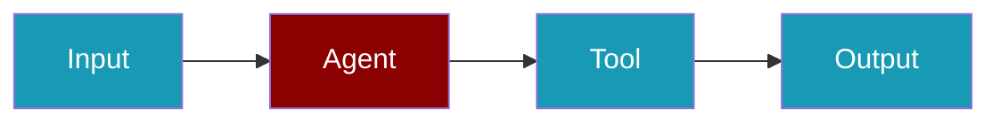
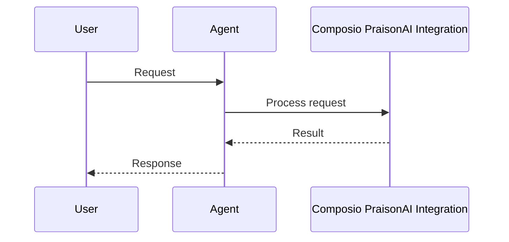

```python
from praisonaiagents import Agent

agent = Agent(
    name="ComposioAgent",
    instructions="Use Composio-connected apps when needed.",
    tools=["composio"],
)
agent.start("Search for the latest AI news")
```

The user names an app action; Composio tools let the agent read mail, post updates, or query SaaS APIs.






# Composio PraisonAI Integration

[Composio](https://composio.dev/) allows AI agents and LLMs to easily integrate with 100+ tools (GitHub, Gmail, CodeExecution and more) to perform actions and subscribe to triggers. This example will show how to integrate Composio with PraisonAI agents to let them seamlessly interact with external apps.

```bash
pip install composio-praisonai
```

To add Composio's Serpapi tool - 

```bash
composio add serpapi
```

```python
from praisonai import PraisonAI
from composio_praisonai import Action, ComposioToolSet

# Initialize Composio's Toolset
composio_toolset = ComposioToolSet()

# Get the SERPAPI tool
tools = composio_toolset.get_tools(actions=[Action.SERPAPI_SEARCH])

# Get the tool string for agent_yaml
tool_section_str = composio_toolset.get_tools_section(tools)

# Example configuration
agent_yaml = """
framework: "crewai"
topic: "Research"

agents:  # Canonical: use 'agents' instead of 'roles'
  researcher:
    role: "Researcher"
    goal: "Search the internet for the information requested"
    instructions:  # Canonical: use 'instructions' instead of 'backstory' "A researcher tasked with finding and analyzing information on various topics using available tools."
    tasks:
      research_task:
        description: "Research about open source LLMs vs closed source LLMs."
        expected_output: "A full analysis report on the topic."
""" + tool_section_str

# Create PraisonAI instance with the agent_yaml content
praison_ai = PraisonAI(agent_yaml=agent_yaml)

# Run PraisonAI
result = praison_ai.main()

# Print the result
print(result)
```


## Quick Start

<Steps>
<Step title="Install Composio">
```bash
pip install composio-praisonai
composio add serpapi
```
</Step>
<Step title="Create an agent with Composio tools">
```python
from praisonaiagents import Agent
from composio_praisonai import Action, ComposioToolSet

toolset = ComposioToolSet()
tools = toolset.get_tools(actions=[Action.SERPAPI_SEARCH])

agent = Agent(
    name="ResearchAgent",
    instructions="Search the web for the requested information.",
    tools=tools,
)

agent.start("Search for the latest AI news")
```
</Step>
</Steps>


## Best Practices

<AccordionGroup>
  <Accordion title="Add only the tools you need">
    Use `composio add tool-name` for each specific service rather than importing everything.
  </Accordion>
  <Accordion title="Use praisonaiagents imports">
    For new code, use `from praisonaiagents import Agent` for consistency.
  </Accordion>
  <Accordion title="Set permissions carefully">
    Composio tools can send emails and create issues. Grant only the scopes your agent actually needs.
  </Accordion>
  <Accordion title="Test with read-only first">
    Run agents with read-only tools before enabling write operations to avoid unintended side effects.
  </Accordion>
</AccordionGroup>


## Related

<CardGroup cols={2}>
  <Card title="Custom Tools" icon="wrench" href="/docs/tools/custom">
    Build your own agent tools
  </Card>
  <Card title="Tools Overview" icon="toolbox" href="/docs/tools/tools">
    Browse PraisonAI tool documentation
  </Card>
</CardGroup>
