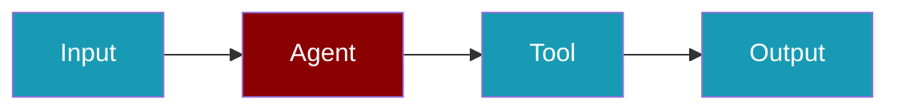
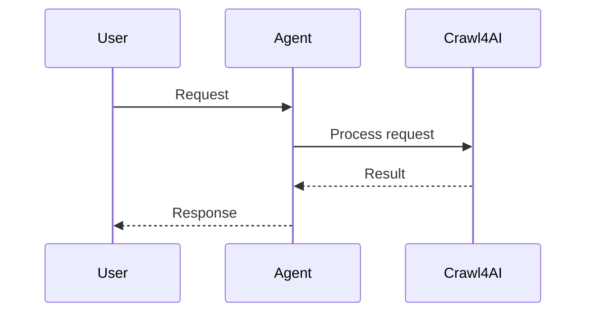
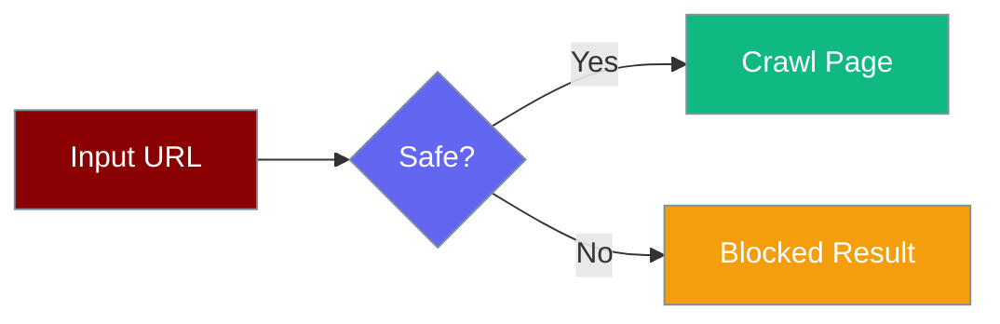

<Note>
  **Prerequisites**
  - Python 3.10 or higher
  - PraisonAI Agents package installed
  - `crawl4ai` package installed and set up
</Note>

```python
from praisonaiagents import Agent, crawl4ai_sync

agent = Agent(name="Researcher", tools=[crawl4ai_sync])
agent.start("Summarize the content at https://example.com")
```

The user shares a URL; the agent crawls the page and returns a concise summary.






Crawl4AI provides powerful async web crawling with JavaScript rendering, content extraction, and LLM-based data extraction. PraisonAI includes **built-in Crawl4AI tools** for easy integration.


## Quick Start

<Steps>
<Step title="Install">
```bash
pip install praisonaiagents crawl4ai
crawl4ai-setup
```
</Step>
<Step title="Crawl a page">
```python
from praisonaiagents import crawl4ai_sync

result = crawl4ai_sync("https://example.com")
print(result["markdown"][:500])
```
</Step>
<Step title="Use with agent">
```python
from praisonaiagents import Agent, crawl4ai_sync

agent = Agent(
    name="WebCrawler",
    instructions="Crawl websites and extract key information.",
    tools=[crawl4ai_sync],
)

agent.start("Summarize the content at https://example.com")
```
</Step>
</Steps>


## Installation

```bash
pip install praisonaiagents crawl4ai
crawl4ai-setup
```

## Setup

```bash
export OPENAI_API_KEY=your_openai_api_key
```

## Built-in Crawl4AI Tool

PraisonAI provides built-in `crawl4ai` functions that you can use directly:

```python
import asyncio
from praisonaiagents import crawl4ai

async def main():
    result = await crawl4ai("https://example.com")
    print(result["markdown"])

asyncio.run(main())
```

## URL Safety

Every URL passed to `crawl`, `crawl_many`, `extract_css`, or `extract_llm` is validated by `is_safe_http_url` before any network request is made.



Blocked categories:

- Loopback (`127.0.0.0/8`, `::1`)
- Link-local (`169.254.0.0/16`, `fe80::/10`) — includes cloud metadata IPs
- Private ranges (`10.0.0.0/8`, `172.16.0.0/12`, `192.168.0.0/16`)
- IANA-reserved and unspecified addresses

Blocked URLs return a `success: False` payload and log `Crawl4AI <method> blocked unsafe URL: <url>`:

```python
{"error": "URL blocked by SSRF safety check: http://169.254.169.254/latest/meta-data/", "success": False}
```

Inline HTML via `raw://` is exempt — it needs no network access:

```python
crawl4ai_sync("raw://<html>...</html>")   # works — no URL validation
```

`crawl_many` preserves input order: a blocked URL appears as its blocked payload in the same index slot as the original request, never stripped or reordered.

<Note>
The mentions handler (`praisonaiagents.tools.mentions`) validates **every** redirect hop, not just the first. A message URL that redirects to an unsafe target returns `[Blocked: redirect target is not allowed: <final url>]`. See [Spider Tools — URL Validation](/tools/spider_tools).
</Note>

## Available Functions

| Function | Description |
|----------|-------------|
| `crawl4ai` | Async crawl a URL and get markdown |
| `crawl4ai_many` | Crawl multiple URLs concurrently |
| `crawl4ai_extract` | Extract data using CSS selectors |
| `crawl4ai_llm_extract` | Extract data using LLM |
| `crawl4ai_sync` | Synchronous version of crawl4ai |
| `crawl4ai_extract_sync` | Synchronous CSS extraction |

## Basic Usage

### Simple Crawl

```python
import asyncio
from praisonaiagents import crawl4ai

async def main():
    result = await crawl4ai("https://example.com")
    
    if result["success"]:
        print(f"URL: {result['url']}")
        print(f"Markdown: {result['markdown'][:500]}...")
        print(f"Links: {len(result['links'].get('internal', []))}")
    else:
        print(f"Error: {result['error']}")

asyncio.run(main())
```

### Crawl with Options

```python
import asyncio
from praisonaiagents import crawl4ai

async def main():
    result = await crawl4ai(
        url="https://example.com",
        css_selector="main.content",  # Focus on specific content
        js_code="window.scrollTo(0, document.body.scrollHeight);",  # Execute JS
        wait_for="css:.loaded",  # Wait for element
        screenshot=True  # Capture screenshot
    )
    
    if result["success"]:
        print(result["markdown"])
        if result.get("screenshot"):
            print("Screenshot captured!")

asyncio.run(main())
```

### Crawl Multiple URLs

```python
import asyncio
from praisonaiagents import crawl4ai_many

async def main():
    urls = [
        "https://example.com/page1",
        "https://example.com/page2",
        "https://example.com/page3"
    ]
    
    results = await crawl4ai_many(urls)
    
    for result in results:
        if result["success"]:
            print(f"✓ {result['url']}: {len(result['markdown'])} chars")
        else:
            print(f"✗ {result['url']}: {result['error']}")

asyncio.run(main())
```

### Extract with CSS Selectors

```python
import asyncio
from praisonaiagents import crawl4ai_extract

async def main():
    schema = {
        "name": "Products",
        "baseSelector": "div.product",
        "fields": [
            {"name": "title", "selector": "h2", "type": "text"},
            {"name": "price", "selector": ".price", "type": "text"},
            {"name": "link", "selector": "a", "type": "attribute", "attribute": "href"}
        ]
    }
    
    result = await crawl4ai_extract(
        url="https://example.com/products",
        schema=schema
    )
    
    if result["success"]:
        print(f"Extracted {result['count']} items")
        for item in result["data"]:
            print(f"  - {item['title']}: {item['price']}")

asyncio.run(main())
```

### Extract with LLM

```python
import asyncio
from praisonaiagents import crawl4ai_llm_extract

async def main():
    result = await crawl4ai_llm_extract(
        url="https://openai.com/api/pricing/",
        instruction="Extract all model names with their input and output token prices",
        provider="openai/gpt-4o-mini"
    )
    
    if result["success"]:
        print("Extracted data:", result["data"])

asyncio.run(main())
```

## Using Crawl4AITools Class

For more control, use the `Crawl4AITools` class directly:

```python
import asyncio
from praisonaiagents import Crawl4AITools

async def main():
    tools = Crawl4AITools(headless=True, output="silent")
    
    try:
        # Basic crawl
        result = await tools.crawl("https://example.com")
        print(result["markdown"][:500])
        
        # CSS extraction
        schema = {
            "name": "Articles",
            "baseSelector": "article",
            "fields": [
                {"name": "title", "selector": "h2", "type": "text"},
                {"name": "summary", "selector": "p", "type": "text"}
            ]
        }
        result = await tools.extract_css("https://example.com/blog", schema)
        print(result["data"])
        
    finally:
        await tools.close()

asyncio.run(main())
```

## Synchronous Usage

For non-async code, use the sync versions:

```python
from praisonaiagents import crawl4ai_sync, crawl4ai_extract_sync

# Simple crawl
result = crawl4ai_sync("https://example.com")
print(result["markdown"][:500])

# CSS extraction
schema = {
    "name": "Items",
    "baseSelector": ".item",
    "fields": [{"name": "title", "selector": "h3", "type": "text"}]
}
result = crawl4ai_extract_sync("https://example.com/items", schema)
print(result["data"])
```

## Schema Reference

### CSS Extraction Schema

```python
schema = {
    "name": "Schema Name",
    "baseSelector": "div.item",  # CSS selector for each item
    "fields": [
        {
            "name": "field_name",
            "selector": "h2",  # CSS selector within item
            "type": "text"  # text, attribute, html, nested, list, nested_list
        },
        {
            "name": "link",
            "selector": "a",
            "type": "attribute",
            "attribute": "href"
        },
        {
            "name": "details",
            "selector": ".details",
            "type": "nested",
            "fields": [
                {"name": "brand", "selector": ".brand", "type": "text"}
            ]
        }
    ]
}
```

### Field Types

| Type | Description |
|------|-------------|
| `text` | Extract text content |
| `attribute` | Extract HTML attribute (specify `attribute` key) |
| `html` | Extract raw HTML |
| `nested` | Single nested object |
| `list` | List of simple items |
| `nested_list` | List of complex objects |

## JavaScript Execution

Execute JavaScript before crawling:

```python
result = await crawl4ai(
    url="https://example.com",
    js_code="""
        // Scroll to load lazy content
        window.scrollTo(0, document.body.scrollHeight);
        
        // Click a button
        document.querySelector('.load-more')?.click();
    """,
    wait_for="css:.loaded-content"  # Wait for content to appear
)
```

## Wait Conditions

```python
# Wait for CSS selector
wait_for="css:.content-loaded"

# Wait for JavaScript condition
wait_for="js:() => document.querySelectorAll('.item').length > 10"
```

## Video Tutorial

<div className="relative w-full aspect-video">
  <iframe
    className="absolute top-0 left-0 w-full h-full"
    src="https://www.youtube.com/embed/KAvuVUh0XU8"
    title="YouTube video player"
    allow="accelerometer; autoplay; clipboard-write; encrypted-media; gyroscope; picture-in-picture"
    allowFullScreen
  ></iframe>
</div>

## Key Points

- **Async by default**: Use `await` for all crawl functions
- **JavaScript rendering**: Full browser support for dynamic content
- **CSS extraction**: Fast, no-LLM structured data extraction
- **LLM extraction**: AI-powered extraction for complex content
- **Multi-URL**: Efficient concurrent crawling

## Best Practices

<AccordionGroup>
  <Accordion title="Use CSS extraction for structured pages">
    CSS selectors are faster and more reliable than LLM extraction for well-structured pages.
  </Accordion>
  <Accordion title="Add wait conditions for dynamic pages">
    Use `wait_for='css:.loaded'` for pages that load content via JavaScript to avoid missing data.
  </Accordion>
  <Accordion title="Use crawl4ai_many for multiple URLs">
    `crawl4ai_many` crawls concurrently and is much faster than sequential calls for multiple URLs.
  </Accordion>
  <Accordion title="Use sync versions in simple scripts">
    Prefer `crawl4ai_sync` for non-async scripts to avoid managing the event loop manually.
  </Accordion>
</AccordionGroup>


## Related

<CardGroup cols={2}>
  <Card title="Custom Tools" icon="wrench" href="/tools/custom">
    Build your own agent tools
  </Card>
  <Card title="Tools Overview" icon="toolbox" href="/tools/tools">
    Browse PraisonAI tool documentation
  </Card>
</CardGroup>
