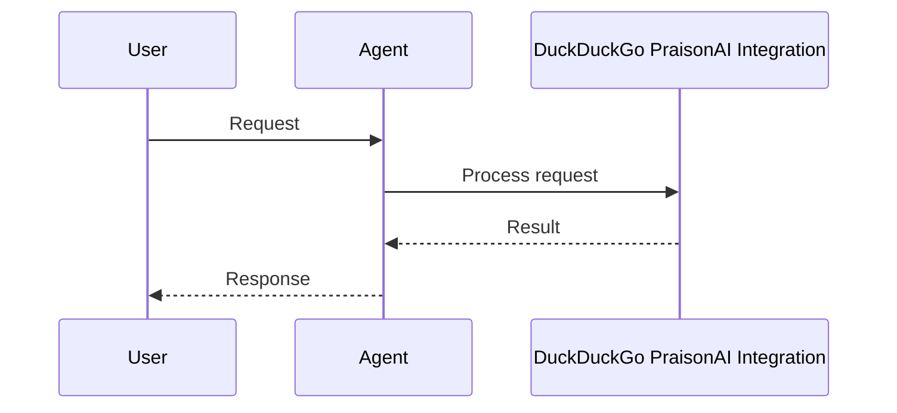

```python
from praisonaiagents import Agent, duckduckgo

agent = Agent(name="Researcher", tools=[duckduckgo])
agent.start("What are the latest AI developments?")
```

The user asks for current information; the agent searches the web with DuckDuckGo and cites findings.





# DuckDuckGo Praison AI Integration

```bash
pip install duckduckgo_search
```

Create a file called tools.py in the same directory as the agents.yaml file.

```python
# example tools.py
from duckduckgo_search import DDGS
from praisonai_tools import BaseTool

class InternetSearchTool(BaseTool):
    name: str = "InternetSearchTool"
    description: str = "Search Internet for relevant information based on a query or latest news"

    def _run(self, query: str):
        ddgs = DDGS()
        results = ddgs.text(keywords=query, region='wt-wt', safesearch='moderate', max_results=5)
        return results
```


## Quick Start

<Steps>
<Step title="Install">
```bash
pip install duckduckgo_search praisonaiagents
```
</Step>
<Step title="Search with agent">
```python
from praisonaiagents import Agent, search_web

agent = Agent(
    name="SearchAgent",
    instructions="Search the web to answer questions.",
    tools=[search_web],
)

agent.start("What are the latest AI developments?")
```
</Step>
</Steps>


## Best Practices

<AccordionGroup>
  <Accordion title="Use as a free fallback">
    DuckDuckGo requires no API key - use it as the zero-cost fallback provider in `search_web`.
  </Accordion>
  <Accordion title="Keep max_results small">
    DuckDuckGo returns best results in the first 5 hits - higher limits add noise.
  </Accordion>
  <Accordion title="Use the unified search_web tool">
    Prefer `from praisonaiagents import search_web` for automatic fallback across providers.
  </Accordion>
  <Accordion title="Use specific queries">
    Use specific, descriptive queries rather than broad terms for better DuckDuckGo results.
  </Accordion>
</AccordionGroup>


## Related

<CardGroup cols={2}>
  <Card title="Custom Tools" icon="wrench" href="/docs/tools/custom">
    Build your own agent tools
  </Card>
  <Card title="Tools Overview" icon="toolbox" href="/docs/tools/tools">
    Browse PraisonAI tool documentation
  </Card>
</CardGroup>
