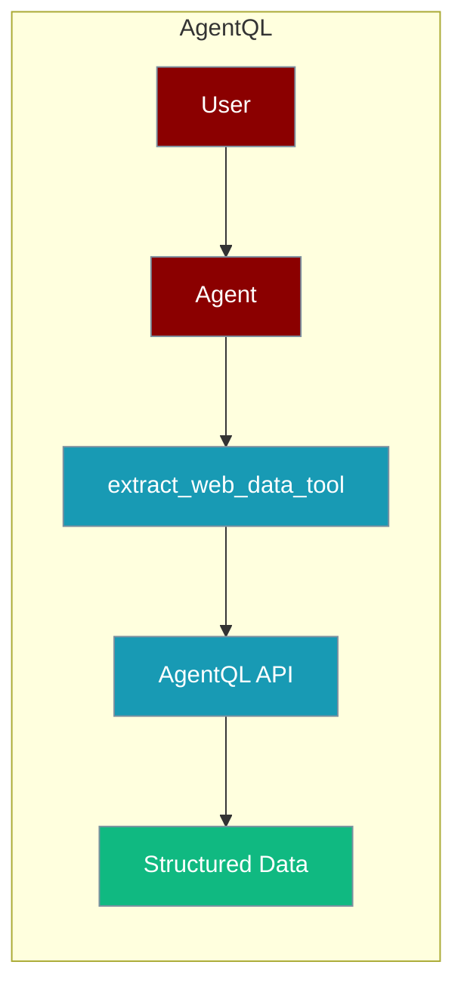
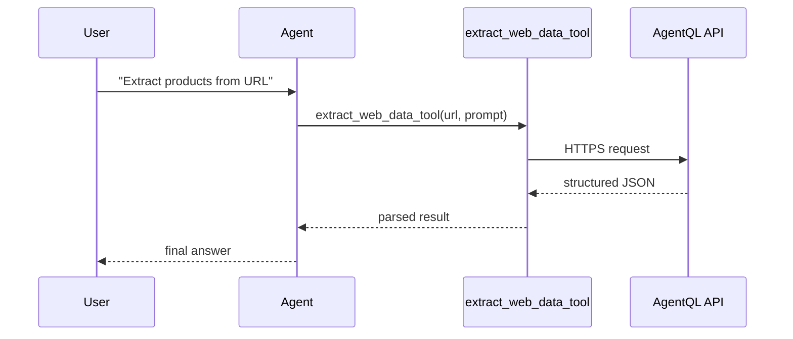

AgentQL lets an agent extract structured data from any webpage using a natural-language prompt.



## Overview

AgentQL is a tool that allows you to extract structured data from webpages using AI Agents.

```bash
pip install langchain_agentql langchain-community
```

```bash
export AGENTQL_API_KEY="${AGENTQL_API_KEY:?Set AGENTQL_API_KEY in your shell}"
```

```python
from praisonaiagents import Agent, AgentTeam
from langchain_agentql.tools import ExtractWebDataTool
from dotenv import load_dotenv

import os

os.environ["AGENTQL_API_KEY"] = os.getenv('AGENTQL_API_KEY')

def extract_web_data_tool(url, query):
    agentql_tool = ExtractWebDataTool().invoke(
        {
            "url": url,
            "prompt": query,
        },)
    return agentql_tool

# Create agent with web extraction instructions
orchestration_agent = Agent(
    instructions="""Extract All 37 products from the url https://www.colorbarcosmetics.com/bestsellers along with its name, overview, description, price and additional information by recursively clicking on each product""",
    tools=[extract_web_data_tool]
)

# Initialize and run agents
agents = AgentTeam(agents=[orchestration_agent])
agents.start()
```

## How It Works



## Getting Started

<Steps>
<Step title="Simple Usage">
1. Get your AgentQL API key from [AgentQL Dashboard](https://agentql.com)
2. Set the API key in your environment variables
3. Install the required dependencies
4. Use the example code to start extracting structured data
</Step>
<Step title="With Configuration">
Use the same tool with an agent — see **Usage with Agent** below, or pass env vars and options from the sections above.
</Step>
</Steps>

## Best Practices

<AccordionGroup>
<Accordion title="Keep AGENTQL_API_KEY in the environment">
Set `AGENTQL_API_KEY` in your shell or `.env` and read it with `os.getenv`. Never commit the key in code.
</Accordion>

<Accordion title="Write precise prompts">
AgentQL extracts exactly what the prompt asks for. Name every field you need (name, price, description) so the returned schema is predictable and token-efficient.
</Accordion>

<Accordion title="Handle extraction failures">
Pages change and requests can time out. Wrap `ExtractWebDataTool().invoke(...)` in `try/except` so the agent can retry or report a clean message instead of crashing.
</Accordion>
</AccordionGroup>

## Related Tools

<CardGroup cols={2}>
  <Card title="Firecrawl" icon="book" href="/docs/tools/external/firecrawl">
    Web scraping
  </Card>
  <Card title="Crawl4AI" icon="book" href="/docs/tools/external/crawl4ai">
    AI web crawler
  </Card>
  <Card title="GitHub" icon="book" href="/docs/tools/external/github">
    Repository automation
  </Card>
</CardGroup>

