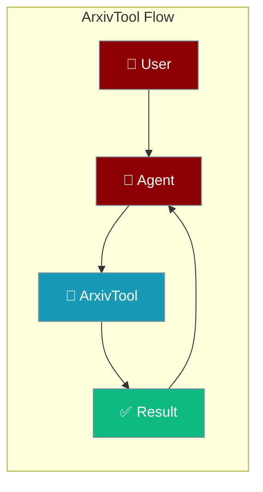
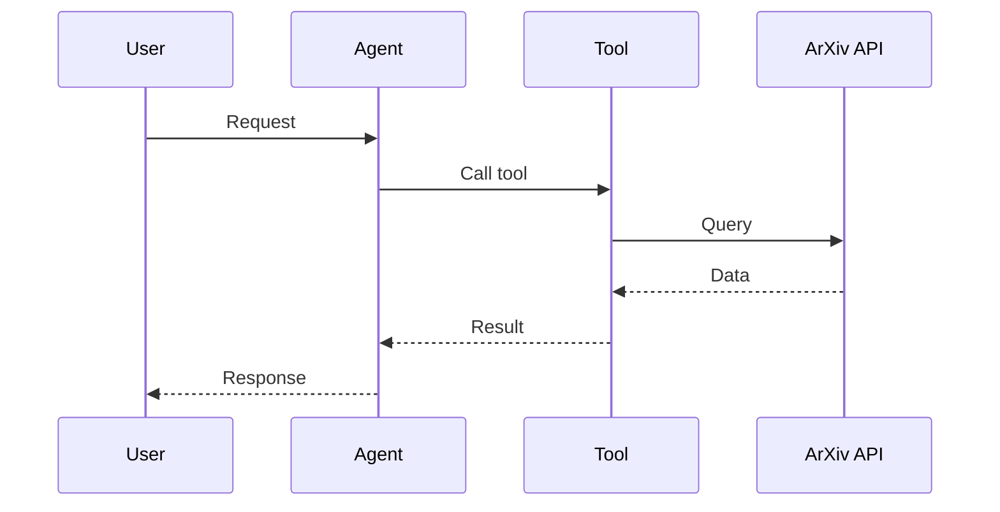

## Overview

ArXiv is a free distribution service and open-access archive for scholarly articles. This tool allows you to search and retrieve academic papers.

The user asks for research papers; the agent queries ArXiv and returns matching papers.



## Installation

```bash
pip install "praisonai[tools]"
```

No API key required!

## Quick Start

<Steps>
<Step title="Simple Usage">
```python
from praisonai_tools import ArxivTool

# Initialize
arxiv = ArxivTool()

# Search
results = arxiv.search("transformer neural networks")
print(results)
```
</Step>
<Step title="With Configuration">
Use the same tool with an agent — see **Usage with Agent** below, or pass env vars and options from the sections above.
</Step>
</Steps>


## Usage with Agent

```python
from praisonaiagents import Agent
from praisonai_tools import ArxivTool

agent = Agent(
    name="Researcher",
    instructions="You are a research assistant. Use ArXiv to find academic papers.",
    tools=[ArxivTool()]
)

response = agent.chat("Find papers about large language models")
print(response)
```

## Available Methods

### search(query, max_results=5)

Search ArXiv for papers.

```python
from praisonai_tools import ArxivTool

arxiv = ArxivTool()
results = arxiv.search("deep learning", max_results=3)

# Returns:
# [
#     {
#         "title": "...",
#         "authors": ["..."],
#         "summary": "...",
#         "published": "2024-01-15",
#         "pdf_url": "https://arxiv.org/pdf/..."
#     },
#     ...
# ]
```

### get_paper(arxiv_id)

Get a specific paper by ArXiv ID.

```python
paper = arxiv.get_paper("2301.00234")

# Returns full paper details including abstract and links
```

## Configuration Options

```python
arxiv = ArxivTool(
    sort_by="relevance",      # "relevance" or "submittedDate"
    sort_order="descending"   # "ascending" or "descending"
)
```

## Function-Based Usage

```python
from praisonai_tools import arxiv_search

# Quick search without instantiating class
results = arxiv_search("quantum computing", max_results=5)
```

## CLI Usage

```bash
# Use with praisonai (no API key needed)
praisonai --tools ArxivTool "Find recent papers on reinforcement learning"
```

## Error Handling

```python
from praisonai_tools import ArxivTool

arxiv = ArxivTool()
results = arxiv.search("my query")

if results and "error" in results[0]:
    print(f"Error: {results[0]['error']}")
else:
    for paper in results:
        print(f"- {paper['title']}")
        print(f"  Authors: {', '.join(paper['authors'][:3])}")
```

## Common Errors

| Error | Cause | Solution |
|-------|-------|----------|
| `arxiv not installed` | Missing dependency | Run `pip install arxiv` |
| `No results found` | Query too specific | Broaden search terms |
| `Connection error` | Network issue | Check internet connection |

## How It Works



---

## Best Practices

<AccordionGroup>
<Accordion title="Search before fetching">
Use `search` to find candidate papers first, then fetch full details only for the ones you need. This keeps token usage low.
</Accordion>
<Accordion title="Narrow with categories">
Filter by ArXiv category (e.g. `cs.AI`) so the agent works with relevant papers instead of the whole corpus.
</Accordion>
<Accordion title="Cache repeated lookups">
ArXiv results are stable — cache them locally when the same query runs often to avoid redundant API calls.
</Accordion>
</AccordionGroup>

---

## Related Tools

<CardGroup cols={2}>
  <Card title="Wikipedia" icon="book" href="/docs/tools/external/wikipedia">
    General knowledge
  </Card>
  <Card title="PubMed" icon="book" href="/docs/tools/external/pubmed">
    Medical research
  </Card>
  <Card title="Exa" icon="book" href="/docs/tools/external/exa">
    Neural search
  </Card>
</CardGroup>

