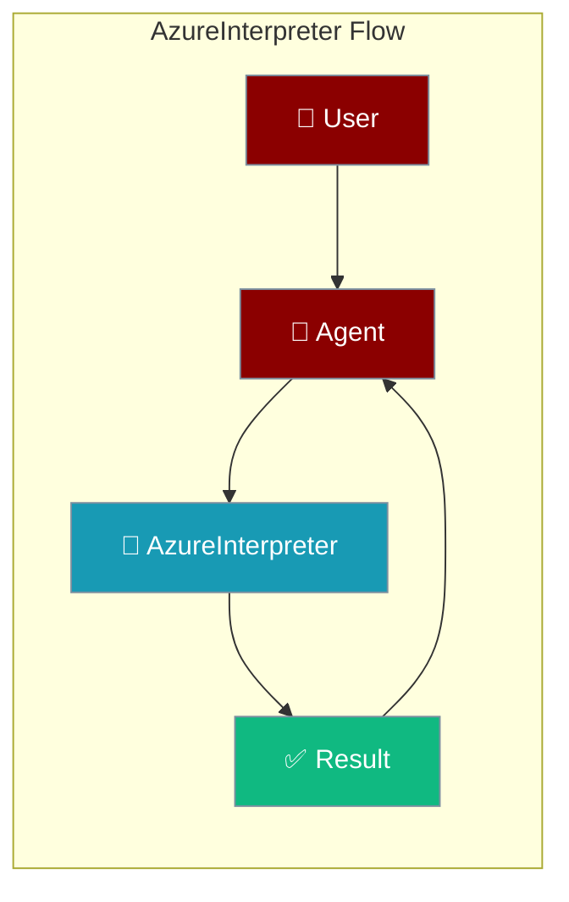
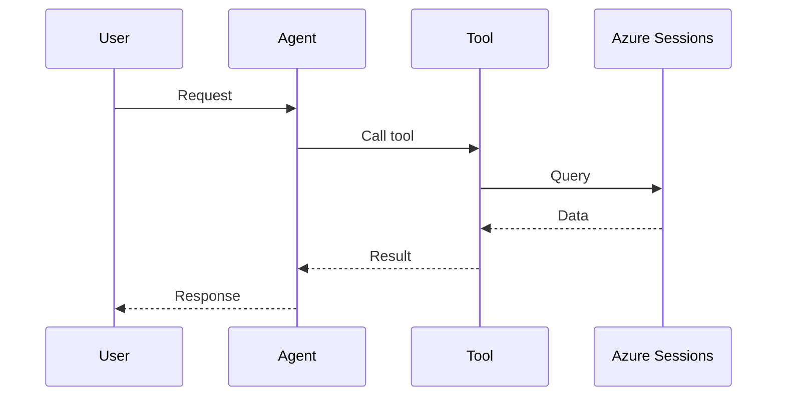

## Overview

The Azure Container Apps dynamic sessions based code Interpreter tool is a tool that allows you to execute and run development environments using the AI Agents.

The user sends code to run; the agent executes it in an Azure dynamic session and returns the output.



```bash
pip install langchain-azure-dynamic-sessions langchain-openai langchainhub langchain langchain-community
```

```python
from praisonaiagents import Agent, AgentTeam
import getpass
from langchain_azure_dynamic_sessions import SessionsPythonREPLTool

POOL_MANAGEMENT_ENDPOINT = getpass.getpass()

coder_agent = Agent(instructions="""word = "strawberry"
                                    count = word.count("r")
                                    print(f"There are {count}'R's in the word 'Strawberry'")""", tools=[SessionsPythonREPLTool])

agents = AgentTeam(agents=[coder_agent])
agents.start()
```

## Getting Started

<Steps>
<Step title="Simple Usage">
1. Install dependencies (see **Overview** above)
2. Set required API keys in your environment
3. Run the agent example in **Overview**
</Step>
<Step title="With Configuration">
Use the same tool with an agent — see the **Overview** example, or pass env vars from the sections above.
</Step>
</Steps>

## How It Works



---

## Best Practices

<AccordionGroup>
<Accordion title="Keep sessions short-lived">
Azure Container Apps dynamic sessions are ephemeral — treat each run as stateless and pass all inputs explicitly.
</Accordion>
<Accordion title="Validate untrusted code">
Only run code the agent generated from trusted instructions. Sandbox limits protect the host, not your data.
</Accordion>
<Accordion title="Handle timeouts">
Long-running code can hit the session timeout. Wrap execution in error handling so the agent recovers gracefully.
</Accordion>
</AccordionGroup>

---

## Related Tools

<CardGroup cols={2}>
  <Card title="Python" icon="book" href="/docs/tools/external/python">
    Run Python code
  </Card>
  <Card title="Shell" icon="book" href="/docs/tools/external/shell">
    Shell commands
  </Card>
  <Card title="Bearly Code Interpreter" icon="book" href="/docs/tools/external/bearly-code-interpreter">
    Cloud code execution
  </Card>
</CardGroup>

