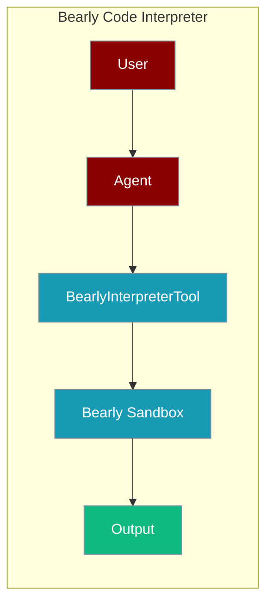
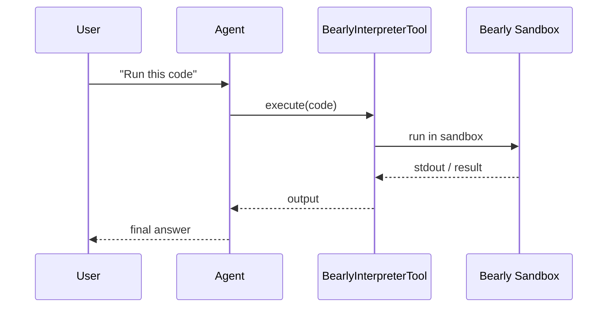

The Bearly Code Interpreter tool lets an agent run code in a sandboxed cloud environment.



## Overview

The Bearly Code Interpreter tool is a tool that allows you to execute various programming languages using the AI Agents.

```bash
pip install langchain-community
export BEARLY_API_KEY="${BEARLY_API_KEY:?Set BEARLY_API_KEY in your shell}"
```

```python
from praisonaiagents import Agent, AgentTeam
from langchain_community.tools import BearlyInterpreterTool

coder_agent = Agent(instructions="""for i in range(0,10):
                                        print(f'The number is {i}')""", tools=[BearlyInterpreterTool])

agents = AgentTeam(agents=[coder_agent])
agents.start()
```

## How It Works



## Getting Started

<Steps>
<Step title="Simple Usage">
1. Install dependencies (see **Overview** above)
2. Set required API keys in your environment
3. Run the agent example in **Overview**
</Step>
<Step title="With Configuration">
Use the same tool with an agent — see the **Overview** example, or pass env vars from the sections above.
</Step>
</Steps>

## Best Practices

<AccordionGroup>
<Accordion title="Keep BEARLY_API_KEY in the environment">
Set `BEARLY_API_KEY` in your shell or `.env`. The tool reads it automatically — never hard-code the key.
</Accordion>

<Accordion title="Sandbox untrusted code">
Bearly runs code in an isolated cloud sandbox, so agent-generated code cannot touch your machine. Prefer it over local execution for untrusted input.
</Accordion>

<Accordion title="Keep snippets self-contained">
Each run is stateless. Include all imports and inputs in the snippet you pass so it executes without external state.
</Accordion>
</AccordionGroup>

## Related Tools

<CardGroup cols={2}>
  <Card title="Python" icon="book" href="/docs/tools/external/python">
    Run Python code
  </Card>
  <Card title="Azure Code Interpreter" icon="book" href="/docs/tools/external/azure-code-interpreter">
    Azure sessions runtime
  </Card>
  <Card title="Jina Code Interpreter" icon="book" href="/docs/tools/external/jina-code-interpreter">
    Riza Python execution
  </Card>
</CardGroup>

