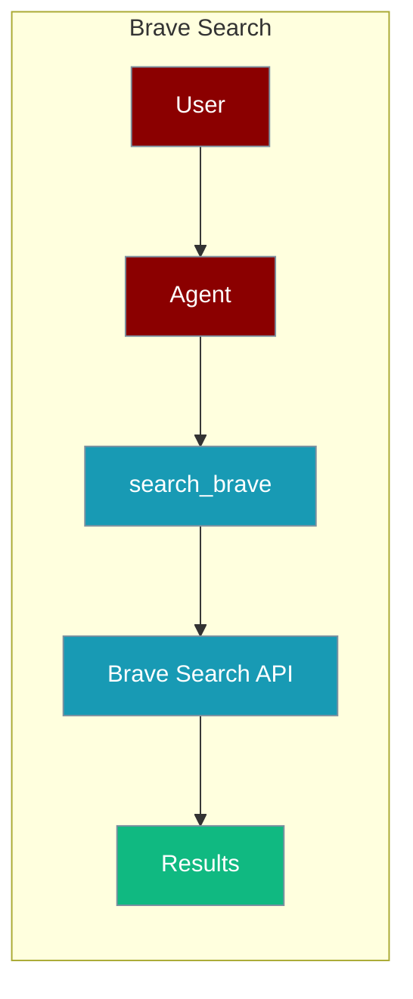
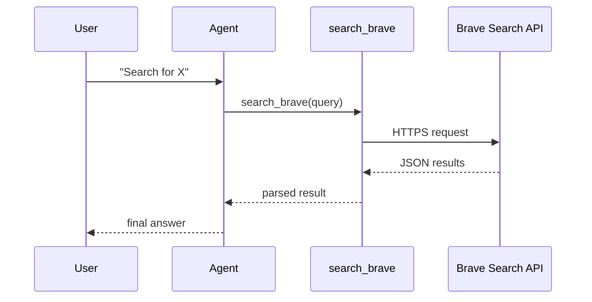

The BraveSearch tool lets an agent search the web through the Brave Search API.



## Overview

The BraveSearch tool is a tool that allows you to search the web using the BraveSearch API.

```bash
pip install langchain-community google-search-results
``` 

```bash
export BRAVE_SEARCH_API="${BRAVE_SEARCH_API:?Set BRAVE_SEARCH_API in your shell}"
export OPENAI_API_KEY="${OPENAI_API_KEY:?Set OPENAI_API_KEY in your shell}"
```

```python
from praisonaiagents import Agent, AgentTeam
from langchain_community.tools import BraveSearch
import os


def search_brave(query: str):
    """Searches using BraveSearch and returns results."""
    api_key = os.environ['BRAVE_SEARCH_API']
    tool = BraveSearch.from_api_key(api_key=api_key, search_kwargs={"count": 3})
    return tool.run(query)

data_agent = Agent(instructions="Search about AI job trends in 2025", tools=[search_brave])
editor_agent = Agent(instructions="Write a blog article")
agents = AgentTeam(agents=[data_agent, editor_agent])
agents.start()
```

Generate your BraveSearch API key from [BraveSearch](https://brave.com/search/api/)

## How It Works



## Getting Started

<Steps>
<Step title="Simple Usage">
1. Install dependencies (see **Overview** above)
2. Set required API keys in your environment
3. Run the agent example in **Overview**
</Step>
<Step title="With Configuration">
Use the same tool with an agent — see the **Overview** example, or pass env vars from the sections above.
</Step>
</Steps>

## Best Practices

<AccordionGroup>
<Accordion title="Keep API keys out of code">
Read the key with `os.environ['BRAVE_SEARCH_API']` and set it in your shell or a `.env` file. Never hard-code the key in the tool function.
</Accordion>

<Accordion title="Cap the result count">
`BraveSearch.from_api_key` accepts `search_kwargs={"count": 3}`. Keep `count` low so the agent processes fewer tokens and answers faster.
</Accordion>

<Accordion title="Handle rate limits">
Brave returns HTTP 429 when the plan quota is exceeded. Wrap `tool.run(query)` in a `try/except` so the agent can fall back to another search tool instead of crashing.
</Accordion>
</AccordionGroup>

## Related Tools

<CardGroup cols={2}>
  <Card title="DuckDuckGo" icon="book" href="/docs/tools/external/duckduckgo">
    Privacy-focused search
  </Card>
  <Card title="Tavily" icon="book" href="/docs/tools/external/tavily">
    AI-powered search
  </Card>
  <Card title="Serper" icon="book" href="/docs/tools/external/serper">
    Google search API
  </Card>
</CardGroup>

