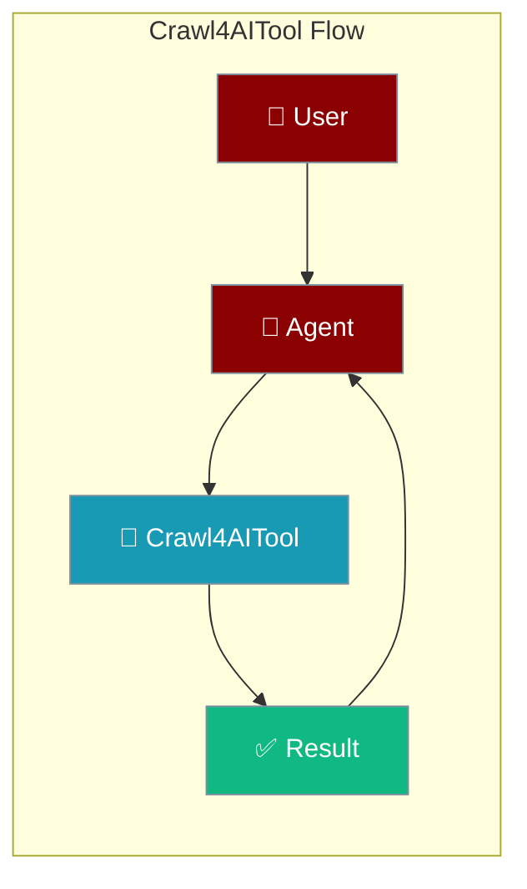
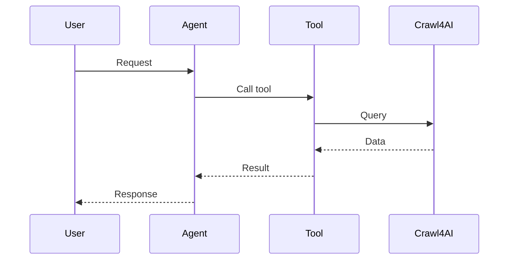

## Overview

Crawl4AI is an open-source, LLM-friendly web crawler that extracts clean content from websites.

The user shares a URL; the agent crawls the page and returns clean, structured content.



## Installation

```bash
pip install "praisonai[tools]"
```

## Quick Start

<Steps>
<Step title="Simple Usage">
```python
from praisonai_tools import Crawl4AITool

# Initialize
crawler = Crawl4AITool()

# Crawl
result = crawler.crawl("https://example.com")
print(result)
```
</Step>
<Step title="With Configuration">
Use the same tool with an agent — see **Usage with Agent** below, or pass env vars and options from the sections above.
</Step>
</Steps>


## Usage with Agent

```python
from praisonaiagents import Agent
from praisonai_tools import Crawl4AITool

agent = Agent(
    name="WebCrawler",
    instructions="You crawl websites and extract content.",
    tools=[Crawl4AITool()]
)

response = agent.chat("Crawl https://praison.ai/docs and summarize")
print(response)
```

## Available Methods

### crawl(url)

Crawl a URL and extract content.

```python
from praisonai_tools import Crawl4AITool

crawler = Crawl4AITool()
result = crawler.crawl("https://example.com")
```

## Common Errors

| Error | Cause | Solution |
|-------|-------|----------|
| `crawl4ai not installed` | Missing dependency | Run `pip install crawl4ai` |
| `Timeout` | Page too slow | Increase timeout |

## How It Works



---

## Best Practices

<AccordionGroup>
<Accordion title="Respect robots.txt">
Crawl only pages you are allowed to access. Check the site's crawl policy before large runs.
</Accordion>
<Accordion title="Limit crawl depth">
Cap depth and page count so the agent processes focused content instead of an entire site.
</Accordion>
<Accordion title="Extract, don't dump">
Ask for structured extraction rather than raw HTML so the agent works with fewer, cleaner tokens.
</Accordion>
</AccordionGroup>

---

## Related Tools

<CardGroup cols={2}>
  <Card title="Firecrawl" icon="book" href="/docs/tools/external/firecrawl">
    Web scraping API
  </Card>
  <Card title="Spider" icon="book" href="/docs/tools/external/spider">
    Fast crawler
  </Card>
  <Card title="Jina" icon="book" href="/docs/tools/external/jina">
    Reader API
  </Card>
</CardGroup>

