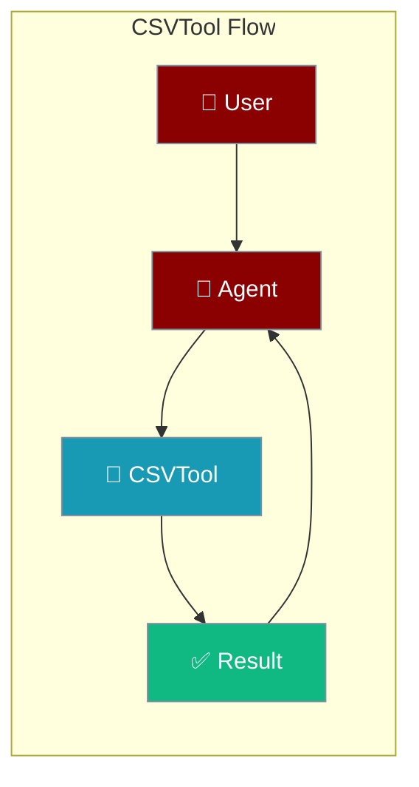
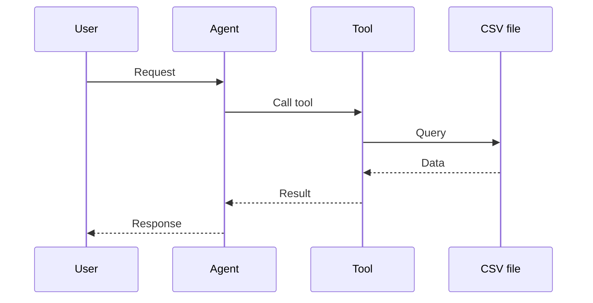

## Overview

CSV tool allows you to read, write, and query CSV files.

The user points to a CSV file; the agent reads, filters, or writes rows and returns the result.



## Installation

```bash
pip install "praisonai[tools]"
```

## Quick Start

<Steps>
<Step title="Simple Usage">
```python
from praisonai_tools import CSVTool

# Initialize
csv_tool = CSVTool()

# Read CSV
data = csv_tool.read("data.csv")
print(data)
```
</Step>
<Step title="With Configuration">
Use the same tool with an agent — see **Usage with Agent** below, or pass env vars and options from the sections above.
</Step>
</Steps>


## Usage with Agent

```python
from praisonaiagents import Agent
from praisonai_tools import CSVTool

agent = Agent(
    name="DataAnalyst",
    instructions="You help analyze CSV data.",
    tools=[CSVTool()]
)

response = agent.chat("Read sales.csv and summarize the data")
print(response)
```

## Available Methods

### read(path)

Read a CSV file.

```python
from praisonai_tools import CSVTool

csv_tool = CSVTool()
data = csv_tool.read("data.csv")
```

### write(path, data)

Write data to a CSV file.

```python
csv_tool.write("output.csv", [{"name": "Alice", "age": 30}])
```

## How It Works



---

## Best Practices

<AccordionGroup>
<Accordion title="Read a schema first">
Inspect column names before querying so the agent references real fields, not guesses.
</Accordion>
<Accordion title="Stream large files">
For big CSVs, process in chunks so memory stays bounded.
</Accordion>
<Accordion title="Validate before writing">
Confirm row shape before `write` so you don't corrupt an existing file.
</Accordion>
</AccordionGroup>

---

## Related Tools

<CardGroup cols={2}>
  <Card title="JSON" icon="book" href="/docs/tools/external/json">
    JSON files
  </Card>
  <Card title="Pandas" icon="book" href="/docs/tools/external/pandas">
    Data analysis
  </Card>
  <Card title="File" icon="book" href="/docs/tools/external/file">
    General files
  </Card>
</CardGroup>

