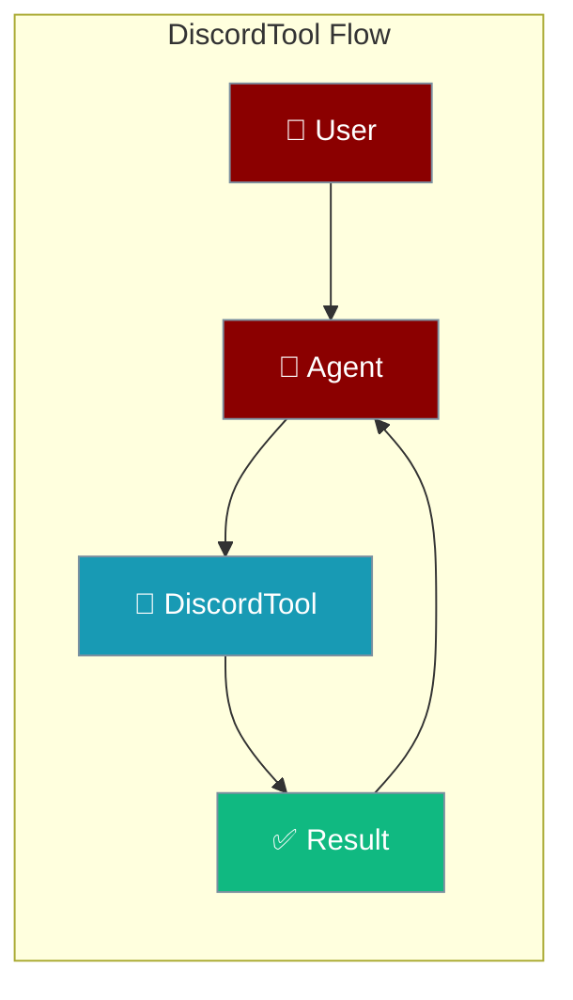
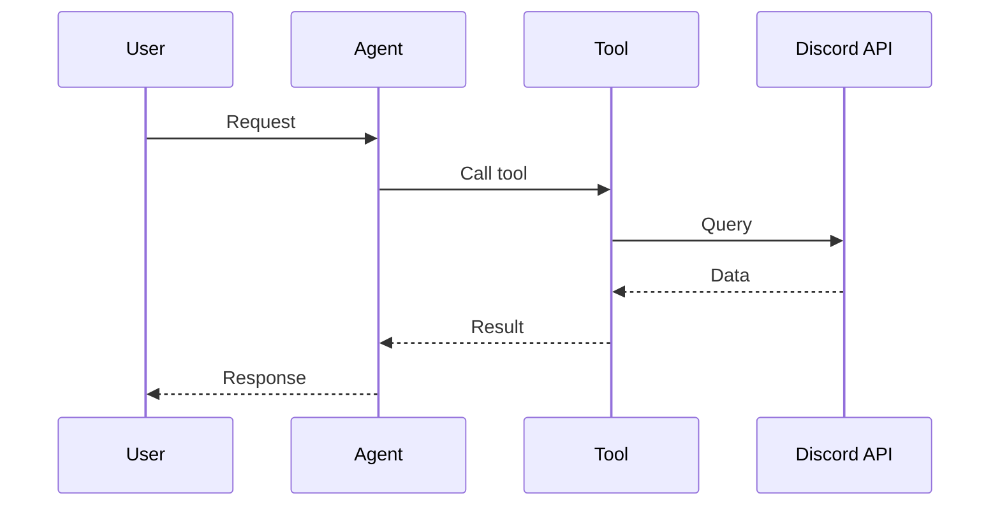

## Overview

Discord tool allows you to send messages via webhooks or bot tokens to Discord servers.

The user asks to post or read messages; the agent calls Discord and returns the outcome.



## Installation

```bash
pip install "praisonai[tools]"
```

## Environment Variables

```bash
export DISCORD_WEBHOOK_URL=https://discord.com/api/webhooks/...
export DISCORD_BOT_TOKEN=your_bot_token  # Optional
```

## Quick Start

<Steps>
<Step title="Simple Usage">
```python
from praisonai_tools import DiscordTool

# Initialize with webhook
discord = DiscordTool(webhook_url="https://discord.com/api/webhooks/...")

# Send message
discord.send_webhook("Hello from PraisonAI!")
```
</Step>
<Step title="With Configuration">
Use the same tool with an agent — see **Usage with Agent** below, or pass env vars and options from the sections above.
</Step>
</Steps>


## Usage with Agent

```python
from praisonaiagents import Agent
from praisonai_tools import DiscordTool

agent = Agent(
    name="DiscordBot",
    instructions="You send notifications to Discord.",
    tools=[DiscordTool()]
)

response = agent.chat("Send an alert to Discord about the new release")
print(response)
```

## Available Methods

### send_webhook(content, username=None)

Send a message via webhook.

```python
from praisonai_tools import DiscordTool

discord = DiscordTool()
discord.send_webhook("Alert: System is down!", username="AlertBot")
```

### send_message(channel_id, content)

Send a message to a channel (requires bot token).

```python
discord.send_message("123456789", "Hello!")
```

## Common Errors

| Error | Cause | Solution |
|-------|-------|----------|
| `DISCORD_WEBHOOK_URL not configured` | Missing webhook | Set environment variable |
| `Invalid webhook` | Wrong URL | Check webhook URL |
| `Rate limited` | Too many messages | Add delays |

## How It Works



---

## Best Practices

<AccordionGroup>
<Accordion title="Store the bot token securely">
Read the Discord token from the environment, never hard-code it in the tool.
</Accordion>
<Accordion title="Scope bot permissions">
Grant the bot only the channels and permissions it needs for the task.
</Accordion>
<Accordion title="Handle rate limits">
Discord returns HTTP 429 under load. Retry with backoff so the agent stays responsive.
</Accordion>
</AccordionGroup>

---

## Related Tools

<CardGroup cols={2}>
  <Card title="Slack" icon="book" href="/docs/tools/external/slack">
    Slack messaging
  </Card>
  <Card title="Telegram" icon="book" href="/docs/tools/external/telegram">
    Telegram bot
  </Card>
  <Card title="Email" icon="book" href="/docs/tools/external/email">
    Email notifications
  </Card>
</CardGroup>

