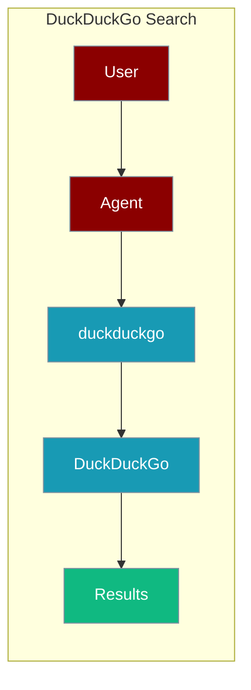
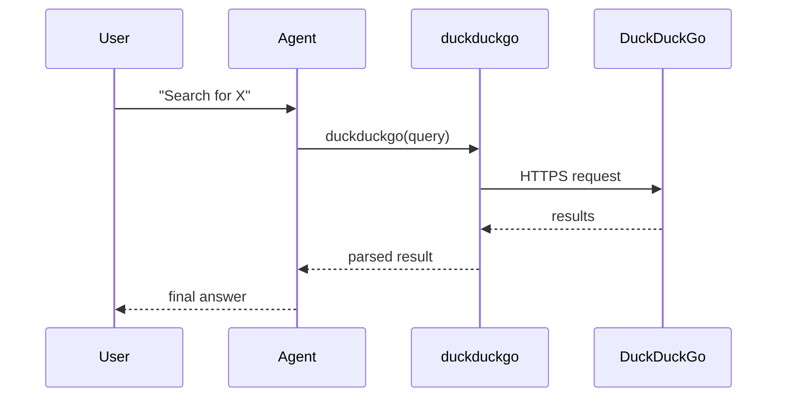

The DuckDuckGo Search tool lets an agent search the web with no API key required.



## Overview

The DuckDuckGo Search tool is a tool that allows you to search the web using the DuckDuckGo search engine.

```bash
pip install praisonaiagents
export OPENAI_API_KEY="${OPENAI_API_KEY:?Set OPENAI_API_KEY in your shell}"
```

```python
from praisonaiagents import Agent, AgentTeam
from praisonaiagents import duckduckgo

data_agent = Agent(instructions="Search and Read Research Papers on DNA Mutation", tools=[duckduckgo])
editor_agent = Agent(instructions="Write a scientifically researched outcome and findings about DNA Mutation")
agents = AgentTeam(agents=[data_agent, editor_agent])
agents.start()
```

## How It Works



## Getting Started

<Steps>
<Step title="Simple Usage">
1. Install dependencies (see **Overview** above)
2. Set required API keys in your environment
3. Run the agent example in **Overview**
</Step>
<Step title="With Configuration">
Use the same tool with an agent — see the **Overview** example, or pass env vars from the sections above.
</Step>
</Steps>

## Best Practices

<AccordionGroup>
<Accordion title="No API key needed">
The built-in `duckduckgo` tool ships with `praisonaiagents` and needs no provider key — only `OPENAI_API_KEY` for the agent's LLM.
</Accordion>

<Accordion title="Cap results with max_results">
The underlying `internet_search(query, max_results=5)` defaults to 5 results. Lower it for faster, cheaper agent loops when you only need the top hits.
</Accordion>

<Accordion title="Retries are built in">
The tool retries up to 3 times with backoff on transient failures. For persistent empty results, fall back to another search tool in the agent's toolset.
</Accordion>
</AccordionGroup>

## Related Tools

<CardGroup cols={2}>
  <Card title="Tavily" icon="book" href="/docs/tools/external/tavily">
    AI-powered search
  </Card>
  <Card title="Brave Search" icon="book" href="/docs/tools/external/brave-search">
    Brave Search API
  </Card>
  <Card title="Serper" icon="book" href="/docs/tools/external/serper">
    Google search API
  </Card>
</CardGroup>

