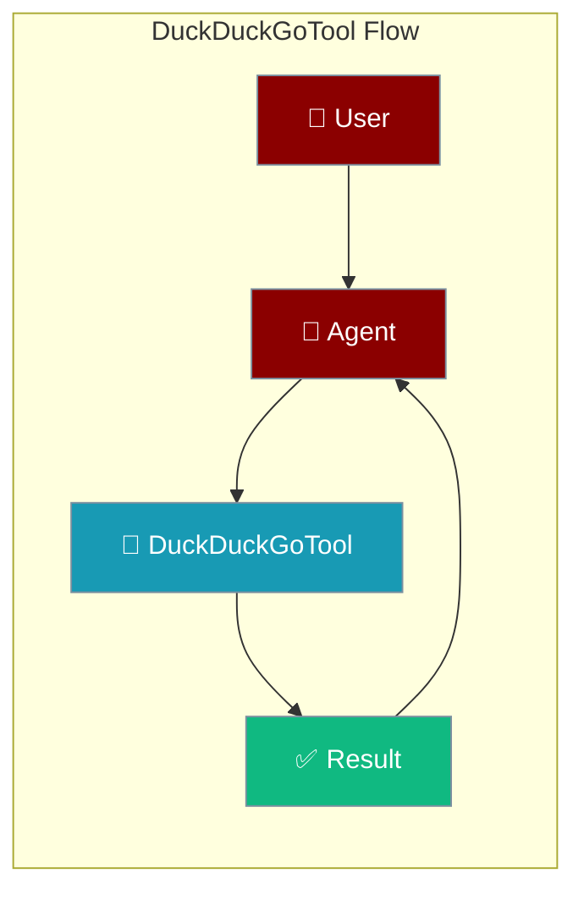
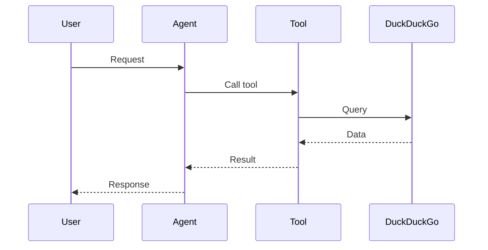

## Overview

DuckDuckGo is a privacy-focused search engine. This tool provides web search, news, and image search capabilities without requiring an API key.

The user asks a question; the agent searches DuckDuckGo and returns relevant results.



## Installation

```bash
pip install "praisonai[tools]"
```

No API key required!

## Quick Start

<Steps>
<Step title="Simple Usage">
```python
from praisonai_tools import DuckDuckGoTool

# Initialize
ddg = DuckDuckGoTool()

# Search
results = ddg.search("Python programming")
print(results)
```
</Step>
<Step title="With Configuration">
Use the same tool with an agent — see **Usage with Agent** below, or pass env vars and options from the sections above.
</Step>
</Steps>


## Usage with Agent

```python
from praisonaiagents import Agent
from praisonai_tools import DuckDuckGoTool

agent = Agent(
    name="Researcher",
    instructions="You are a research assistant. Use DuckDuckGo to search for information.",
    tools=[DuckDuckGoTool()]
)

response = agent.chat("Search for the latest Python tutorials")
print(response)
```

## Available Methods

### search(query, max_results=5)

Search the web.

```python
from praisonai_tools import DuckDuckGoTool

ddg = DuckDuckGoTool()
results = ddg.search("machine learning basics", max_results=3)

# Returns:
# [
#     {"title": "...", "url": "...", "snippet": "..."},
#     ...
# ]
```

### news(query, max_results=5)

Get news articles.

```python
news = ddg.news("AI technology", max_results=5)

# Returns:
# [
#     {"title": "...", "url": "...", "source": "...", "date": "...", "snippet": "..."},
#     ...
# ]
```

### images(query, max_results=5)

Search for images.

```python
images = ddg.images("cute cats", max_results=3)

# Returns:
# [
#     {"title": "...", "image_url": "...", "thumbnail": "...", "source": "..."},
#     ...
# ]
```

## Configuration Options

```python
ddg = DuckDuckGoTool(
    proxy="socks5://localhost:9050",  # Optional: use proxy
    timeout=10                         # Request timeout in seconds
)
```

## Function-Based Usage

```python
from praisonai_tools import duckduckgo_search

# Quick search without instantiating class
results = duckduckgo_search("latest tech news", max_results=5)
```

## CLI Usage

```bash
# Use with praisonai (no API key needed)
praisonai --tools DuckDuckGoTool "Search for Python best practices"
```

## Error Handling

```python
from praisonai_tools import DuckDuckGoTool

ddg = DuckDuckGoTool()
results = ddg.search("my query")

if results and "error" in results[0]:
    print(f"Error: {results[0]['error']}")
else:
    for r in results:
        print(f"- {r['title']}: {r['url']}")
```

## Common Errors

| Error | Cause | Solution |
|-------|-------|----------|
| `duckduckgo-search not installed` | Missing dependency | Run `pip install duckduckgo-search` |
| `RatelimitException` | Too many requests | Add delay between requests or use proxy |
| `TimeoutException` | Request timeout | Increase timeout or check network |

## Advantages

- **No API key required** - Works out of the box
- **Privacy-focused** - No tracking
- **Multiple search types** - Web, news, images
- **Free** - No usage limits (respect rate limits)

## How It Works



---

## Best Practices

<AccordionGroup>
<Accordion title="No API key needed">
DuckDuckGo works without credentials — ideal for quick prototypes and privacy-sensitive use.
</Accordion>
<Accordion title="Cap result count">
Request a small number of results so the agent processes fewer tokens and answers faster.
</Accordion>
<Accordion title="Fall back on failure">
Wrap the search in error handling so the agent can switch to another search tool if a request fails.
</Accordion>
</AccordionGroup>

---

## Related Tools

<CardGroup cols={2}>
  <Card title="Tavily" icon="book" href="/docs/tools/external/tavily">
    AI-powered search
  </Card>
  <Card title="Exa" icon="book" href="/docs/tools/external/exa">
    Neural search engine
  </Card>
  <Card title="Serper" icon="book" href="/docs/tools/external/serper">
    Google search API
  </Card>
</CardGroup>

