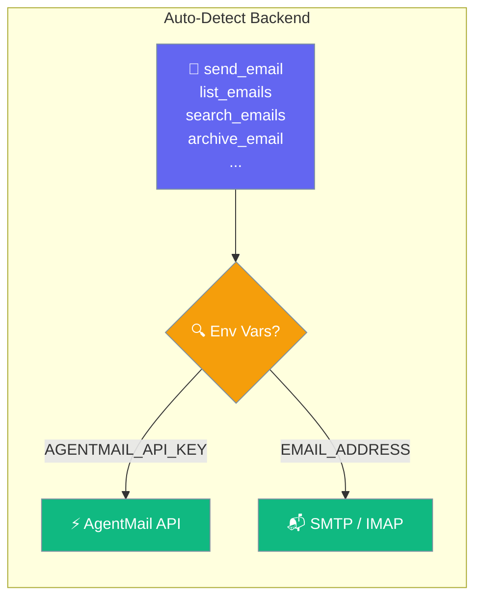
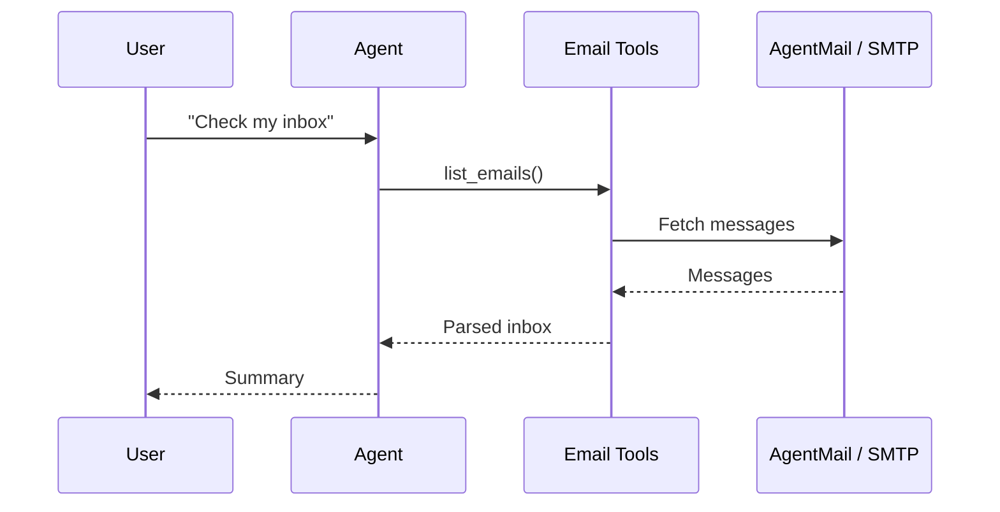

Give your agents email superpowers. Just set env vars — tools auto-detect the right backend.

```python
from praisonaiagents import Agent
from praisonai_tools import EmailTool

agent = Agent(name="InboxAssistant", tools=[EmailTool()])
agent.start("Check my inbox for unread messages from Bob")
```

The user asks about mail; the agent reads or sends email through the configured inbox tool.



## Quick Start

<Steps>
<Step title="Simple Usage">
```python
from praisonaiagents import Agent
from praisonaiagents.tools.email_tools import send_email, list_emails, search_emails, archive_email

agent = Agent(
    name="EmailAgent",
    instructions="You help send and manage emails.",
    tools=[send_email, list_emails, search_emails, archive_email]
)

agent.start("Check my inbox for unread messages from Bob")
```

Set **either** backend via env vars — same code works for both:

<Tabs>
<Tab title="AgentMail (API)">
```bash
export AGENTMAIL_API_KEY="am_..."
export AGENTMAIL_INBOX_ID="you@agentmail.to"
```
</Tab>

<Tab title="Gmail / Outlook (SMTP)">
```bash
export EMAIL_ADDRESS="you@gmail.com"
export EMAIL_PASSWORD="xxxx xxxx xxxx xxxx"  # App Password
```
</Tab>
</Tabs>

---
</Step>
<Step title="With Configuration">
Use the same tool with an agent — see **Usage with Agent** below, or pass env vars and options from the sections above.
</Step>
</Steps>


## Available Tools

### Auto-Detect Tools (Recommended)

These work with **both** backends. Just set env vars and go.

| Tool | Signature | AgentMail | SMTP/IMAP |
|------|-----------|:---------:|:---------:|
| `send_email` | `(to, subject, body)` | ✅ API | ✅ SMTP |
| `list_emails` | `(limit=10)` | ✅ API | ✅ IMAP |
| `read_email` | `(message_id)` | ✅ API | ✅ IMAP |
| `reply_email` | `(message_id, body)` | ✅ API | ✅ SMTP (In-Reply-To) |
| `search_emails` | `(query, from_addr, subject, label, after_date, before_date, limit)` | ✅ label/date | ✅ text/from/subject |
| `archive_email` | `(message_id)` | ✅ label toggle | ✅ Gmail→All Mail |
| `draft_email` | `(to, subject, body)` | ✅ drafts API | ✅ IMAP APPEND |
| `forward_email` | `(message_id, to, note)` | ✅ API | ❌ (graceful fallback) |
| `send_draft` | `(draft_id)` | ✅ drafts API | ❌ (graceful fallback) |

### AgentMail-Only Tools

| Tool | Signature | Description |
|------|-----------|-------------|
| `list_inboxes` | `()` | List all inboxes for this API key |
| `create_inbox` | `(display_name)` | Create a new inbox |

<Info>
When a tool isn't supported on the active backend, it returns a friendly fallback message — no errors.
</Info>

---

## Using Tool Profiles

```python
from praisonaiagents import Agent
from praisonaiagents.tools import resolve_profiles

# AgentMail tools (send, list, read, reply)
agent = Agent(tools=resolve_profiles("email"))

# SMTP/IMAP tools (backward-compat aliases)
agent = Agent(tools=resolve_profiles("smtp_email"))
```

---

## Backward-Compatible Aliases

These still work but the auto-detect tools above are preferred:

| Alias | Maps To |
|-------|---------|
| `smtp_send_email` | `_smtp_send_email` (SMTP only) |
| `smtp_read_inbox` | `_smtp_list_emails` (IMAP only) |
| `smtp_search_inbox` | `_smtp_search_emails` (IMAP only) |
| `smtp_archive_email` | `_smtp_archive_email` (IMAP only) |
| `smtp_draft_email` | `_smtp_draft_email` (IMAP only) |

---

## Environment Variables

| Variable | Backend | Default | Description |
|----------|---------|---------|-------------|
| `AGENTMAIL_API_KEY` | AgentMail | — | API key from [agentmail.to](https://agentmail.to) |
| `AGENTMAIL_INBOX_ID` | AgentMail | — | Inbox email address |
| `EMAIL_ADDRESS` | SMTP/IMAP | — | Your email address |
| `EMAIL_PASSWORD` | SMTP/IMAP | — | App Password (recommended) |
| `EMAIL_SMTP_SERVER` | SMTP/IMAP | Auto-detected | SMTP server hostname |
| `EMAIL_IMAP_SERVER` | SMTP/IMAP | Auto-detected | IMAP server hostname |

<Note>
If both `AGENTMAIL_API_KEY` and `EMAIL_ADDRESS` are set, AgentMail is preferred.
</Note>

---

## Gmail Setup

1. Enable 2-Factor Authentication
2. Generate App Password at [Google Account](https://myaccount.google.com/apppasswords)
3. Use App Password as `EMAIL_PASSWORD`

---

## How It Works



---

## Best Practices

<AccordionGroup>
<Accordion title="Use App Passwords, not your login">
For Gmail and Outlook, generate an App Password and set it as `EMAIL_PASSWORD`. Never store your real account password.
</Accordion>
<Accordion title="Let auto-detect pick the backend">
Set the env vars for one backend and use the auto-detect tools — the same agent code works for AgentMail or SMTP/IMAP.
</Accordion>
<Accordion title="Scope inbox access">
Give the agent only the email tools it needs. A read-only assistant should not include `send_email`.
</Accordion>
<Accordion title="Filter searches">
Use `search_emails` with `from_addr`, `subject`, or date filters so the agent processes a focused set of messages.
</Accordion>
</AccordionGroup>

---

## Related

<CardGroup cols={2}>
<Card title="Email Bot" icon="robot" href="/docs/features/email-bot">
  Deploy always-on email bots with event-driven modes
</Card>
<Card title="Messaging Bots" icon="comments" href="/docs/features/messaging-bots">
  All supported messaging platforms
</Card>
</CardGroup>
