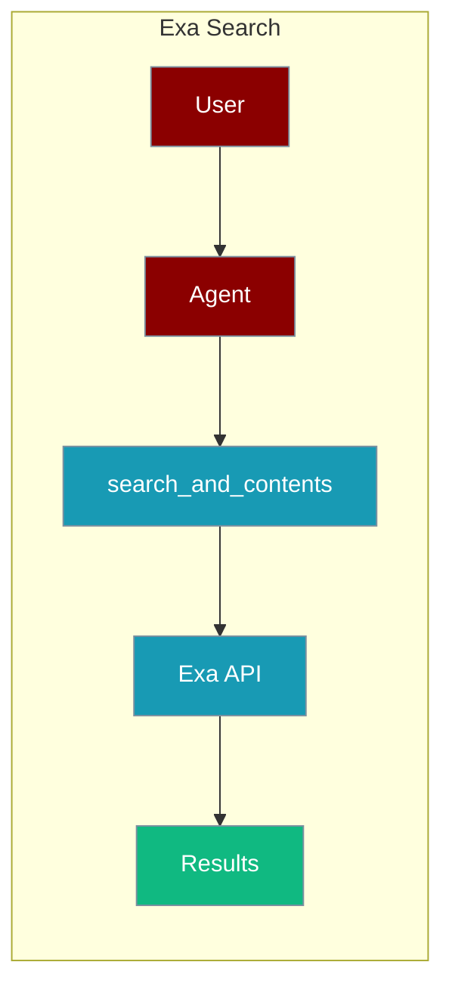
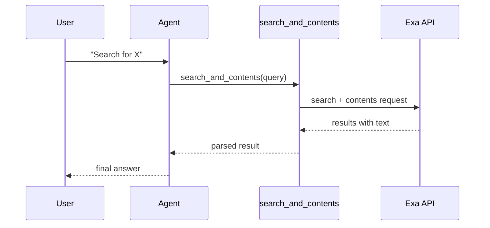

The Exa Search tool lets an agent run neural web search and retrieve page contents through the Exa API.



## Overview

The Exa Search tool is a tool that allows you to search the web and retrieve content using the Exa API.

```bash
pip install praisonaiagents exa-py
export EXA_API_KEY="${EXA_API_KEY:?Set EXA_API_KEY in your shell}"
export OPENAI_API_KEY="${OPENAI_API_KEY:?Set OPENAI_API_KEY in your shell}"
```

```python
from praisonaiagents import Agent, AgentTeam
from exa_py import Exa
import os

exa = Exa(api_key=os.environ["EXA_API_KEY"])

def search_and_contents(query: str):
    """Search for webpages based on the query and retrieve their contents."""
    # This combines two API endpoints: search and contents retrieval
    return str(exa.search_and_contents(
        query, use_autoprompt=False, num_results=5, text=True, highlights=True
    ))

data_agent = Agent(instructions="Find the latest jobs for Video Editor in New York at startups", tools=[search_and_contents])
editor_agent = Agent(instructions="Curate the available jobs at startups and their email for the candidate to apply based on his skills on Canva, Adobe Premiere Pro, and Adobe After Effects")
agents = AgentTeam(agents=[data_agent, editor_agent], process='hierarchical')
agents.start()
```

## How It Works



## Getting Started

<Steps>
<Step title="Simple Usage">
1. Install dependencies (see **Overview** above)
2. Set required API keys in your environment
3. Run the agent example in **Overview**
</Step>
<Step title="With Configuration">
Use the same tool with an agent — see the **Overview** example, or pass env vars from the sections above.
</Step>
</Steps>

## Best Practices

<AccordionGroup>
<Accordion title="Keep the API key in the environment">
Read the key with `os.environ["EXA_API_KEY"]` and set it in your shell or `.env`. Never hard-code it in the tool function.
</Accordion>

<Accordion title="Cap num_results">
`search_and_contents` accepts `num_results=5`. Keep it low so the agent processes fewer tokens — raising it retrieves full page text for every hit.
</Accordion>

<Accordion title="Handle rate limits">
Exa returns HTTP 429 when the plan quota is exceeded. Wrap the call in `try/except` so the agent can fall back to another search tool instead of crashing.
</Accordion>
</AccordionGroup>

## Related Tools

<CardGroup cols={2}>
  <Card title="Exa" icon="book" href="/docs/tools/external/exa">
    Neural search (praisonai-tools)
  </Card>
  <Card title="Tavily" icon="book" href="/docs/tools/external/tavily">
    AI-powered search
  </Card>
  <Card title="Serper" icon="book" href="/docs/tools/external/serper">
    Google search API
  </Card>
</CardGroup>

