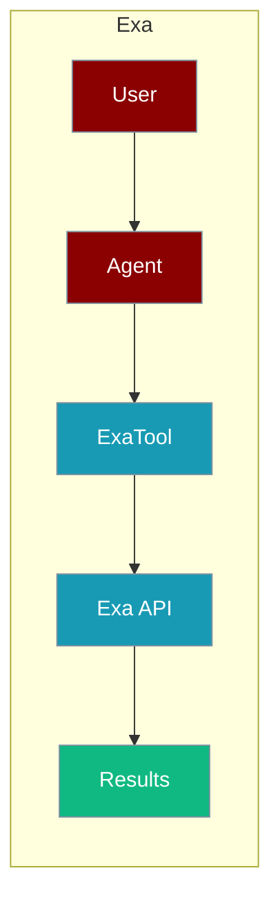
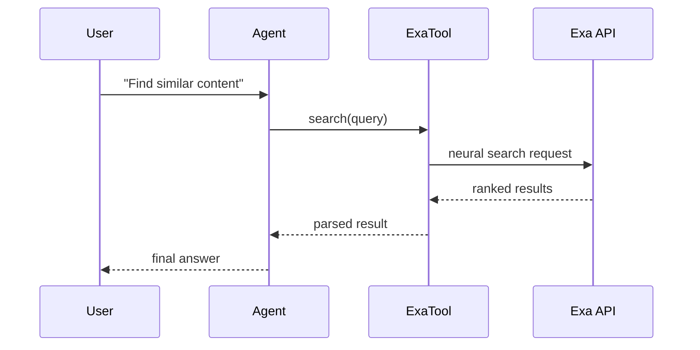

Exa is a neural search engine that finds semantically similar content for your agents.



## Overview

Exa is a neural search engine that uses embeddings to find semantically similar content. It's particularly good at finding content that matches the meaning of your query.

## Installation

```bash
pip install "praisonai[tools]"
```

## Environment Variables

```bash
export EXA_API_KEY="${EXA_API_KEY:?Set EXA_API_KEY in your shell}"
```

Get your API key from [Exa](https://exa.ai/).

## How It Works



## Quick Start

<Steps>
<Step title="Simple Usage">
```python
from praisonai_tools import ExaTool

# Initialize
exa = ExaTool()

# Search
results = exa.search("best practices for Python development")
print(results)
```
</Step>
<Step title="With Configuration">
Use the same tool with an agent — see **Usage with Agent** below, or pass env vars and options from the sections above.
</Step>
</Steps>


## Usage with Agent

```python
from praisonaiagents import Agent
from praisonai_tools import ExaTool

agent = Agent(
    name="Researcher",
    instructions="You are a research assistant. Use Exa to find relevant content.",
    tools=[ExaTool()]
)

response = agent.chat("Find articles about machine learning best practices")
print(response)
```

## Available Methods

### search(query, num_results=10)

Search for content using neural search.

```python
from praisonai_tools import ExaTool

exa = ExaTool()
results = exa.search("transformer architecture explained", num_results=5)

# Returns:
# [
#     {"title": "...", "url": "...", "snippet": "...", "score": 0.95},
#     ...
# ]
```

### find_similar(url, num_results=10)

Find content similar to a given URL.

```python
similar = exa.find_similar("https://example.com/article", num_results=5)
```

### get_contents(urls)

Get full content from URLs.

```python
contents = exa.get_contents(["https://example.com/article1", "https://example.com/article2"])
```

## Configuration Options

```python
exa = ExaTool(
    api_key="your_key",           # Optional: defaults to EXA_API_KEY
    use_autoprompt=True,          # Auto-optimize queries
    type="neural"                 # "neural" or "keyword"
)
```

## Function-Based Usage

```python
from praisonai_tools import exa_search

# Quick search without instantiating class
results = exa_search("AI safety research", num_results=5)
```

## CLI Usage

```bash
# Set API key
export EXA_API_KEY=your_key

# Use with praisonai
praisonai --tools ExaTool "Find articles about reinforcement learning"
```

## Error Handling

```python
from praisonai_tools import ExaTool

exa = ExaTool()
results = exa.search("my query")

if results and "error" in results[0]:
    print(f"Error: {results[0]['error']}")
else:
    for r in results:
        print(f"- {r['title']}: {r['url']}")
```

## Common Errors

| Error | Cause | Solution |
|-------|-------|----------|
| `EXA_API_KEY not configured` | Missing API key | Set environment variable |
| `exa not installed` | Missing dependency | Run `pip install exa-py` |
| `Rate limited` | Too many requests | Add delays between requests |

## Best Practices

<AccordionGroup>
<Accordion title="Let EXA_API_KEY come from the environment">
`ExaTool()` defaults to the `EXA_API_KEY` env var. Set it in your shell or `.env` instead of passing `api_key=` inline.
</Accordion>

<Accordion title="Cap num_results">
`search(query, num_results=10)` defaults to 10. Lower it for faster, cheaper agent loops when you only need the top matches.
</Accordion>

<Accordion title="Handle rate limits">
Exa returns a rate-limited response under heavy use. Check for an `error` key in results and fall back to another search tool so the agent degrades gracefully.
</Accordion>
</AccordionGroup>

## Related Tools

<CardGroup cols={2}>
  <Card title="Tavily" icon="book" href="/docs/tools/external/tavily">
    AI-powered search
  </Card>
  <Card title="DuckDuckGo" icon="book" href="/docs/tools/external/duckduckgo">
    Privacy-focused search
  </Card>
  <Card title="Serper" icon="book" href="/docs/tools/external/serper">
    Google search API
  </Card>
</CardGroup>

