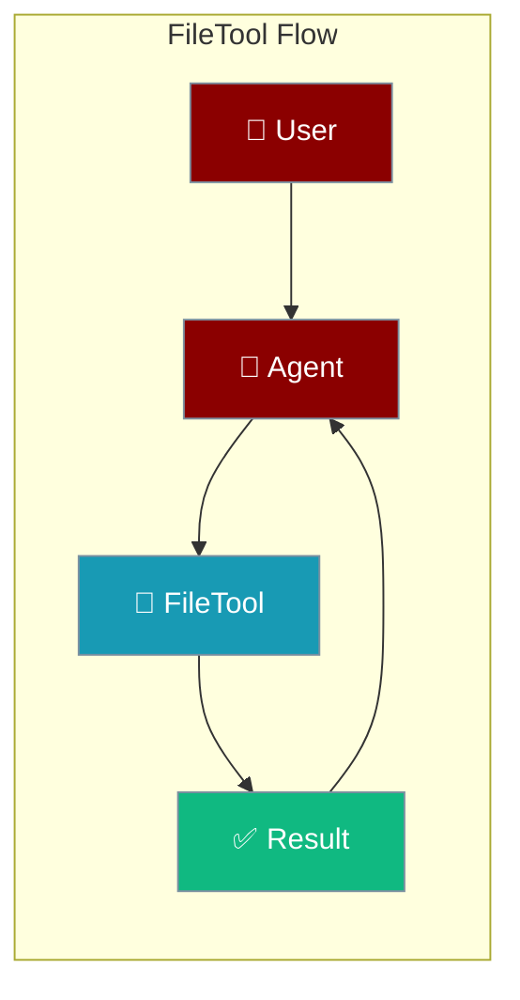
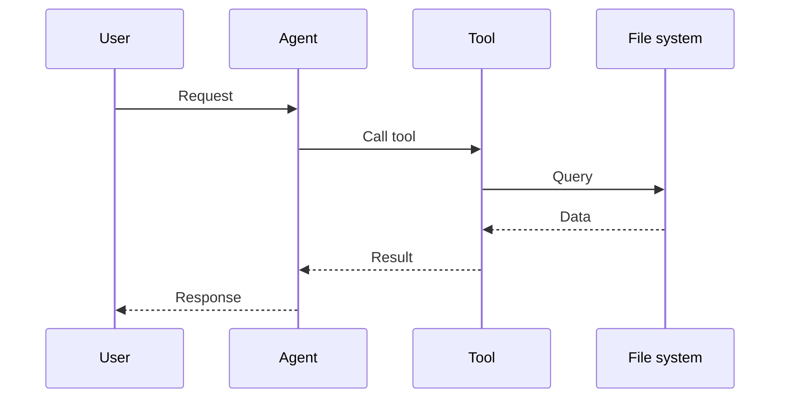

## Overview

File tool allows you to read, write, and manage files from your AI agents.

The user asks to read or write a file; the agent performs the operation and returns the result.



## Installation

```bash
pip install "praisonai[tools]"
```

## Quick Start

<Steps>
<Step title="Simple Usage">
```python
from praisonai_tools import FileTool

# Initialize
file = FileTool()

# Read file
content = file.read("document.txt")
print(content)
```
</Step>
<Step title="With Configuration">
Use the same tool with an agent — see **Usage with Agent** below, or pass env vars and options from the sections above.
</Step>
</Steps>


## Usage with Agent

```python
from praisonaiagents import Agent
from praisonai_tools import FileTool

agent = Agent(
    name="FileManager",
    instructions="You help manage files.",
    tools=[FileTool()]
)

response = agent.chat("Read the contents of config.json")
print(response)
```

## Available Methods

### read(path)

Read file contents.

```python
from praisonai_tools import FileTool

file = FileTool()
content = file.read("data.txt")
```

### write(path, content)

Write content to a file.

```python
file.write("output.txt", "Hello World!")
```

### list_dir(path)

List directory contents.

```python
files = file.list_dir("./documents")
```

## Common Errors

| Error | Cause | Solution |
|-------|-------|----------|
| `File not found` | Invalid path | Check file path |
| `Permission denied` | No access | Check permissions |

## How It Works



---

## Best Practices

<AccordionGroup>
<Accordion title="Use absolute paths">
Pass absolute paths so file operations are predictable regardless of the working directory.
</Accordion>
<Accordion title="Confirm before overwriting">
Check for existing files before `write` to avoid data loss.
</Accordion>
<Accordion title="Restrict to a safe directory">
Limit file operations to a known workspace so the agent can't touch sensitive paths.
</Accordion>
</AccordionGroup>

---

## Related Tools

<CardGroup cols={2}>
  <Card title="JSON" icon="book" href="/docs/tools/external/json">
    JSON files
  </Card>
  <Card title="CSV" icon="book" href="/docs/tools/external/csv">
    CSV files
  </Card>
  <Card title="Shell" icon="book" href="/docs/tools/external/shell">
    Shell commands
  </Card>
</CardGroup>

