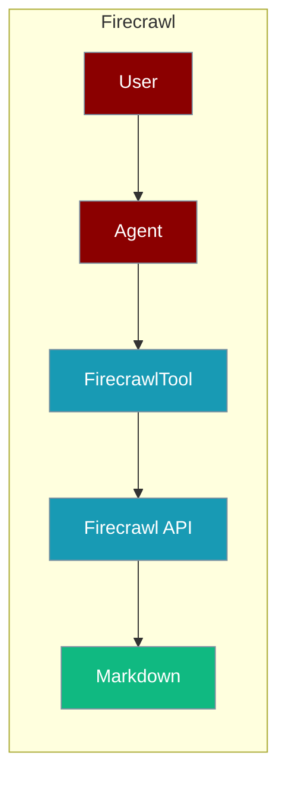
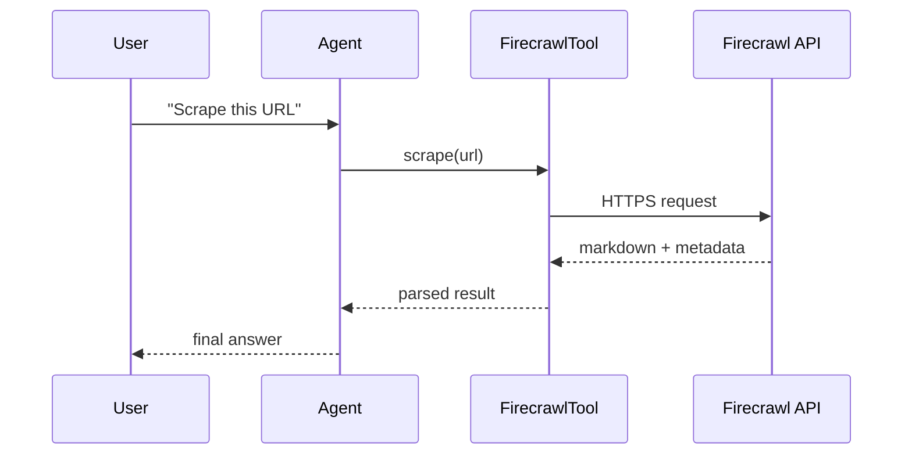

Firecrawl lets an agent scrape and crawl websites into clean, LLM-ready markdown.



## Overview

Firecrawl is a powerful web scraping API that converts websites into clean, LLM-ready markdown or structured data.

## Installation

```bash
pip install "praisonai[tools]"
```

## Environment Variables

```bash
export FIRECRAWL_API_KEY="${FIRECRAWL_API_KEY:?Set FIRECRAWL_API_KEY in your shell}"
```

Get your API key from [Firecrawl](https://firecrawl.dev/).

## How It Works



## Quick Start

<Steps>
<Step title="Simple Usage">
```python
from praisonai_tools import FirecrawlTool

# Initialize
firecrawl = FirecrawlTool()

# Scrape a page
result = firecrawl.scrape("https://example.com")
print(result)
```
</Step>
<Step title="With Configuration">
Use the same tool with an agent — see **Usage with Agent** below, or pass env vars and options from the sections above.
</Step>
</Steps>


## Usage with Agent

```python
from praisonaiagents import Agent
from praisonai_tools import FirecrawlTool

agent = Agent(
    name="WebScraper",
    instructions="You are a web scraping assistant. Use Firecrawl to extract content.",
    tools=[FirecrawlTool()]
)

response = agent.chat("Scrape the content from https://praison.ai/docs")
print(response)
```

## Available Methods

### scrape(url)

Scrape a single URL and get markdown content.

```python
from praisonai_tools import FirecrawlTool

firecrawl = FirecrawlTool()
result = firecrawl.scrape("https://example.com")

# Returns:
# {
#     "url": "https://example.com",
#     "markdown": "# Example Domain\n\nThis domain is...",
#     "metadata": {...}
# }
```

### crawl(url, limit=10)

Crawl a website and get multiple pages.

```python
results = firecrawl.crawl("https://docs.example.com", limit=5)

# Returns list of scraped pages
```

## Configuration Options

```python
firecrawl = FirecrawlTool(
    api_key="your_key",           # Optional: defaults to FIRECRAWL_API_KEY
    formats=["markdown", "html"], # Output formats
    only_main_content=True        # Extract only main content
)
```

## Function-Based Usage

```python
from praisonai_tools import firecrawl_scrape

# Quick scrape without instantiating class
result = firecrawl_scrape("https://example.com")
```

## CLI Usage

```bash
# Set API key
export FIRECRAWL_API_KEY=your_key

# Use with praisonai
praisonai --tools FirecrawlTool "Scrape the content from https://example.com"
```

## Error Handling

```python
from praisonai_tools import FirecrawlTool

firecrawl = FirecrawlTool()
result = firecrawl.scrape("https://example.com")

if "error" in result:
    print(f"Error: {result['error']}")
else:
    print(f"Content: {result['markdown'][:500]}")
```

## Common Errors

| Error | Cause | Solution |
|-------|-------|----------|
| `FIRECRAWL_API_KEY not configured` | Missing API key | Set environment variable |
| `firecrawl not installed` | Missing dependency | Run `pip install firecrawl-py` |
| `Rate limited` | Too many requests | Upgrade plan or add delays |

## Best Practices

<AccordionGroup>
<Accordion title="Let FIRECRAWL_API_KEY come from the environment">
`FirecrawlTool()` defaults to the `FIRECRAWL_API_KEY` env var. Set it in your shell or `.env` rather than passing `api_key=` inline.
</Accordion>

<Accordion title="Limit crawl scope">
`crawl(url, limit=10)` follows links up to the limit. Keep it small so the agent does not pull an entire site into context.
</Accordion>

<Accordion title="Handle rate limits">
Firecrawl returns HTTP 429 when the plan quota is exceeded. Check for an `error` key in the result and back off or fall back to another scraper.
</Accordion>
</AccordionGroup>

## Related Tools

<CardGroup cols={2}>
  <Card title="Crawl4AI" icon="book" href="/docs/tools/external/crawl4ai">
    Open-source crawler
  </Card>
  <Card title="Spider" icon="book" href="/docs/tools/external/spider">
    Fast web crawler
  </Card>
  <Card title="Jina" icon="book" href="/docs/tools/external/jina">
    Reader API
  </Card>
</CardGroup>

