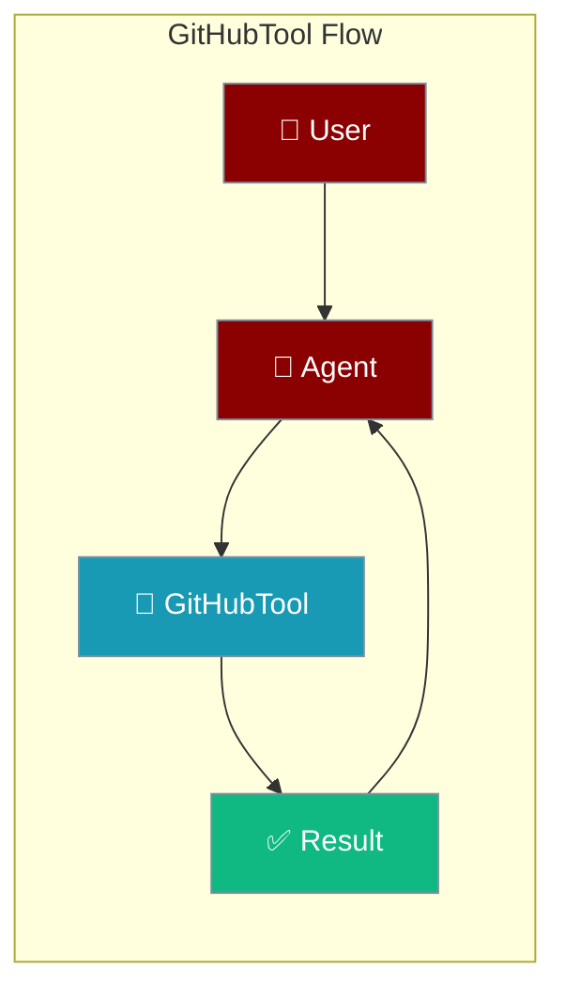
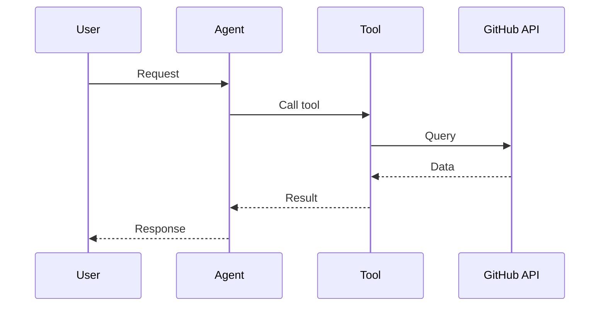

## Overview

GitHub tool allows you to search repositories, manage issues, and interact with GitHub's API.

The user asks about a repo or issue; the agent calls the GitHub API and returns the answer.



## Installation

```bash
pip install "praisonai[tools]"
```

## Environment Variables

```bash
export GITHUB_TOKEN=your_personal_access_token
```

Get your token from [GitHub Settings](https://github.com/settings/tokens).

## Quick Start

<Steps>
<Step title="Simple Usage">
```python
from praisonai_tools import GitHubTool

# Initialize
github = GitHubTool()

# Search repos
results = github.search_repos("machine learning python")
print(results)
```
</Step>
<Step title="With Configuration">
Use the same tool with an agent — see **Usage with Agent** below, or pass env vars and options from the sections above.
</Step>
</Steps>


## Usage with Agent

```python
from praisonaiagents import Agent
from praisonai_tools import GitHubTool

agent = Agent(
    name="DevAssistant",
    instructions="You help with GitHub tasks.",
    tools=[GitHubTool()]
)

response = agent.chat("Find popular Python AI frameworks on GitHub")
print(response)
```

## Available Methods

### search_repos(query, limit=10)

Search GitHub repositories.

```python
from praisonai_tools import GitHubTool

github = GitHubTool()
repos = github.search_repos("langchain", limit=5)
```

### get_repo(owner, repo)

Get repository details.

```python
repo = github.get_repo("MervinPraison", "PraisonAI")
```

### list_issues(owner, repo, state="open")

List repository issues.

```python
issues = github.list_issues("MervinPraison", "PraisonAI", state="open")
```

### create_issue(owner, repo, title, body)

Create a new issue.

```python
github.create_issue("owner", "repo", "Bug: Something broken", "Description here")
```

## Common Errors

| Error | Cause | Solution |
|-------|-------|----------|
| `GITHUB_TOKEN not configured` | Missing token | Set environment variable |
| `Rate limited` | Too many requests | Use authenticated requests |
| `Not found` | Repo doesn't exist | Check owner/repo name |

## How It Works



---

## Best Practices

<AccordionGroup>
<Accordion title="Use a scoped token">
Read the GitHub token from the environment and grant only the scopes the task needs.
</Accordion>
<Accordion title="Handle rate limits">
GitHub throttles unauthenticated and heavy requests. Authenticate and retry with backoff.
</Accordion>
<Accordion title="Paginate large results">
Fetch issues and commits in pages so the agent processes manageable chunks.
</Accordion>
</AccordionGroup>

---

## Related Tools

<CardGroup cols={2}>
  <Card title="Bitbucket" icon="book" href="/docs/tools/external/bitbucket">
    Bitbucket repos
  </Card>
  <Card title="Linear" icon="book" href="/docs/tools/external/linear">
    Issue tracking
  </Card>
  <Card title="Jira" icon="book" href="/docs/tools/jira">
    Project management
  </Card>
</CardGroup>

