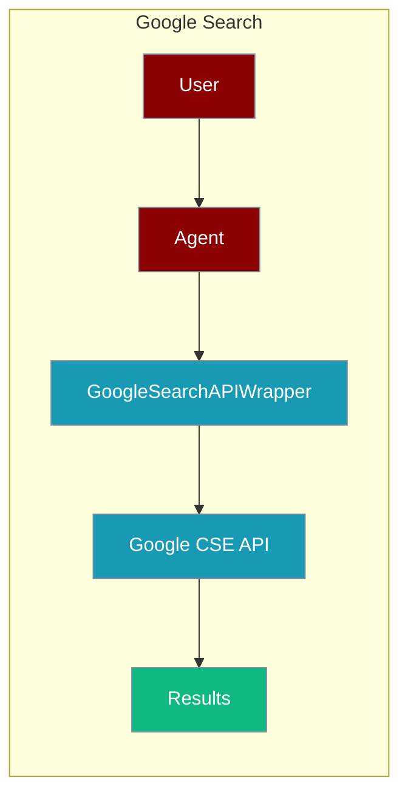
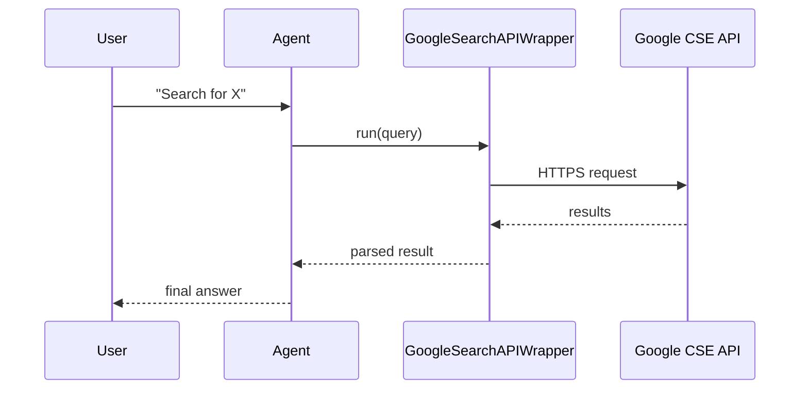

The GoogleSearch tool lets an agent search the web through Google's Programmable Search Engine.



## Overview
The GoogleSearch tool is a tool that allows you to search the web using the GoogleSearch API.

```bash
pip install langchain-community langchain-google-community
``` 

```bash
export GOOGLE_CSE_ID="${GOOGLE_CSE_ID:?Set GOOGLE_CSE_ID in your shell}"
export GOOGLE_API_KEY="${GOOGLE_API_KEY:?Set GOOGLE_API_KEY in your shell}"
```

```python
import os 
from langchain_google_community import GoogleSearchAPIWrapper
from praisonaiagents import Agent, AgentTeam

data_agent = Agent(instructions="Search about best places to visit in India during Summer", tools=[GoogleSearchAPIWrapper])
editor_agent = Agent(instructions="Write a blog article")
agents = AgentTeam(agents=[data_agent, editor_agent], process='hierarchical')
agents.start()
```

Generate your GoogleSearch API key from Google CloudConsole by clicking on [Create Credentials](https://console.cloud.google.com/apis/credentials)
To get a CSE ID, Create a Google Programmable Search Engine [here](https://programmablesearchengine.google.com/)
From the Overview of your newly created search engine copy the "Search engine ID"

## How It Works



## Getting Started

<Steps>
<Step title="Simple Usage">
1. Install dependencies (see **Overview** above)
2. Set required API keys in your environment
3. Run the agent example in **Overview**
</Step>
<Step title="With Configuration">
Use the same tool with an agent — see the **Overview** example, or pass env vars from the sections above.
</Step>
</Steps>

## Best Practices

<AccordionGroup>
<Accordion title="Keep credentials in the environment">
Set `GOOGLE_API_KEY` and `GOOGLE_CSE_ID` in your shell or `.env`. `GoogleSearchAPIWrapper` reads them automatically — never hard-code them.
</Accordion>

<Accordion title="Watch the daily quota">
The Programmable Search API has a free daily query cap. Cache repeated queries and cap results so agents do not exhaust the quota mid-task.
</Accordion>

<Accordion title="Handle empty or blocked results">
Some queries return no results or hit quota errors. Wrap the call in `try/except` so the agent can fall back to another search tool.
</Accordion>
</AccordionGroup>

## Related Tools

<CardGroup cols={2}>
  <Card title="Serper" icon="book" href="/docs/tools/external/serper">
    Google search API
  </Card>
  <Card title="Google Serper Search" icon="book" href="/docs/tools/external/google-serper-search">
    LangChain Serper wrapper
  </Card>
  <Card title="Tavily" icon="book" href="/docs/tools/external/tavily">
    AI-powered search
  </Card>
</CardGroup>

