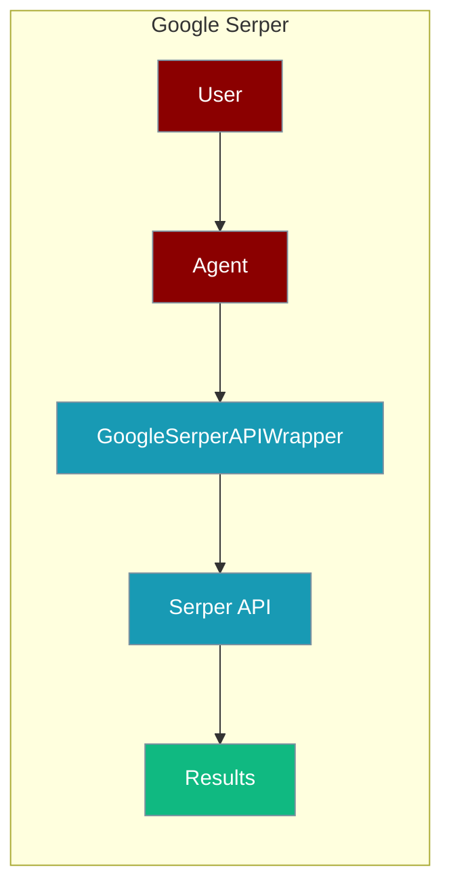
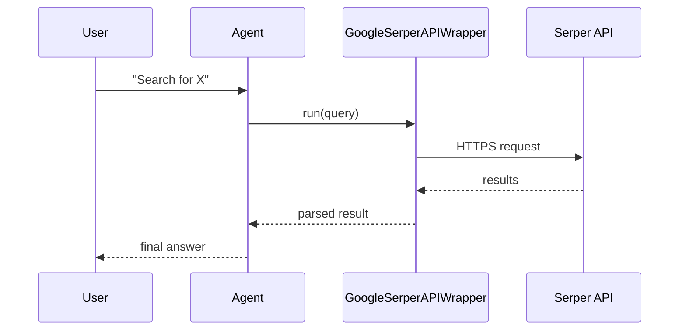

The Google Serper Search tool lets an agent query Google results through the Serper API.



## Overview

The Google Serper Search tool is a tool that allows you to search the web using the Google Serper API.

```bash
pip install langchain-community python-dotenv
export SERPER_API_KEY="${SERPER_API_KEY:?Set SERPER_API_KEY in your shell}"
export OPENAI_API_KEY="${OPENAI_API_KEY:?Set OPENAI_API_KEY in your shell}"
```

```python
from praisonaiagents import Agent, AgentTeam
from langchain_community.utilities import GoogleSerperAPIWrapper
import os
from dotenv import load_dotenv

load_dotenv()

os.environ['SERPER_API_KEY'] = os.getenv('SERPER_API_KEY')

search = GoogleSerperAPIWrapper()

data_agent = Agent(instructions="Suggest me top 5 most visited websites for Dosa Recipe", tools=[search])
editor_agent = Agent(instructions="List out the websites with their url and a short description")
agents = AgentTeam(agents=[data_agent, editor_agent])
agents.start()
```

## How It Works



## Getting Started

<Steps>
<Step title="Simple Usage">
1. Install dependencies (see **Overview** above)
2. Set required API keys in your environment
3. Run the agent example in **Overview**
</Step>
<Step title="With Configuration">
Use the same tool with an agent — see the **Overview** example, or pass env vars from the sections above.
</Step>
</Steps>

## Best Practices

<AccordionGroup>
<Accordion title="Keep SERPER_API_KEY in the environment">
Set `SERPER_API_KEY` in your shell or `.env`. `GoogleSerperAPIWrapper` reads it automatically — never hard-code the key.
</Accordion>

<Accordion title="Reuse one wrapper instance">
Create a single `GoogleSerperAPIWrapper()` and pass it to the agent. It is cheaper than re-instantiating per call.
</Accordion>

<Accordion title="Handle rate limits">
Serper returns HTTP 429 when the plan quota is exceeded. Wrap the call in `try/except` so the agent can degrade to another search tool.
</Accordion>
</AccordionGroup>

## Related Tools

<CardGroup cols={2}>
  <Card title="Serper" icon="book" href="/docs/tools/external/serper">
    Google search API
  </Card>
  <Card title="Google Search" icon="book" href="/docs/tools/external/google-search">
    LangChain Google search
  </Card>
  <Card title="Serp Search" icon="book" href="/docs/tools/external/serp-search">
    SerpAPI wrapper
  </Card>
</CardGroup>

