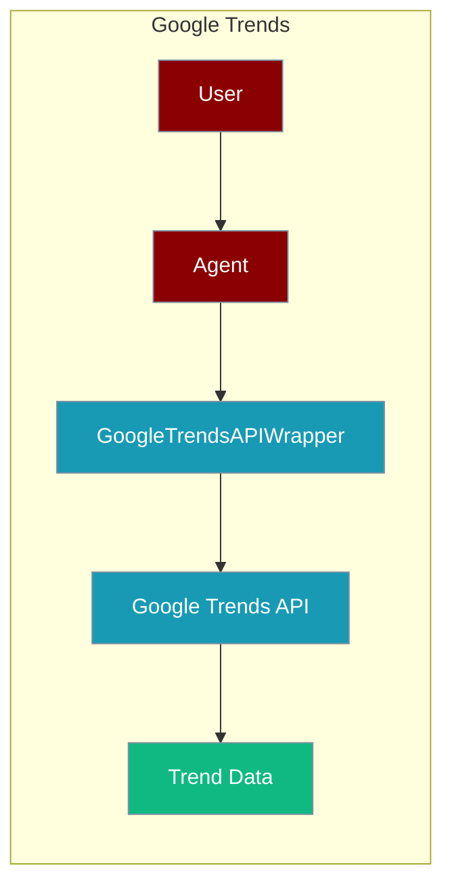
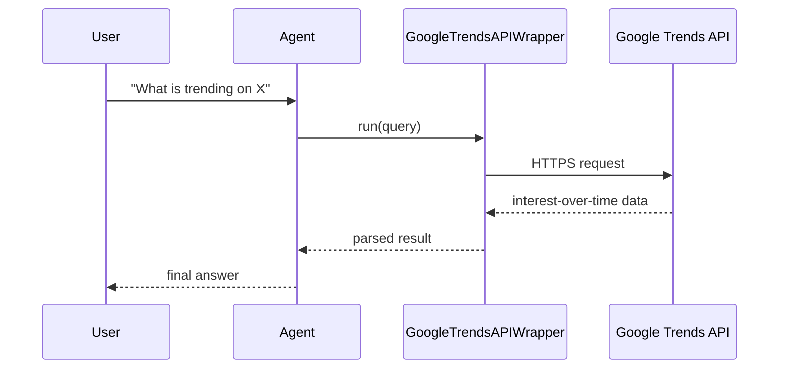

The Google Trends tool lets an agent pull trending-topic data through the SerpAPI Google Trends endpoint.



## Overview

The Google Trends tool is a tool that allows you to search the web using the Google Trends API.

```bash
pip install langchain-community google-search-results
```

```bash
export SERPAPI_API_KEY="${SERPAPI_API_KEY:?Set SERPAPI_API_KEY in your shell}"
```

```python
from langchain_community.utilities.google_trends import GoogleTrendsAPIWrapper
from praisonaiagents import Agent, AgentTeam

research_agent = Agent(
    instructions="Research trending topics related to AI",
    tools=[GoogleTrendsAPIWrapper]
)

summarise_agent = Agent(
    instructions="Summarise findings from the research agent",
)

agents = AgentTeam(agents=[research_agent, summarise_agent])
agents.start()
```

## How It Works



## Getting Started

<Steps>
<Step title="Simple Usage">
1. Install dependencies (see **Overview** above)
2. Set required API keys in your environment
3. Run the agent example in **Overview**
</Step>
<Step title="With Configuration">
Use the same tool with an agent — see the **Overview** example, or pass env vars from the sections above.
</Step>
</Steps>

## Best Practices

<AccordionGroup>
<Accordion title="Keep SERPAPI_API_KEY in the environment">
Google Trends here runs through SerpAPI, so set `SERPAPI_API_KEY` in your shell or `.env`. Never hard-code the key.
</Accordion>

<Accordion title="Query specific terms">
Trends data is per keyword. Feed the agent concrete terms rather than broad phrases so the returned interest data is meaningful.
</Accordion>

<Accordion title="Handle quota errors">
SerpAPI enforces a monthly search quota. Wrap the call in `try/except` so the agent can report a clean message when the quota is hit.
</Accordion>
</AccordionGroup>

## Related Tools

<CardGroup cols={2}>
  <Card title="Serp Search" icon="book" href="/docs/tools/external/serp-search">
    SerpAPI search
  </Card>
  <Card title="Google Search" icon="book" href="/docs/tools/external/google-search">
    LangChain Google search
  </Card>
  <Card title="Tavily" icon="book" href="/docs/tools/external/tavily">
    AI-powered search
  </Card>
</CardGroup>

