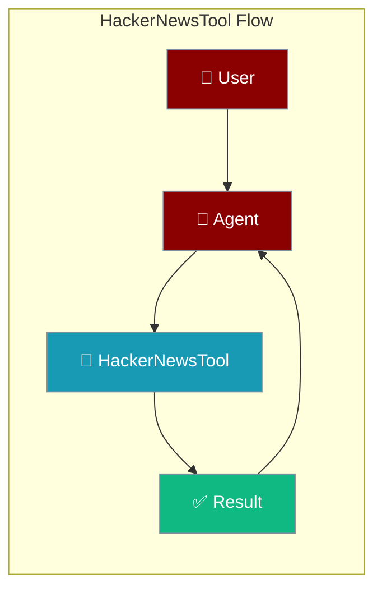
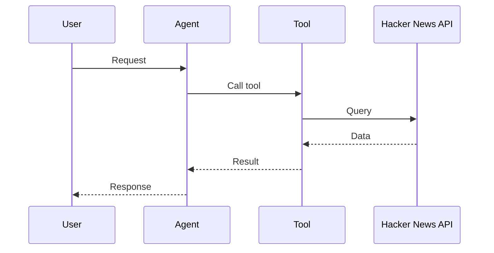

## Overview

Hacker News tool allows you to fetch top stories, new stories, and comments from Hacker News. No API key required.

The user asks for tech news; the agent fetches Hacker News stories and returns them.



## Installation

```bash
pip install "praisonai[tools]"
```

No API key required!

## Quick Start

<Steps>
<Step title="Simple Usage">
```python
from praisonai_tools import HackerNewsTool

# Initialize
hn = HackerNewsTool()

# Get top stories
stories = hn.get_top_stories(limit=5)
print(stories)
```
</Step>
<Step title="With Configuration">
Use the same tool with an agent — see **Usage with Agent** below, or pass env vars and options from the sections above.
</Step>
</Steps>


## Usage with Agent

```python
from praisonaiagents import Agent
from praisonai_tools import HackerNewsTool

agent = Agent(
    name="TechNews",
    instructions="You are a tech news assistant. Use Hacker News to find trending stories.",
    tools=[HackerNewsTool()]
)

response = agent.chat("What are the top stories on Hacker News today?")
print(response)
```

## Available Methods

### get_top_stories(limit=10)

Get top stories from Hacker News.

```python
from praisonai_tools import HackerNewsTool

hn = HackerNewsTool()
stories = hn.get_top_stories(limit=5)

# Returns:
# [
#     {"title": "...", "url": "...", "score": 150, "comments": 45},
#     ...
# ]
```

### get_new_stories(limit=10)

Get newest stories.

```python
stories = hn.get_new_stories(limit=5)
```

### get_best_stories(limit=10)

Get best stories.

```python
stories = hn.get_best_stories(limit=5)
```

### get_story(story_id)

Get a specific story by ID.

```python
story = hn.get_story(12345678)
```

## Function-Based Usage

```python
from praisonai_tools import get_hackernews_top

# Quick access without instantiating class
stories = get_hackernews_top(limit=5)
```

## CLI Usage

```bash
# Use with praisonai
praisonai --tools HackerNewsTool "What are the trending tech stories today?"
```

## Error Handling

```python
from praisonai_tools import HackerNewsTool

hn = HackerNewsTool()
stories = hn.get_top_stories(limit=5)

if stories and "error" in stories[0]:
    print(f"Error: {stories[0]['error']}")
else:
    for story in stories:
        print(f"- {story['title']} ({story['score']} points)")
```

## Common Errors

| Error | Cause | Solution |
|-------|-------|----------|
| `requests not installed` | Missing dependency | Run `pip install requests` |
| `Connection error` | Network issue | Check internet connection |
| `Rate limited` | Too many requests | Add delay between requests |

## How It Works



---

## Best Practices

<AccordionGroup>
<Accordion title="No API key needed">
The Hacker News API is public — no credentials required.
</Accordion>
<Accordion title="Limit story count">
Fetch the top N stories so the agent summarises a focused set instead of the full feed.
</Accordion>
<Accordion title="Cache the front page">
The front page changes slowly — cache it briefly to avoid repeated calls.
</Accordion>
</AccordionGroup>

---

## Related Tools

<CardGroup cols={2}>
  <Card title="Reddit" icon="book" href="/docs/tools/external/reddit">
    Reddit discussions
  </Card>
  <Card title="ArXiv" icon="book" href="/docs/tools/external/arxiv">
    Academic papers
  </Card>
  <Card title="DuckDuckGo" icon="book" href="/docs/tools/external/duckduckgo">
    Web search
  </Card>
</CardGroup>
