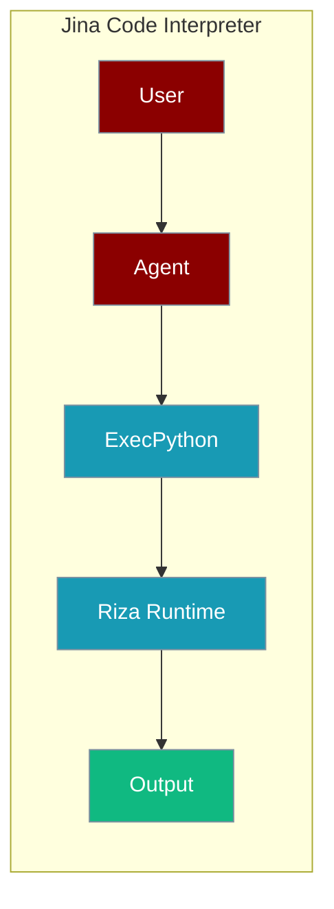
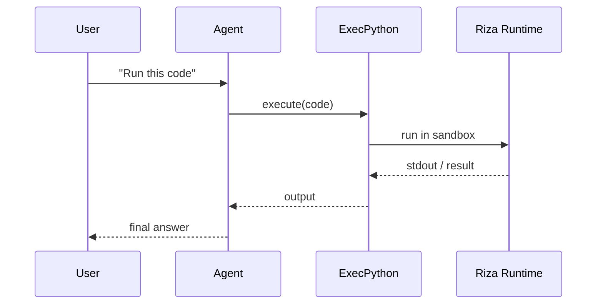

The Jina Code Interpreter tool lets an agent run Python in the Riza sandboxed runtime.



## Overview

The Jina Code Interpreter tool is a tool that allows you to execute various programming languages using the AI Agents.

```bash
pip install langchain-community rizaio
export RIZA_API_KEY="${RIZA_API_KEY:?Set RIZA_API_KEY in your shell}"
```

```python
from praisonaiagents import Agent, AgentTeam
from langchain_community.tools.riza.command import ExecPython

coder_agent = Agent(instructions="""word = "strawberry"
                                    count = word.count("r")
                                    print(f"There are {count}'R's in the word 'Strawberry'")""", tools=[ExecPython])

agents = AgentTeam(agents=[coder_agent])
agents.start()
```

## How It Works



## Getting Started

<Steps>
<Step title="Simple Usage">
1. Install dependencies (see **Overview** above)
2. Set required API keys in your environment
3. Run the agent example in **Overview**
</Step>
<Step title="With Configuration">
Use the same tool with an agent — see the **Overview** example, or pass env vars from the sections above.
</Step>
</Steps>

## Best Practices

<AccordionGroup>
<Accordion title="Keep RIZA_API_KEY in the environment">
Set `RIZA_API_KEY` in your shell or `.env`. `ExecPython` reads it automatically — never hard-code the key.
</Accordion>

<Accordion title="Sandbox untrusted code">
Riza runs code in an isolated runtime, so agent-generated code cannot touch your machine. Prefer it over local `exec` for untrusted input.
</Accordion>

<Accordion title="Keep snippets self-contained">
Each execution is stateless. Include all imports and inputs in the snippet you pass so it runs without external state.
</Accordion>
</AccordionGroup>

## Related Tools

<CardGroup cols={2}>
  <Card title="Python" icon="book" href="/docs/tools/external/python">
    Run Python code
  </Card>
  <Card title="Bearly Code Interpreter" icon="book" href="/docs/tools/external/bearly-code-interpreter">
    Cloud code execution
  </Card>
  <Card title="Azure Code Interpreter" icon="book" href="/docs/tools/external/azure-code-interpreter">
    Azure sessions runtime
  </Card>
</CardGroup>

