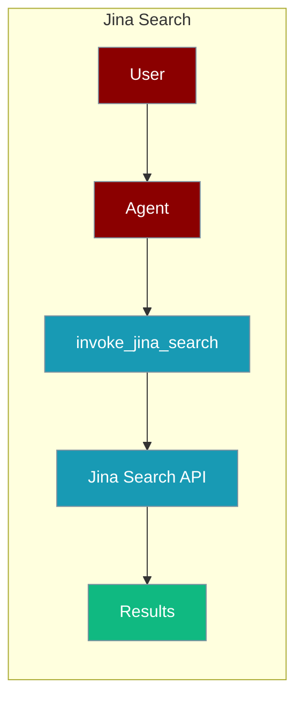
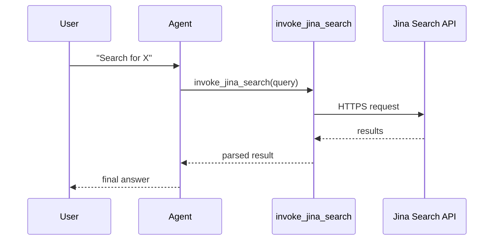

The JinaSearch tool lets an agent search the web through the Jina Search API.



## Overview
The JinaSearch tool is a tool that allows you to search the web using the JinaSearch API.

```bash
pip install langchain-community
``` 

```bash
export JINA_API_KEY="${JINA_API_KEY:?Set JINA_API_KEY in your shell}"
```

```python
from praisonaiagents import Agent, AgentTeam
from langchain_community.tools import JinaSearch
import os 

def invoke_jina_search(query: str):
    JinaSearchTool = JinaSearch()
    model_generated_tool_call = {
        "args": {"query": query},
        "id": "1",
        "name": JinaSearchTool.name,
        "type": "tool_call",
    }
    tool_msg = JinaSearchTool.invoke(model_generated_tool_call)
    return(tool_msg.content[:1000])

data_agent = Agent(instructions="Find 10 websites where I can learn coding for free", tools=[invoke_jina_search])
editor_agent = Agent(instructions="write a listicle blog ranking the best websites. The blog should contain a proper intro and conclusion")
agents = AgentTeam(agents=[data_agent, editor_agent], process='hierarchical')
agents.start()
```

Register on Jina Generate your JinaSearch API key from [Jina Platform](https://jina.ai/api-dashboard/key-manager)

## How It Works



## Getting Started

<Steps>
<Step title="Simple Usage">
1. Install dependencies (see **Overview** above)
2. Set required API keys in your environment
3. Run the agent example in **Overview**
</Step>
<Step title="With Configuration">
Use the same tool with an agent — see the **Overview** example, or pass env vars from the sections above.
</Step>
</Steps>

## Best Practices

<AccordionGroup>
<Accordion title="Keep JINA_API_KEY in the environment">
Set `JINA_API_KEY` in your shell or `.env`. `JinaSearch` reads it automatically — never hard-code the key.
</Accordion>

<Accordion title="Trim the returned content">
The example slices results with `tool_msg.content[:1000]`. Cap the length you feed back to the agent so it stays within context limits.
</Accordion>

<Accordion title="Handle rate limits">
Jina returns HTTP 429 under heavy use. Wrap `JinaSearchTool.invoke(...)` in `try/except` so the agent can fall back to another search tool.
</Accordion>
</AccordionGroup>

## Related Tools

<CardGroup cols={2}>
  <Card title="Jina" icon="book" href="/docs/tools/external/jina">
    Jina tools
  </Card>
  <Card title="Tavily" icon="book" href="/docs/tools/external/tavily">
    AI-powered search
  </Card>
  <Card title="Exa" icon="book" href="/docs/tools/external/exa">
    Neural search
  </Card>
</CardGroup>

