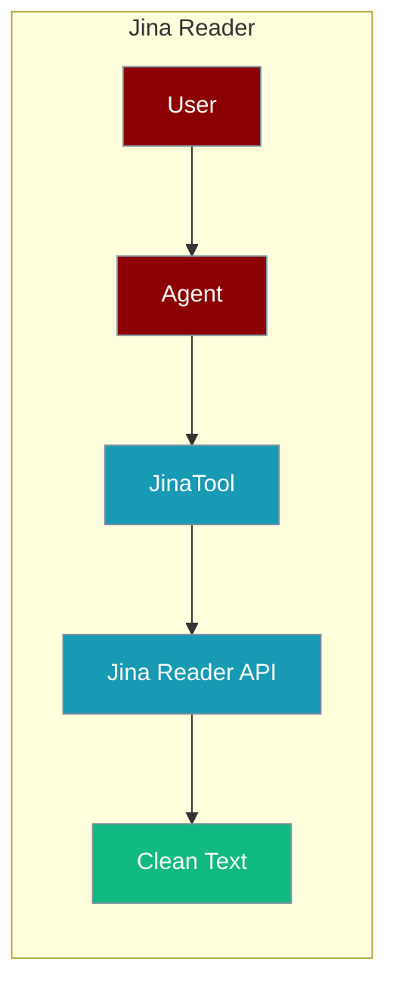
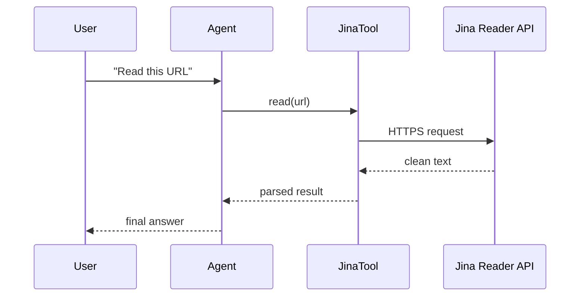

Jina Reader lets an agent turn any URL into clean, LLM-ready text.



## Overview

Jina Reader API converts any URL into clean, LLM-ready text. It handles JavaScript rendering, removes ads, and extracts the main content.

## Installation

```bash
pip install "praisonai[tools]"
```

## Environment Variables

```bash
export JINA_API_KEY="${JINA_API_KEY:?Set JINA_API_KEY in your shell}"  # Optional - works without key with limits
```

Get your API key from [Jina AI](https://jina.ai/).

## How It Works



## Quick Start

<Steps>
<Step title="Simple Usage">
```python
from praisonai_tools import JinaTool

# Initialize
jina = JinaTool()

# Read a URL
content = jina.read("https://example.com")
print(content)
```
</Step>
<Step title="With Configuration">
Use the same tool with an agent — see **Usage with Agent** below, or pass env vars and options from the sections above.
</Step>
</Steps>


## Usage with Agent

```python
from praisonaiagents import Agent
from praisonai_tools import JinaTool

agent = Agent(
    name="Reader",
    instructions="You are a content reader. Use Jina to extract content from URLs.",
    tools=[JinaTool()]
)

response = agent.chat("Read the content from https://praison.ai/docs")
print(response)
```

## Available Methods

### read(url)

Read and extract content from a URL.

```python
from praisonai_tools import JinaTool

jina = JinaTool()
result = jina.read("https://example.com/article")

# Returns:
# {
#     "url": "https://example.com/article",
#     "title": "Article Title",
#     "content": "Clean extracted content...",
#     "description": "..."
# }
```

### search(query)

Search the web and get content.

```python
results = jina.search("Python best practices")
```

## Configuration Options

```python
jina = JinaTool(
    api_key="your_key",    # Optional: defaults to JINA_API_KEY
    timeout=30             # Request timeout in seconds
)
```

## Function-Based Usage

```python
from praisonai_tools import jina_read

# Quick read without instantiating class
content = jina_read("https://example.com")
```

## CLI Usage

```bash
# Use with praisonai (works without API key)
praisonai --tools JinaTool "Read the content from https://example.com"
```

## Error Handling

```python
from praisonai_tools import JinaTool

jina = JinaTool()
result = jina.read("https://example.com")

if "error" in result:
    print(f"Error: {result['error']}")
else:
    print(f"Title: {result['title']}")
    print(f"Content: {result['content'][:500]}")
```

## Common Errors

| Error | Cause | Solution |
|-------|-------|----------|
| `Connection error` | Network issue | Check internet connection |
| `Timeout` | Page took too long | Increase timeout or try later |
| `Rate limited` | Too many requests | Add API key or add delays |

## Features

- **JavaScript rendering** - Handles dynamic content
- **Ad removal** - Extracts only main content
- **Clean output** - LLM-ready text format
- **No API key required** - Works with limits

## Best Practices

<AccordionGroup>
<Accordion title="Add JINA_API_KEY for higher limits">
Jina Reader works without a key at low rate limits. Set `JINA_API_KEY` in your shell or `.env` for production throughput.
</Accordion>

<Accordion title="Trim long pages">
Reader output can be large. Cap or summarise the returned `content` before feeding it back so the agent stays within its context window.
</Accordion>

<Accordion title="Handle timeouts and rate limits">
`JinaTool(timeout=30)` sets a request timeout. Check for an `error` key in the result and retry or fall back to another reader when Jina rate-limits.
</Accordion>
</AccordionGroup>

## Related Tools

<CardGroup cols={2}>
  <Card title="Firecrawl" icon="book" href="/docs/tools/external/firecrawl">
    Web scraping API
  </Card>
  <Card title="Crawl4AI" icon="book" href="/docs/tools/external/crawl4ai">
    Open-source crawler
  </Card>
  <Card title="Trafilatura" icon="book" href="/docs/tools/external/trafilatura">
    Content extraction
  </Card>
</CardGroup>
