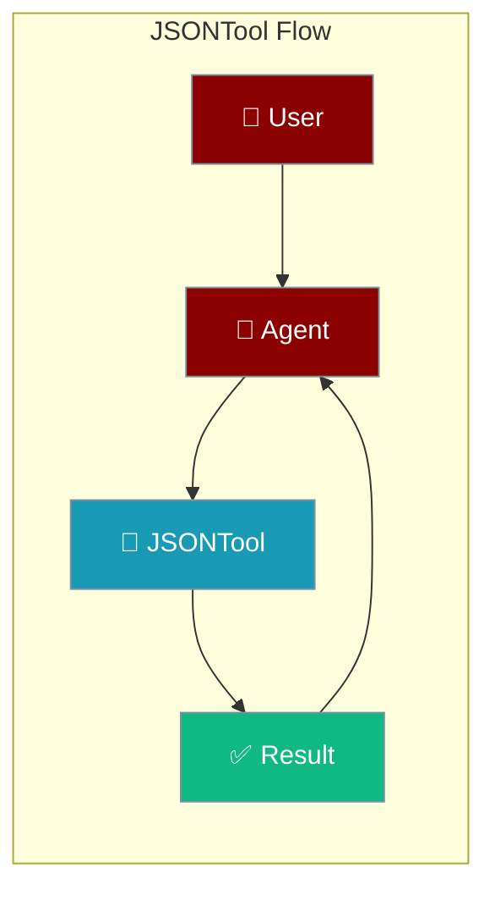
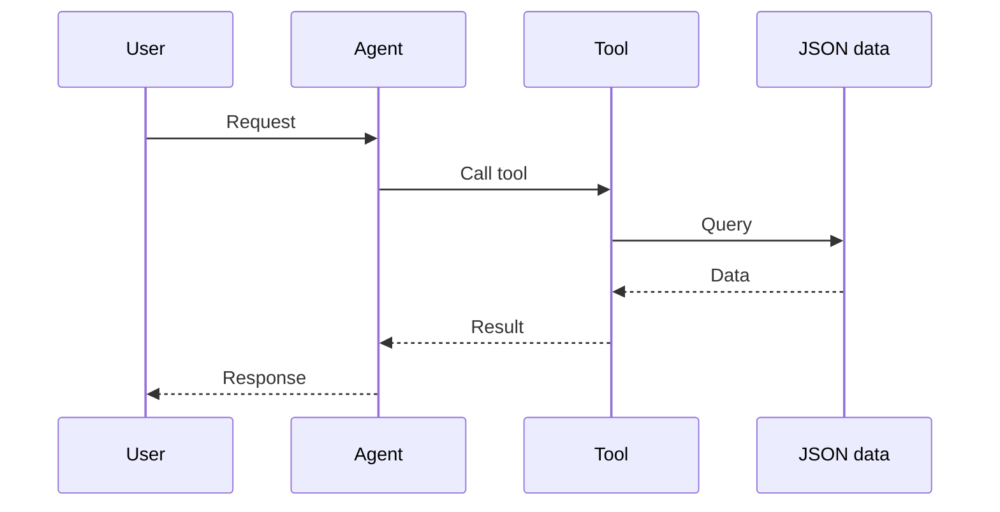

## Overview

JSON tool allows you to read, write, and query JSON files.

The user provides JSON data; the agent parses, queries, or writes it and returns the result.



## Installation

```bash
pip install "praisonai[tools]"
```

## Quick Start

<Steps>
<Step title="Simple Usage">
```python
from praisonai_tools import JSONTool

# Initialize
json_tool = JSONTool()

# Read JSON
data = json_tool.read("config.json")
print(data)
```
</Step>
<Step title="With Configuration">
Use the same tool with an agent — see **Usage with Agent** below, or pass env vars and options from the sections above.
</Step>
</Steps>


## Usage with Agent

```python
from praisonaiagents import Agent
from praisonai_tools import JSONTool

agent = Agent(
    name="DataProcessor",
    instructions="You help process JSON data.",
    tools=[JSONTool()]
)

response = agent.chat("Read config.json and show the database settings")
print(response)
```

## Available Methods

### read(path)

Read a JSON file.

```python
from praisonai_tools import JSONTool

json_tool = JSONTool()
data = json_tool.read("data.json")
```

### write(path, data)

Write data to a JSON file.

```python
json_tool.write("output.json", {"key": "value"})
```

### query(path, jq_query)

Query JSON with JQ-like syntax.

```python
result = json_tool.query("data.json", ".users[0].name")
```

## How It Works



---

## Best Practices

<AccordionGroup>
<Accordion title="Validate before parsing">
Handle malformed JSON gracefully so the agent returns a clear error instead of crashing.
</Accordion>
<Accordion title="Query by path">
Extract only the fields you need rather than loading the whole document into context.
</Accordion>
<Accordion title="Preserve types">
Keep numbers and booleans typed — don't stringify everything when writing JSON back out.
</Accordion>
</AccordionGroup>

---

## Related Tools

<CardGroup cols={2}>
  <Card title="CSV" icon="book" href="/docs/tools/external/csv">
    CSV files
  </Card>
  <Card title="File" icon="book" href="/docs/tools/external/file">
    General files
  </Card>
</CardGroup>
