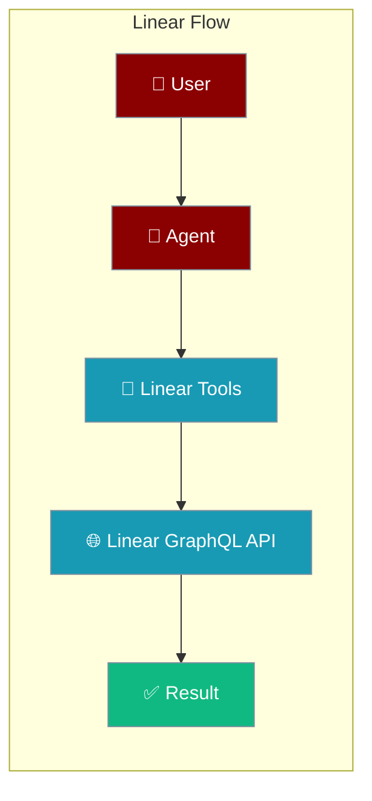
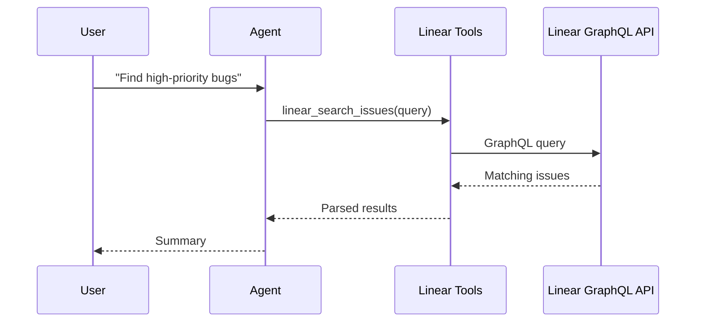

Linear tools provide comprehensive issue management capabilities through Linear's GraphQL API, enabling agents to search, create, update, and comment on issues across teams.

The user asks about issues or requests an update; the agent queries Linear and returns the result or confirms the change.



## Getting Started

<Steps>
<Step title="Simple Usage">
1. Set `LINEAR_OAUTH_TOKEN` or `LINEAR_API_KEY` (see **Authentication** below)
2. Create an agent with Linear tool names (e.g. `linear_search_issues`)
3. Run a prompt — see **Complete Linear Agent Example** below
</Step>
<Step title="With Configuration">
Use OAuth or API key precedence from **Authentication**, and combine tools from **Issue Management** and **Team and Workflow**.
</Step>
</Steps>

---

## Authentication

Linear tools support both OAuth tokens and personal API keys with automatic precedence:

```python
# Environment variables (recommended)
os.environ["LINEAR_OAUTH_TOKEN"] = "your-oauth-token"     # Takes precedence
os.environ["LINEAR_API_KEY"] = "your-personal-api-key"    # Fallback

# Or pass directly to agent
from praisonaiagents import Agent

agent = Agent(
    name="Linear Assistant",
    tools=["linear_search_issues", "linear_get_issue"],
    auto_approve_tools=True
)
```

<Note>
OAuth tokens are sent as `Bearer <token>` while API keys are sent raw. OAuth tokens take precedence if both are configured.
</Note>

---

## Issue Management

### linear_search_issues

Search Linear issues by text, status, team, or other criteria.

**Parameters:**
- `query` (str): Search query text
- `team_id` (str, optional): Filter by specific team ID
- `state_id` (str, optional): Filter by issue state
- `assignee_id` (str, optional): Filter by assignee
- `limit` (int, optional): Maximum results to return (default: 20)

**Returns:** List of issue objects with ID, title, description, status, and metadata.

```python
from praisonaiagents import Agent

agent = Agent(
    name="Issue Searcher",
    instructions="Help users find relevant Linear issues",
    tools=["linear_search_issues"]
)

# Agent can search like: "Find open bugs assigned to me"
result = agent.start("Find all high priority issues in the API team")
```

---

### linear_get_issue

Get detailed information about a specific Linear issue.

**Parameters:**
- `issue_id` (str): Linear issue ID or identifier (e.g., "ENG-42")

**Returns:** Complete issue object with title, description, comments, attachments, and relationships.

```python
from praisonaiagents import Agent

agent = Agent(
    name="Issue Reader",
    instructions="Analyze Linear issues and provide detailed summaries",
    tools=["linear_get_issue", "linear_search_issues"]
)

result = agent.start("Get details for issue ENG-42")
```

---

### linear_add_comment

Add a comment to an existing Linear issue.

**Parameters:**
- `issue_id` (str): Issue ID to comment on
- `comment` (str): Comment text (supports Markdown)

**Returns:** Created comment object with ID and URL.

```python
from praisonaiagents import Agent

agent = Agent(
    name="Progress Updater", 
    instructions="Provide status updates on Linear issues",
    tools=["linear_add_comment", "linear_get_issue"]
)

result = agent.start("Add a progress update to issue ENG-42")
```

---

### linear_update_issue

Update issue properties like status, assignee, priority, or description.

**Parameters:**
- `issue_id` (str): Issue ID to update
- `title` (str, optional): New issue title
- `description` (str, optional): New description
- `state_id` (str, optional): New state/status ID
- `assignee_id` (str, optional): New assignee user ID
- `priority` (int, optional): Priority level (1-4)
- `estimate` (int, optional): Story point estimate

**Returns:** Updated issue object.

```python
from praisonaiagents import Agent

agent = Agent(
    name="Issue Manager",
    instructions="Manage Linear issue lifecycle and assignments", 
    tools=["linear_update_issue", "linear_list_issue_states"]
)

result = agent.start("Mark issue ENG-42 as completed")
```

---

## Team and Workflow

### linear_list_teams

Get all teams in the Linear workspace.

**Parameters:** None

**Returns:** List of team objects with IDs, names, and metadata.

```python
from praisonaiagents import Agent

agent = Agent(
    name="Team Explorer",
    instructions="Help users navigate Linear team structure",
    tools=["linear_list_teams", "linear_search_issues"]
)

result = agent.start("Show me all teams and their current workload")
```

---

### linear_list_issue_states

Get available issue states for workflow management.

**Parameters:**
- `team_id` (str, optional): Filter states for specific team

**Returns:** List of state objects with IDs, names, colors, and workflow positions.

```python
from praisonaiagents import Agent

agent = Agent(
    name="Workflow Assistant",
    instructions="Help manage issue states and transitions",
    tools=["linear_list_issue_states", "linear_update_issue"]
)

result = agent.start("What are the available states for engineering issues?")
```

---

## Complete Linear Agent Example

Here's a comprehensive agent that combines multiple Linear tools:

```python
from praisonaiagents import Agent

linear_agent = Agent(
    name="Linear Project Manager",
    instructions="""
    You are a Linear project management assistant. You can:
    
    1. Search and analyze issues across teams
    2. Create detailed issue reports and summaries
    3. Update issue status and assignments
    4. Provide team workload insights
    5. Comment on issues with progress updates
    
    Always provide clear, actionable information and suggest next steps.
    """,
    llm="gpt-4o-mini",
    tools=[
        "linear_search_issues",
        "linear_get_issue", 
        "linear_add_comment",
        "linear_update_issue",
        "linear_list_teams",
        "linear_list_issue_states"
    ],
    memory=True,
    auto_approve_tools=True
)

# Example usage
result = linear_agent.start(
    "Find all high-priority bugs assigned to the API team and provide a summary"
)
print(result)
```

---

## Integration with LinearBot

These tools work seamlessly with the LinearBot for automated issue management:

```python
from praisonaiagents import Agent
from praisonai.bots import LinearBot

# Create agent with Linear tools
agent = Agent(
    name="Autonomous Issue Manager",
    instructions="""
    When assigned or mentioned on Linear issues:
    1. Analyze the issue requirements
    2. Search for related issues or dependencies  
    3. Break down complex tasks into smaller issues
    4. Update status and add progress comments
    5. Coordinate with team members via comments
    """,
    tools=[
        "linear_search_issues", "linear_get_issue", "linear_add_comment",
        "linear_update_issue", "linear_list_teams", "linear_list_issue_states",
        "github_create_branch", "github_commit_and_push"
    ],
    memory=True,
    auto_approve_tools=True
)

# Connect to Linear via webhooks
bot = LinearBot(
    token=os.getenv("LINEAR_OAUTH_TOKEN"),
    signing_secret=os.getenv("LINEAR_WEBHOOK_SECRET"),
    agent=agent
)
```

<Tip>
Use Linear tools alongside the [LinearBot](/docs/features/linear-bot) for complete issue-to-code automation workflows.
</Tip>

---

## Error Handling

Linear tools handle common API errors gracefully:

- **Authentication errors** → Clear messages about token configuration
- **Rate limiting** → Automatic retry with exponential backoff
- **Invalid IDs** → Helpful suggestions for finding correct identifiers
- **Permission errors** → Specific guidance on required scopes

```python
# Tools will provide helpful error context
agent = Agent(
    name="Robust Linear Agent",
    instructions="Handle Linear API errors gracefully and guide users",
    tools=["linear_search_issues", "linear_get_issue"],
    auto_approve_tools=True
)

# Even with invalid input, get helpful responses
result = agent.start("Get issue INVALID-123")  # Will suggest search instead
```

---

## How It Works



---

## Best Practices

<AccordionGroup>
<Accordion title="Store tokens in the environment">
Read `LINEAR_OAUTH_TOKEN` or `LINEAR_API_KEY` from the environment. Never hard-code credentials in the agent definition.
</Accordion>
<Accordion title="Scope tools to the task">
Give the agent only the Linear tools it needs — a read-only agent should not include `linear_update_issue`.
</Accordion>
<Accordion title="Rely on built-in retries">
Linear tools retry rate-limited requests with backoff. Keep prompts focused so the agent makes fewer, targeted calls.
</Accordion>
<Accordion title="Reference issues by identifier">
Use identifiers like `ENG-42` so the agent targets the exact issue instead of relying on a fuzzy search.
</Accordion>
</AccordionGroup>

---

## Related

<CardGroup cols={2}>
<Card title="Linear Bot" icon="robot" href="/docs/features/linear-bot">
  Webhook-based Linear integration
</Card>
<Card title="GitHub Tools" icon="github" href="/docs/tools/external/github">
  Combine with GitHub for complete workflows
</Card>
<Card title="Jira" icon="book" href="/docs/tools/jira">
  Project management
</Card>
</CardGroup>