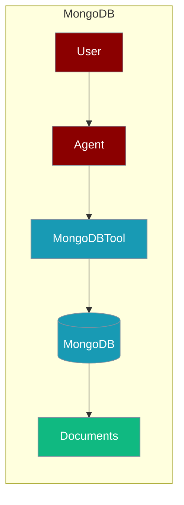
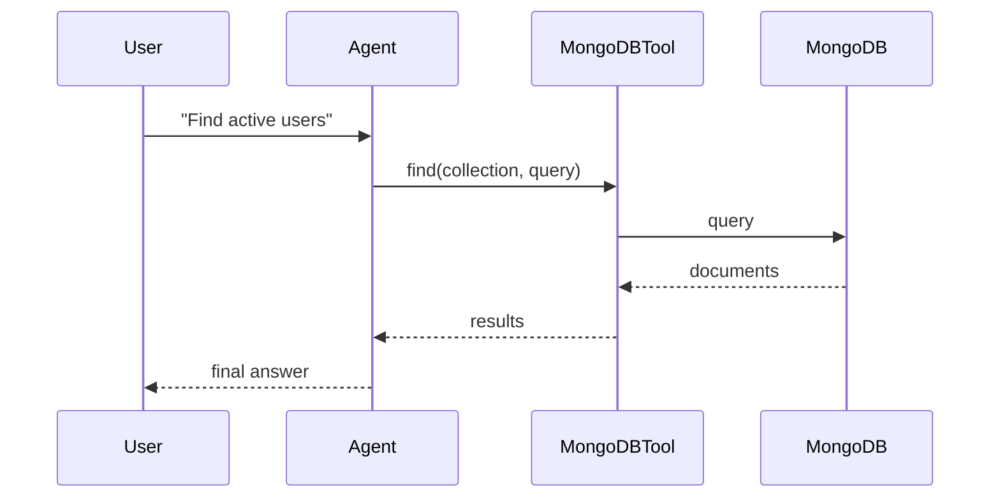

The MongoDB tool lets an agent query and manage MongoDB collections directly.



## Overview

MongoDB tool allows you to query and manage MongoDB NoSQL databases directly from your AI agents.

## Installation

```bash
pip install "praisonai[tools]"
```

## Environment Variables

```bash
export MONGODB_URI=mongodb://localhost:27017
export MONGODB_DATABASE=mydb
```

## Quick Start

<Steps>
<Step title="Simple Usage">
```python
from praisonai_tools import MongoDBTool

# Initialize
mongo = MongoDBTool(
    uri="mongodb://localhost:27017",
    database="mydb"
)

# Query
results = mongo.find("users", {"active": True})
print(results)
```
</Step>
<Step title="With Configuration">
Use the same tool with an agent — see **Usage with Agent** below, or pass env vars and options from the sections above.
</Step>
</Steps>


## How It Works



## Usage with Agent

```python
from praisonaiagents import Agent
from praisonai_tools import MongoDBTool

mongo = MongoDBTool(uri="mongodb://localhost:27017", database="mydb")

agent = Agent(
    name="DataAnalyst",
    instructions="You are a data analyst. Use MongoDB to query documents.",
    tools=[mongo]
)

response = agent.chat("Find all active users")
print(response)
```

## Available Methods

### find(collection, query, limit=10)

Find documents matching a query.

```python
from praisonai_tools import MongoDBTool

mongo = MongoDBTool(uri="mongodb://localhost:27017", database="mydb")
results = mongo.find("users", {"status": "active"}, limit=5)
```

### insert(collection, document)

Insert a document.

```python
mongo.insert("users", {"name": "Alice", "email": "alice@example.com"})
```

### update(collection, query, update)

Update documents.

```python
mongo.update("users", {"name": "Alice"}, {"$set": {"status": "inactive"}})
```

### delete(collection, query)

Delete documents.

```python
mongo.delete("users", {"status": "inactive"})
```

### list_collections()

List all collections.

```python
collections = mongo.list_collections()
```

## Docker Setup

```bash
docker run -d --name mongodb \
    -p 27017:27017 \
    mongo:7
```

## Common Errors

| Error | Cause | Solution |
|-------|-------|----------|
| `pymongo not installed` | Missing dependency | Run `pip install pymongo` |
| `Connection refused` | MongoDB not running | Start MongoDB server |
| `Authentication failed` | Wrong credentials | Check connection string |

## Best Practices

<AccordionGroup>
<Accordion title="Load the connection URI from the environment">
Read `MONGODB_URI` from the environment instead of hard-coding credentials in the connection string.
</Accordion>

<Accordion title="Cap query results">
`find(collection, query, limit=10)` defaults to 10 documents. Keep the limit low so large collections do not flood the agent's context.
</Accordion>

<Accordion title="Scope agent access">
Give the agent a database user with only the permissions it needs. Read-only credentials prevent accidental writes from generated queries.
</Accordion>
</AccordionGroup>

## Related Tools

<CardGroup cols={2}>
  <Card title="PostgreSQL" icon="book" href="/docs/tools/external/postgres">
    SQL database
  </Card>
  <Card title="Redis" icon="book" href="/docs/tools/external/redis">
    Key-value store
  </Card>
  <Card title="DynamoDB" icon="book" href="/docs/databases/dynamodb">
    AWS NoSQL
  </Card>
</CardGroup>
