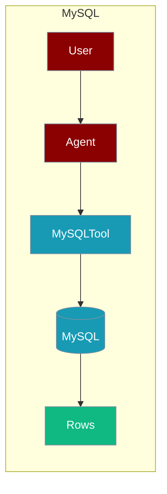
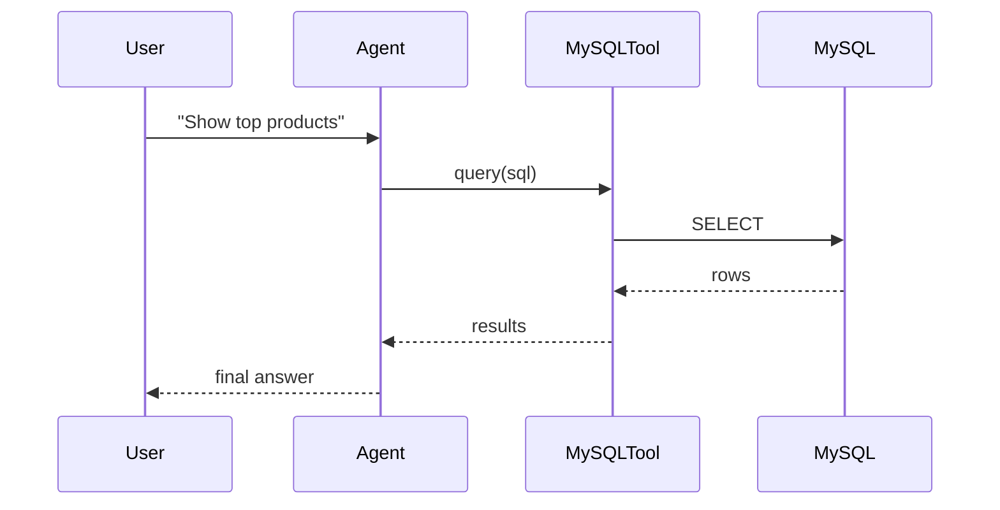

The MySQL tool lets an agent query and manage MySQL databases directly.



## Overview

MySQL tool allows you to query and manage MySQL databases directly from your AI agents.

## Installation

```bash
pip install "praisonai[tools]"
```

## Environment Variables

```bash
export MYSQL_HOST=localhost
export MYSQL_PORT=3306
export MYSQL_DATABASE=mydb
export MYSQL_USER=root
export MYSQL_PASSWORD=your_password
```

## Quick Start

<Steps>
<Step title="Simple Usage">
```python
from praisonai_tools import MySQLTool

# Initialize
mysql = MySQLTool(
    host="localhost",
    database="mydb",
    user="root",
    password="your_password"
)

# Query
results = mysql.query("SELECT * FROM users LIMIT 5")
print(results)
```
</Step>
<Step title="With Configuration">
Use the same tool with an agent — see **Usage with Agent** below, or pass env vars and options from the sections above.
</Step>
</Steps>


## How It Works



## Usage with Agent

```python
from praisonaiagents import Agent
from praisonai_tools import MySQLTool

mysql = MySQLTool(
    host="localhost",
    database="mydb",
    user="root",
    password="your_password"
)

agent = Agent(
    name="DBAnalyst",
    instructions="You are a database analyst. Use MySQL to query data.",
    tools=[mysql]
)

response = agent.chat("Show me the top 10 products by sales")
print(response)
```

## Available Methods

### query(sql)

Execute a SQL query.

```python
from praisonai_tools import MySQLTool

mysql = MySQLTool(host="localhost", database="mydb", user="root", password="pass")
results = mysql.query("SELECT * FROM users WHERE active = 1")
```

### execute(sql)

Execute a SQL statement (INSERT, UPDATE, DELETE).

```python
mysql.execute("INSERT INTO users (name, email) VALUES ('Bob', 'bob@example.com')")
```

### list_tables()

List all tables in the database.

```python
tables = mysql.list_tables()
```

## Docker Setup

```bash
docker run -d --name mysql \
    -e MYSQL_ROOT_PASSWORD=praison123 \
    -e MYSQL_DATABASE=praisonai \
    -p 3306:3306 \
    mysql:8
```

## Common Errors

| Error | Cause | Solution |
|-------|-------|----------|
| `mysql-connector not installed` | Missing dependency | Run `pip install mysql-connector-python` |
| `Connection refused` | Database not running | Start MySQL server |
| `Access denied` | Wrong credentials | Check username/password |

## Best Practices

<AccordionGroup>
<Accordion title="Load credentials from the environment">
Read `MYSQL_HOST`, `MYSQL_USER`, and `MYSQL_PASSWORD` from the environment instead of hard-coding them in the tool call.
</Accordion>

<Accordion title="Use LIMIT on generated queries">
Agent-generated `SELECT`s can return huge result sets. Instruct the agent to add `LIMIT` so results stay within the context window.
</Accordion>

<Accordion title="Scope agent access">
Give the agent a read-only MySQL user for analytics tasks so generated SQL cannot modify data.
</Accordion>
</AccordionGroup>

## Related Tools

<CardGroup cols={2}>
  <Card title="PostgreSQL" icon="book" href="/docs/tools/external/postgres">
    PostgreSQL database
  </Card>
  <Card title="SQLite" icon="book" href="/docs/tools/external/sqlite">
    SQLite database
  </Card>
  <Card title="MongoDB" icon="book" href="/docs/tools/external/mongodb">
    NoSQL database
  </Card>
</CardGroup>
