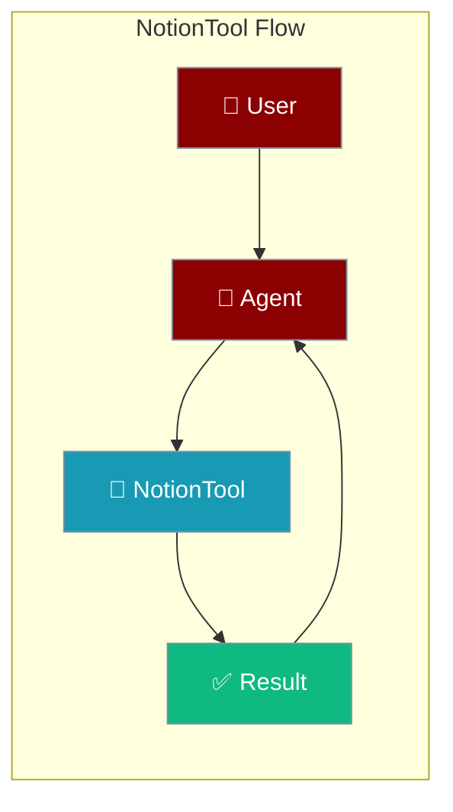
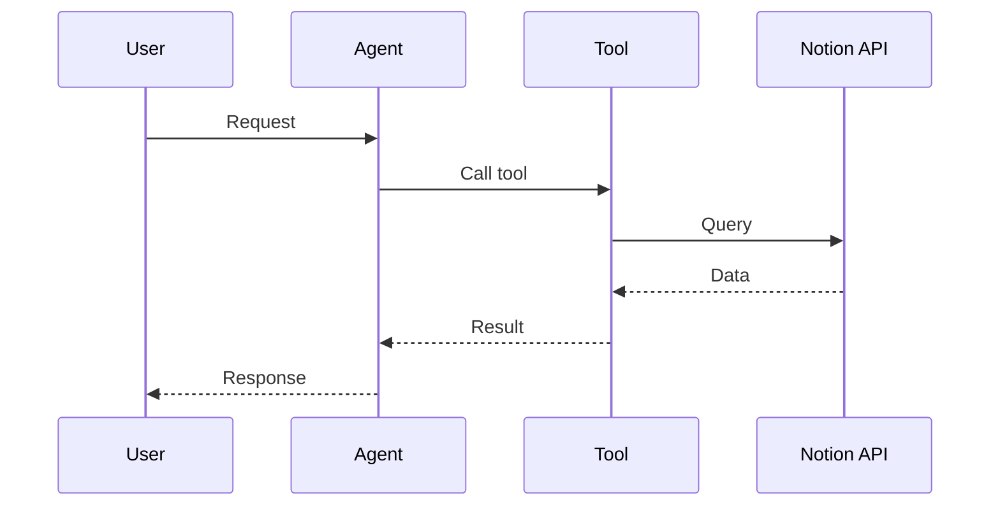

## Overview

Notion tool allows you to search, create, and update pages and databases in Notion.

The user asks to read or update a page; the agent calls Notion and returns the outcome.



## Installation

```bash
pip install "praisonai[tools]"
```

## Environment Variables

```bash
export NOTION_API_KEY=your_integration_token
```

Get your token from [Notion Integrations](https://www.notion.so/my-integrations).

## Quick Start

<Steps>
<Step title="Simple Usage">
```python
from praisonai_tools import NotionTool

# Initialize
notion = NotionTool()

# Search
results = notion.search("meeting notes")
print(results)
```
</Step>
<Step title="With Configuration">
Use the same tool with an agent — see **Usage with Agent** below, or pass env vars and options from the sections above.
</Step>
</Steps>


## Usage with Agent

```python
from praisonaiagents import Agent
from praisonai_tools import NotionTool

agent = Agent(
    name="NotionAssistant",
    instructions="You help manage Notion pages and databases.",
    tools=[NotionTool()]
)

response = agent.chat("Create a new page titled 'Project Plan'")
print(response)
```

## Available Methods

### search(query)

Search Notion pages and databases.

```python
from praisonai_tools import NotionTool

notion = NotionTool()
results = notion.search("project")
```

### create_page(parent_id, title, content)

Create a new page.

```python
notion.create_page(
    parent_id="database_id",
    title="New Page",
    content="Page content here"
)
```

### get_page(page_id)

Get page content.

```python
page = notion.get_page("page_id")
```

## Common Errors

| Error | Cause | Solution |
|-------|-------|----------|
| `NOTION_API_KEY not configured` | Missing token | Set environment variable |
| `object_not_found` | Invalid ID | Check page/database ID |
| `unauthorized` | No access | Share page with integration |

## How It Works



---

## Best Practices

<AccordionGroup>
<Accordion title="Store the integration token securely">
Read the Notion token from the environment, never hard-code it.
</Accordion>
<Accordion title="Share pages with the integration">
Notion integrations only see pages explicitly shared with them — grant access first.
</Accordion>
<Accordion title="Handle rate limits">
Notion throttles bursts. Retry with backoff so the agent stays responsive.
</Accordion>
</AccordionGroup>

---

## Related Tools

<CardGroup cols={2}>
  <Card title="Confluence" icon="book" href="/docs/tools/external/confluence">
    Atlassian wiki
  </Card>
  <Card title="Google Docs" icon="book" href="/docs/tools/external/google-drive">
    Google Docs
  </Card>
  <Card title="Trello" icon="book" href="/docs/tools/external/trello">
    Task management
  </Card>
</CardGroup>
