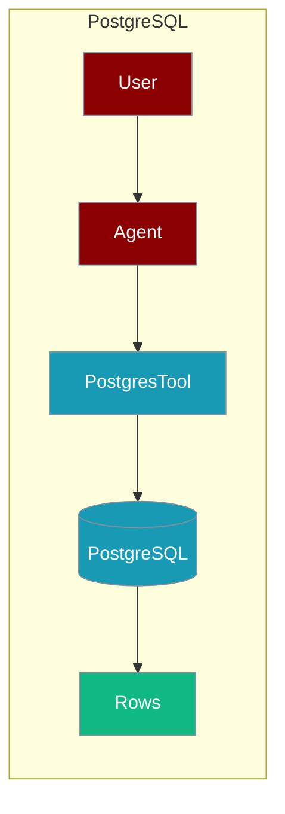
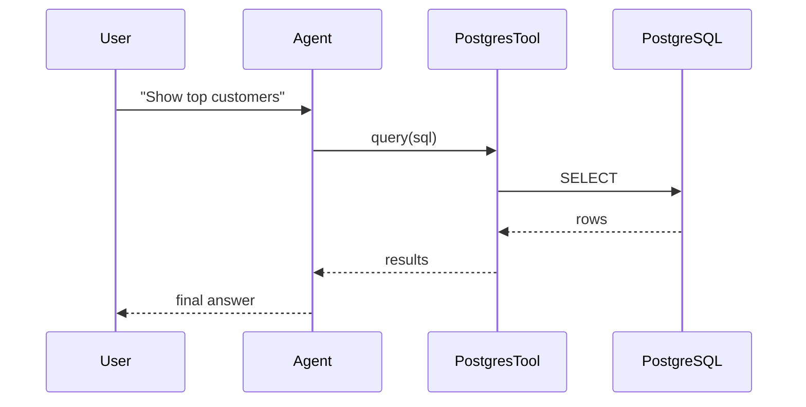

The PostgreSQL tool lets an agent query and manage PostgreSQL databases directly.



## Overview

PostgreSQL tool allows you to query and manage PostgreSQL databases directly from your AI agents.

## Installation

```bash
pip install "praisonai[tools]"
```

## Environment Variables

```bash
export POSTGRES_HOST=localhost
export POSTGRES_PORT=5432
export POSTGRES_DATABASE=mydb
export POSTGRES_USER=postgres
export POSTGRES_PASSWORD=your_password
```

## Quick Start

<Steps>
<Step title="Simple Usage">
```python
from praisonai_tools import PostgresTool

# Initialize
pg = PostgresTool(
    host="localhost",
    database="mydb",
    user="postgres",
    password="your_password"
)

# Query
results = pg.query("SELECT * FROM users LIMIT 5")
print(results)
```
</Step>
<Step title="With Configuration">
Use the same tool with an agent — see **Usage with Agent** below, or pass env vars and options from the sections above.
</Step>
</Steps>


## How It Works



## Usage with Agent

```python
from praisonaiagents import Agent
from praisonai_tools import PostgresTool

pg = PostgresTool(
    host="localhost",
    database="mydb",
    user="postgres",
    password="your_password"
)

agent = Agent(
    name="DBAnalyst",
    instructions="You are a database analyst. Use PostgreSQL to query data.",
    tools=[pg]
)

response = agent.chat("Show me the top 10 customers by order count")
print(response)
```

## Available Methods

### query(sql)

Execute a SQL query.

```python
from praisonai_tools import PostgresTool

pg = PostgresTool(host="localhost", database="mydb", user="postgres", password="pass")

# SELECT query
results = pg.query("SELECT * FROM users WHERE active = true")

# Returns list of dictionaries
# [{"id": 1, "name": "Alice", "active": true}, ...]
```

### execute(sql)

Execute a SQL statement (INSERT, UPDATE, DELETE).

```python
pg.execute("INSERT INTO users (name, email) VALUES ('Bob', 'bob@example.com')")
pg.execute("UPDATE users SET active = false WHERE id = 5")
```

### list_tables()

List all tables in the database.

```python
tables = pg.list_tables()
# Returns: [{"table_name": "users"}, {"table_name": "orders"}, ...]
```

### describe_table(table_name)

Get table schema.

```python
schema = pg.describe_table("users")
# Returns column names, types, and constraints
```

## Configuration Options

```python
pg = PostgresTool(
    host="localhost",
    port=5432,
    database="mydb",
    user="postgres",
    password="your_password",
    schema="public"
)
```

## Function-Based Usage

```python
from praisonai_tools import query_postgres, list_postgres_tables

# Quick query
results = query_postgres("SELECT * FROM users", host="localhost", database="mydb", user="postgres", password="pass")

# List tables
tables = list_postgres_tables(host="localhost", database="mydb", user="postgres", password="pass")
```

## Docker Setup

```bash
docker run -d --name postgres \
    -e POSTGRES_PASSWORD=praison123 \
    -e POSTGRES_DB=praisonai \
    -p 5432:5432 \
    postgres:16
```

## Error Handling

```python
from praisonai_tools import PostgresTool

pg = PostgresTool(host="localhost", database="mydb", user="postgres", password="pass")
result = pg.query("SELECT * FROM users")

if "error" in result:
    print(f"Error: {result['error']}")
else:
    for row in result:
        print(row)
```

## Common Errors

| Error | Cause | Solution |
|-------|-------|----------|
| `psycopg2 not installed` | Missing dependency | Run `pip install psycopg2-binary` |
| `Connection refused` | Database not running | Start PostgreSQL server |
| `Authentication failed` | Wrong credentials | Check username/password |

## Best Practices

<AccordionGroup>
<Accordion title="Load credentials from the environment">
Read `POSTGRES_HOST`, `POSTGRES_USER`, and `POSTGRES_PASSWORD` from the environment rather than hard-coding them in the tool call.
</Accordion>

<Accordion title="Use LIMIT on generated queries">
Agent-generated `SELECT`s can return huge result sets. Instruct the agent to add `LIMIT` so results stay within the context window.
</Accordion>

<Accordion title="Scope agent access">
Give the agent a read-only role for analytics tasks so generated SQL cannot modify data. Use a dedicated schema when writes are required.
</Accordion>
</AccordionGroup>

## Related Tools

<CardGroup cols={2}>
  <Card title="MySQL" icon="book" href="/docs/tools/external/mysql">
    MySQL database
  </Card>
  <Card title="SQLite" icon="book" href="/docs/tools/external/sqlite">
    SQLite database
  </Card>
  <Card title="MongoDB" icon="book" href="/docs/tools/external/mongodb">
    NoSQL database
  </Card>
</CardGroup>
