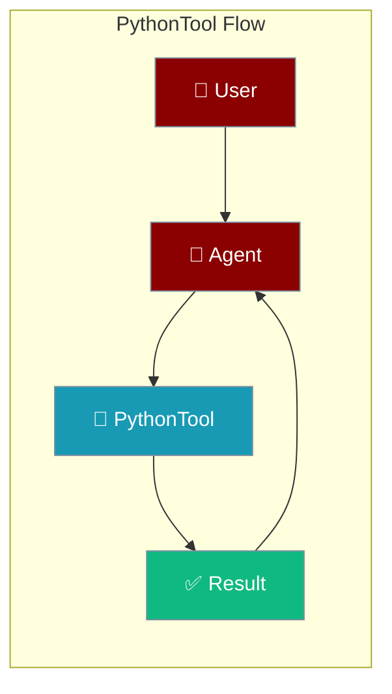
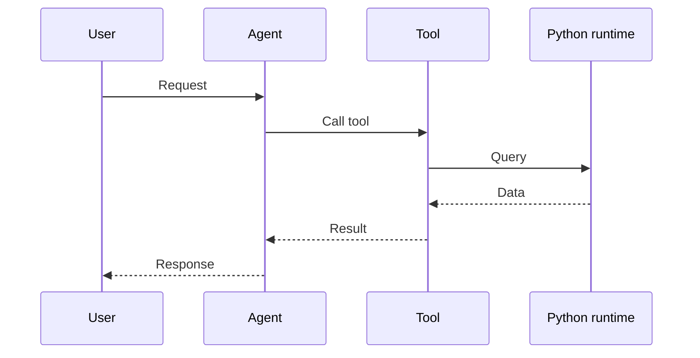

## Overview

Python tool allows you to execute Python code from your AI agents.

The user sends code; the agent runs it in a sandbox and returns stdout and results.



## Installation

```bash
pip install "praisonai[tools]"
```

## Quick Start

<Steps>
<Step title="Simple Usage">
```python
from praisonai_tools import PythonTool

# Initialize
python = PythonTool()

# Execute code
result = python.execute("print(2 + 2)")
print(result)
```
</Step>
<Step title="With Configuration">
Use the same tool with an agent — see **Usage with Agent** below, or pass env vars and options from the sections above.
</Step>
</Steps>


## Usage with Agent

```python
from praisonaiagents import Agent
from praisonai_tools import PythonTool

agent = Agent(
    name="CodeRunner",
    instructions="You help execute Python code.",
    tools=[PythonTool()]
)

response = agent.chat("Calculate the factorial of 10")
print(response)
```

## Available Methods

### execute(code)

Execute Python code.

```python
from praisonai_tools import PythonTool

python = PythonTool()
result = python.execute('''
import math
print(math.factorial(10))
''')
```

## Security Warning

⚠️ **Use with caution!** Executing arbitrary code can be dangerous.

## How It Works



---

## Best Practices

<AccordionGroup>
<Accordion title="Sandbox untrusted code">
Only execute code generated from trusted instructions. Treat all output as untrusted.
</Accordion>
<Accordion title="Capture errors">
Wrap execution so tracebacks are returned to the agent instead of terminating the run.
</Accordion>
<Accordion title="Keep runs stateless">
Pass all inputs explicitly — don't rely on state persisting between executions.
</Accordion>
</AccordionGroup>

---

## Related Tools

<CardGroup cols={2}>
  <Card title="Shell" icon="book" href="/docs/tools/external/shell">
    Shell commands
  </Card>
  <Card title="Calculator" icon="book" href="/docs/tools/external/calculator">
    Math calculations
  </Card>
</CardGroup>
