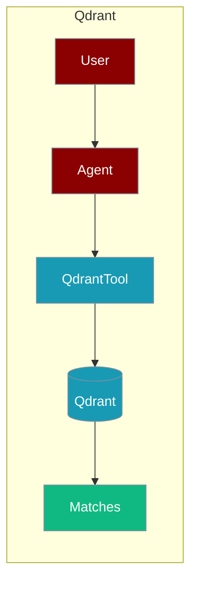
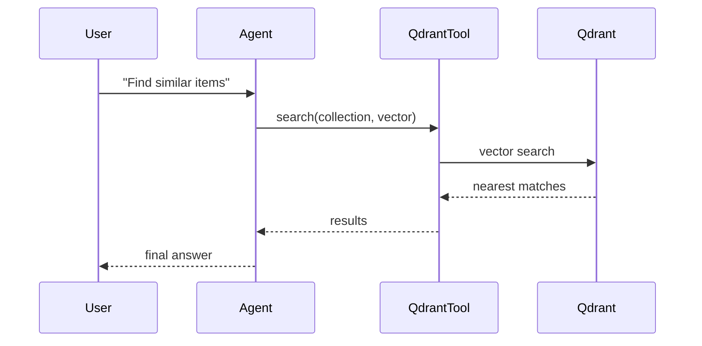

The Qdrant tool lets an agent run vector similarity search for semantic retrieval and RAG.



## Overview

Qdrant is a vector similarity search engine. Use it for semantic search, recommendations, and RAG applications.

## Installation

```bash
pip install "praisonai[tools]"
```

## Environment Variables

```bash
export QDRANT_URL=http://localhost:6333
export QDRANT_API_KEY="${QDRANT_API_KEY:?Set QDRANT_API_KEY in your shell}"  # Optional for cloud
```

## How It Works



## Quick Start

<Steps>
<Step title="Simple Usage">
```python
from praisonai_tools import QdrantTool

# Initialize
qdrant = QdrantTool(url="http://localhost:6333")

# Search
results = qdrant.search("products", query_vector=[0.1, 0.2, ...], limit=5)
print(results)
```
</Step>
<Step title="With Configuration">
Use the same tool with an agent — see **Usage with Agent** below, or pass env vars and options from the sections above.
</Step>
</Steps>


## Usage with Agent

```python
from praisonaiagents import Agent
from praisonai_tools import QdrantTool

qdrant = QdrantTool(url="http://localhost:6333")

agent = Agent(
    name="SearchAgent",
    instructions="You perform semantic search using Qdrant.",
    tools=[qdrant]
)

response = agent.chat("Find similar products to item 123")
print(response)
```

## Available Methods

### search(collection, query_vector, limit=10)

Search for similar vectors.

```python
from praisonai_tools import QdrantTool

qdrant = QdrantTool(url="http://localhost:6333")
results = qdrant.search("documents", query_vector=[0.1, 0.2, 0.3], limit=5)
```

### upsert(collection, points)

Insert or update points.

```python
qdrant.upsert("documents", [
    {"id": 1, "vector": [0.1, 0.2, 0.3], "payload": {"text": "Hello"}}
])
```

### create_collection(name, vector_size)

Create a new collection.

```python
qdrant.create_collection("my_collection", vector_size=384)
```

## Docker Setup

```bash
docker run -d --name qdrant \
    -p 6333:6333 \
    qdrant/qdrant
```

## Common Errors

| Error | Cause | Solution |
|-------|-------|----------|
| `qdrant-client not installed` | Missing dependency | Run `pip install qdrant-client` |
| `Connection refused` | Qdrant not running | Start Qdrant server |
| `Collection not found` | Collection doesn't exist | Create collection first |

## Best Practices

<AccordionGroup>
<Accordion title="Load QDRANT_API_KEY from the environment">
For Qdrant Cloud, set `QDRANT_API_KEY` in your shell or `.env`. Local instances need only `QDRANT_URL`.
</Accordion>

<Accordion title="Match vector dimensions">
`create_collection(name, vector_size)` must match your embedding model's dimension. A mismatch causes search errors, so keep the size aligned with the encoder the agent uses.
</Accordion>

<Accordion title="Cap the search limit">
`search(collection, query_vector, limit=10)` defaults to 10. Return only as many matches as the agent needs to keep context small.
</Accordion>
</AccordionGroup>

## Related Tools

<CardGroup cols={2}>
  <Card title="Pinecone" icon="book" href="/docs/databases/pinecone">
    Managed vector DB
  </Card>
  <Card title="Chroma" icon="book" href="/docs/databases/chroma">
    Open-source vector DB
  </Card>
  <Card title="Weaviate" icon="book" href="/docs/databases/weaviate">
    Vector search engine
  </Card>
</CardGroup>
