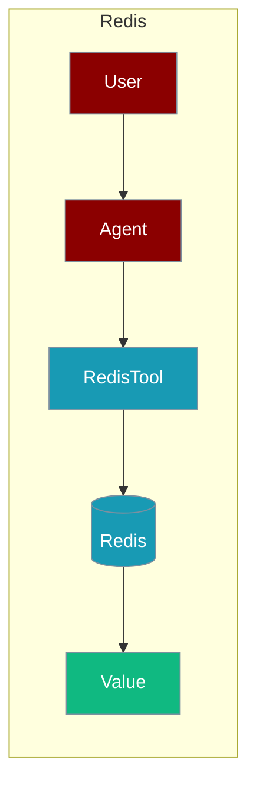
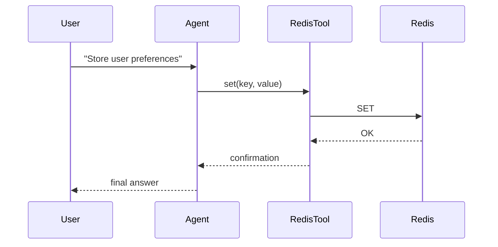

The Redis tool lets an agent read, write, and cache key-value data in Redis.



## Overview

Redis tool allows you to interact with Redis for caching, key-value storage, and pub/sub messaging.

## Installation

```bash
pip install "praisonai[tools]"
```

## Environment Variables

```bash
export REDIS_HOST=localhost
export REDIS_PORT=6379
export REDIS_PASSWORD=your_password  # Optional
```

## Quick Start

<Steps>
<Step title="Simple Usage">
```python
from praisonai_tools import RedisTool

# Initialize
redis = RedisTool(host="localhost", port=6379)

# Set and get values
redis.set("key", "value")
value = redis.get("key")
print(value)
```
</Step>
<Step title="With Configuration">
Use the same tool with an agent — see **Usage with Agent** below, or pass env vars and options from the sections above.
</Step>
</Steps>


## How It Works



## Usage with Agent

```python
from praisonaiagents import Agent
from praisonai_tools import RedisTool

redis = RedisTool(host="localhost", port=6379)

agent = Agent(
    name="CacheManager",
    instructions="You manage cached data using Redis.",
    tools=[redis]
)

response = agent.chat("Store user preferences for user123")
print(response)
```

## Available Methods

### get(key)

Get a value by key.

```python
from praisonai_tools import RedisTool

redis = RedisTool(host="localhost")
value = redis.get("user:123:name")
```

### set(key, value, ttl=None)

Set a key-value pair with optional TTL.

```python
redis.set("session:abc", "data", ttl=3600)  # Expires in 1 hour
```

### delete(key)

Delete a key.

```python
redis.delete("old_key")
```

### keys(pattern)

Find keys matching a pattern.

```python
keys = redis.keys("user:*")
```

### hget/hset

Hash operations.

```python
redis.hset("user:123", "name", "Alice")
name = redis.hget("user:123", "name")
```

## Docker Setup

```bash
docker run -d --name redis \
    -p 6379:6379 \
    redis:7
```

## Common Errors

| Error | Cause | Solution |
|-------|-------|----------|
| `redis not installed` | Missing dependency | Run `pip install redis` |
| `Connection refused` | Redis not running | Start Redis server |
| `NOAUTH` | Authentication required | Provide password |

## Best Practices

<AccordionGroup>
<Accordion title="Load the password from the environment">
Read `REDIS_PASSWORD` from the environment instead of hard-coding it in the tool call.
</Accordion>

<Accordion title="Set a TTL on cached keys">
`set(key, value, ttl=3600)` expires keys automatically. Use TTLs so agent-written cache entries do not grow unbounded.
</Accordion>

<Accordion title="Use scoped key patterns">
Namespace keys (e.g. `user:123:name`) so agents can filter with `keys(pattern)` without scanning the whole store.
</Accordion>
</AccordionGroup>

## Related Tools

<CardGroup cols={2}>
  <Card title="MongoDB" icon="book" href="/docs/tools/external/mongodb">
    NoSQL database
  </Card>
  <Card title="PostgreSQL" icon="book" href="/docs/tools/external/postgres">
    SQL database
  </Card>
  <Card title="Upstash" icon="book" href="/docs/databases/upstash">
    Serverless Redis
  </Card>
</CardGroup>
