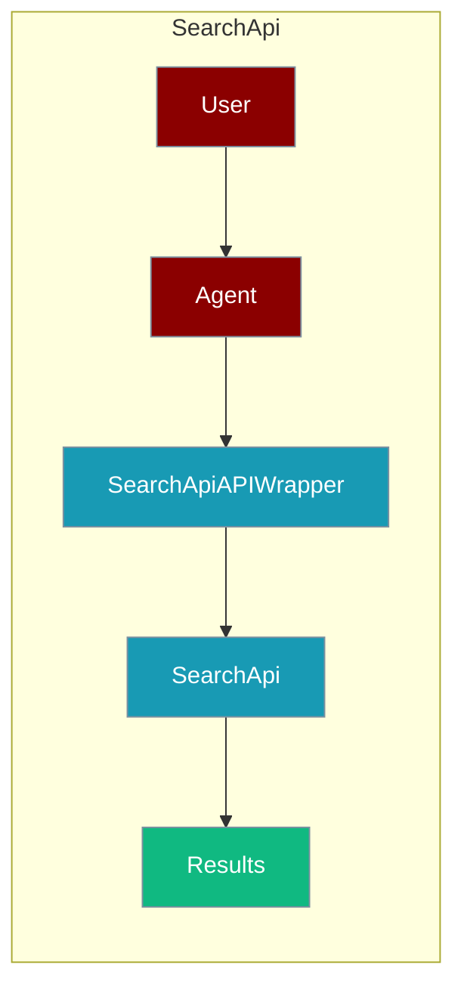
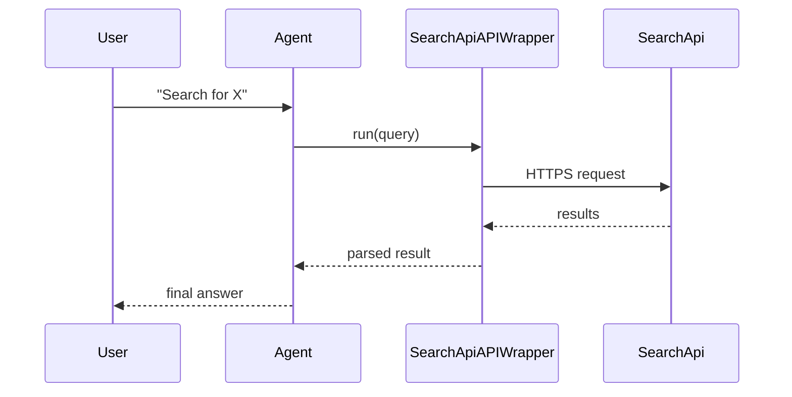

The SearchApi tool lets an agent search the web through the SearchApi service.



## Overview

The SearchApi tool is a tool that allows you to search the web using the SearchApi.

```bash
export SEARCHAPI_API_KEY="${SEARCHAPI_API_KEY:?Set SEARCHAPI_API_KEY in your shell}"
```

```python
from praisonaiagents import Agent, AgentTeam
from langchain_community.utilities import SearchApiAPIWrapper

data_agent = Agent(instructions="I am looking for the top google searches of 2025", tools=[SearchApiAPIWrapper])
editor_agent = Agent(instructions="Analyze the data and derive insights")

agents = AgentTeam(agents=[data_agent, editor_agent])
agents.start()
```

## How It Works



## Getting Started

<Steps>
<Step title="Simple Usage">
1. Install dependencies (see **Overview** above)
2. Set required API keys in your environment
3. Run the agent example in **Overview**
</Step>
<Step title="With Configuration">
Use the same tool with an agent — see the **Overview** example, or pass env vars from the sections above.
</Step>
</Steps>

## Best Practices

<AccordionGroup>
<Accordion title="Keep SEARCHAPI_API_KEY in the environment">
Set `SEARCHAPI_API_KEY` in your shell or `.env`. `SearchApiAPIWrapper` reads it automatically — never hard-code the key.
</Accordion>

<Accordion title="Scope the query">
SearchApi returns broad web results. Give the agent specific queries so it processes fewer, more relevant hits.
</Accordion>

<Accordion title="Handle rate limits">
SearchApi returns HTTP 429 when the plan quota is exceeded. Wrap the call in `try/except` so the agent can fall back to another search tool.
</Accordion>
</AccordionGroup>

## Related Tools

<CardGroup cols={2}>
  <Card title="Serp Search" icon="book" href="/docs/tools/external/serp-search">
    SerpAPI wrapper
  </Card>
  <Card title="Google Search" icon="book" href="/docs/tools/external/google-search">
    LangChain Google search
  </Card>
  <Card title="Tavily" icon="book" href="/docs/tools/external/tavily">
    AI-powered search
  </Card>
</CardGroup>

