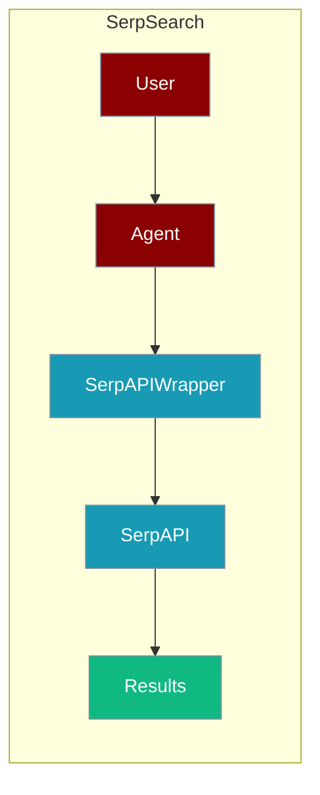
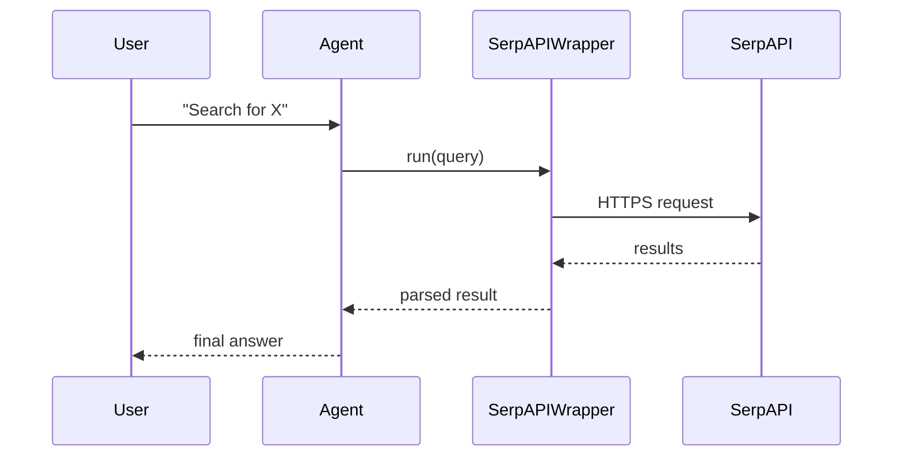

The SerpSearch tool lets an agent search the web through the SerpAPI service.



## Overview

The SerpSearch tool is a tool that allows you to search the web using the SerpAPI.

```bash
pip install langchain-community google-search-results
export SERPAPI_API_KEY="${SERPAPI_API_KEY:?Set SERPAPI_API_KEY in your shell}"
export OPENAI_API_KEY="${OPENAI_API_KEY:?Set OPENAI_API_KEY in your shell}"
```

```python
from praisonaiagents import Agent, AgentTeam
from langchain_community.utilities import SerpAPIWrapper

data_agent = Agent(instructions="Search about decline of recruitment across various industries with the rise of AI", tools=[SerpAPIWrapper])
editor_agent = Agent(instructions="Write a blog article pointing out the jobs most at risk due to the rise of AI")
team = AgentTeam(agents=[data_agent, editor_agent])
team.start()
```

## How It Works



## Getting Started

<Steps>
<Step title="Simple Usage">
1. Install dependencies (see **Overview** above)
2. Set required API keys in your environment
3. Run the agent example in **Overview**
</Step>
<Step title="With Configuration">
Use the same tool with an agent — see the **Overview** example, or pass env vars from the sections above.
</Step>
</Steps>

## Best Practices

<AccordionGroup>
<Accordion title="Keep SERPAPI_API_KEY in the environment">
Set `SERPAPI_API_KEY` in your shell or `.env`. `SerpAPIWrapper` reads it automatically — never hard-code the key.
</Accordion>

<Accordion title="Watch the monthly quota">
SerpAPI plans cap total searches per month. Cache repeated queries so agents do not exhaust the quota mid-task.
</Accordion>

<Accordion title="Handle rate limits">
SerpAPI returns an error when the quota is exceeded. Wrap the call in `try/except` so the agent can fall back to another search tool.
</Accordion>
</AccordionGroup>

## Related Tools

<CardGroup cols={2}>
  <Card title="Serp API" icon="book" href="/docs/tools/external/serp-api">
    SerpAPI tool page
  </Card>
  <Card title="Google Trends" icon="book" href="/docs/tools/external/google-trends">
    Google Trends
  </Card>
  <Card title="Serper" icon="book" href="/docs/tools/external/serper">
    Google search API
  </Card>
</CardGroup>

