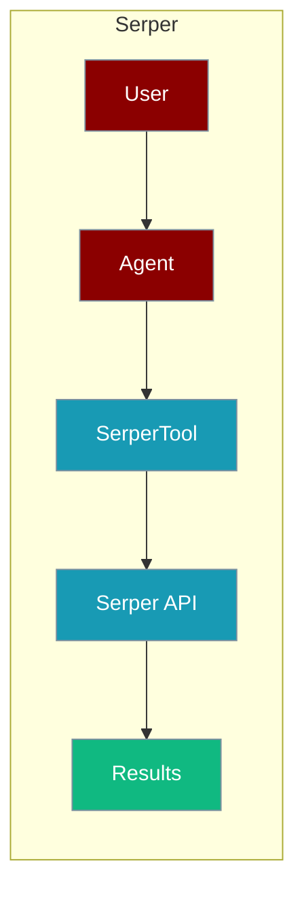
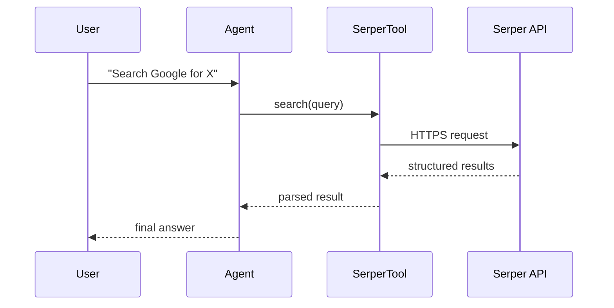

The Serper tool lets an agent fetch structured Google results via the Serper API.



## Overview

Serper provides fast, affordable access to Google Search results via API. Get structured search results including web, images, news, and more.

## Installation

```bash
pip install "praisonai[tools]"
```

## Environment Variables

```bash
export SERPER_API_KEY="${SERPER_API_KEY:?Set SERPER_API_KEY in your shell}"
```

Get your API key from [Serper](https://serper.dev/).

## How It Works



## Quick Start

<Steps>
<Step title="Simple Usage">
```python
from praisonai_tools import SerperTool

# Initialize
serper = SerperTool()

# Search
results = serper.search("Python programming tutorials")
print(results)
```
</Step>
<Step title="With Configuration">
Use the same tool with an agent — see **Usage with Agent** below, or pass env vars and options from the sections above.
</Step>
</Steps>


## Usage with Agent

```python
from praisonaiagents import Agent
from praisonai_tools import SerperTool

agent = Agent(
    name="Researcher",
    instructions="You are a research assistant. Use Serper to search Google.",
    tools=[SerperTool()]
)

response = agent.chat("Search Google for the latest AI news")
print(response)
```

## Available Methods

### search(query, num_results=10)

Search Google for web results.

```python
from praisonai_tools import SerperTool

serper = SerperTool()
results = serper.search("machine learning tutorials", num_results=5)

# Returns:
# [
#     {"title": "...", "link": "...", "snippet": "...", "position": 1},
#     ...
# ]
```

### news(query, num_results=10)

Search Google News.

```python
news = serper.news("artificial intelligence", num_results=5)
```

### images(query, num_results=10)

Search Google Images.

```python
images = serper.images("sunset landscape", num_results=5)
```

## Configuration Options

```python
serper = SerperTool(
    api_key="your_key",    # Optional: defaults to SERPER_API_KEY
    gl="us",               # Country code
    hl="en"                # Language code
)
```

## Function-Based Usage

```python
from praisonai_tools import serper_search

# Quick search without instantiating class
results = serper_search("Python best practices", num_results=5)
```

## CLI Usage

```bash
# Set API key
export SERPER_API_KEY=your_key

# Use with praisonai
praisonai --tools SerperTool "Search for Python tutorials"
```

## Error Handling

```python
from praisonai_tools import SerperTool

serper = SerperTool()
results = serper.search("my query")

if results and "error" in results[0]:
    print(f"Error: {results[0]['error']}")
else:
    for r in results:
        print(f"- {r['title']}: {r['link']}")
```

## Common Errors

| Error | Cause | Solution |
|-------|-------|----------|
| `SERPER_API_KEY not configured` | Missing API key | Set environment variable |
| `Invalid API key` | Wrong API key | Verify at serper.dev |
| `Rate limited` | Too many requests | Check usage limits |

## Best Practices

<AccordionGroup>
<Accordion title="Let SERPER_API_KEY come from the environment">
`SerperTool()` defaults to the `SERPER_API_KEY` env var. Set it in your shell or `.env` rather than passing `api_key=` inline.
</Accordion>

<Accordion title="Cap num_results">
`search(query, num_results=10)` defaults to 10. Lower it so the agent processes fewer tokens and responds faster.
</Accordion>

<Accordion title="Pick the right endpoint">
Serper exposes `search`, `news`, and `images`. Route the agent to the endpoint that matches the task to avoid noisy results.
</Accordion>
</AccordionGroup>

## Related Tools

<CardGroup cols={2}>
  <Card title="Tavily" icon="book" href="/docs/tools/external/tavily">
    AI-powered search
  </Card>
  <Card title="DuckDuckGo" icon="book" href="/docs/tools/external/duckduckgo">
    Privacy-focused search
  </Card>
  <Card title="Exa" icon="book" href="/docs/tools/external/exa">
    Neural search
  </Card>
</CardGroup>
