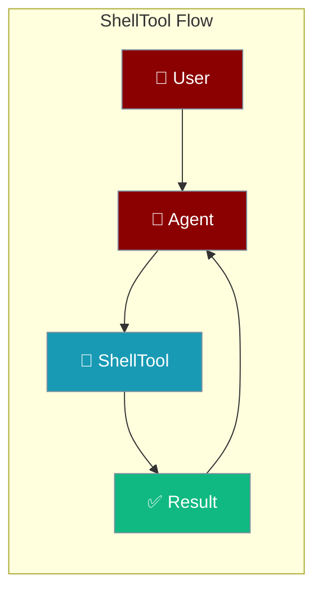
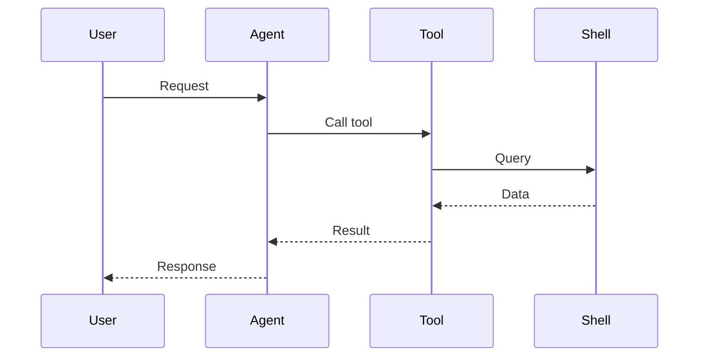

## Overview

Shell tool allows you to execute shell commands from your AI agents. Use with caution!

The user asks to run a command; the agent executes it in the shell and returns the output.



## Installation

```bash
pip install "praisonai[tools]"
```

## Quick Start

<Steps>
<Step title="Simple Usage">
```python
from praisonai_tools import ShellTool

# Initialize
shell = ShellTool()

# Execute command
result = shell.execute("ls -la")
print(result)
```
</Step>
<Step title="With Configuration">
Use the same tool with an agent — see **Usage with Agent** below, or pass env vars and options from the sections above.
</Step>
</Steps>


## Usage with Agent

```python
from praisonaiagents import Agent
from praisonai_tools import ShellTool

agent = Agent(
    name="SysAdmin",
    instructions="You help with system administration tasks.",
    tools=[ShellTool()]
)

response = agent.chat("List all Python processes")
print(response)
```

## Available Methods

### execute(command)

Execute a shell command.

```python
from praisonai_tools import ShellTool

shell = ShellTool()
result = shell.execute("echo 'Hello World'")
```

## Security Warning

⚠️ **Use with caution!** Shell commands can be dangerous. Consider:
- Restricting allowed commands
- Running in sandboxed environments
- Validating user input

## Common Errors

| Error | Cause | Solution |
|-------|-------|----------|
| `Command not found` | Invalid command | Check command exists |
| `Permission denied` | Insufficient permissions | Check file permissions |

## How It Works



---

## Best Practices

<AccordionGroup>
<Accordion title="Allowlist commands">
Restrict the agent to a known set of safe commands rather than arbitrary shell access.
</Accordion>
<Accordion title="Never interpolate untrusted input">
Build commands from validated arguments to avoid injection.
</Accordion>
<Accordion title="Set timeouts">
Bound command execution so a hung process doesn't stall the agent.
</Accordion>
</AccordionGroup>

---

## Related Tools

<CardGroup cols={2}>
  <Card title="Python" icon="book" href="/docs/tools/external/python">
    Execute Python code
  </Card>
  <Card title="Docker" icon="book" href="/docs/tools/external/docker">
    Container management
  </Card>
</CardGroup>
