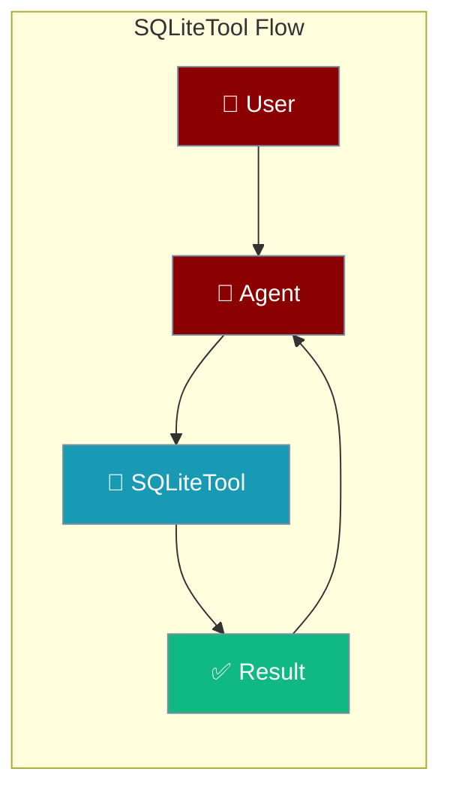
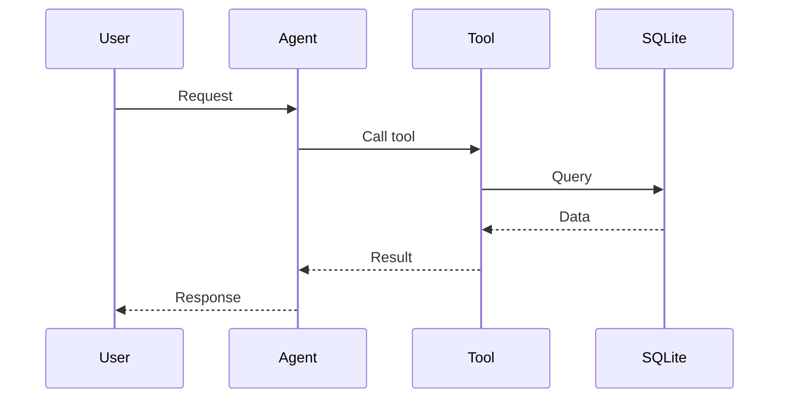

## Overview

SQLite tool allows you to query and manage SQLite databases. No server required - perfect for local development and embedded applications.

The user asks a data question; the agent runs SQL against the database and returns rows.



## Installation

```bash
pip install "praisonai[tools]"
```

No additional dependencies required - SQLite is built into Python!

## Quick Start

<Steps>
<Step title="Simple Usage">
```python
from praisonai_tools import SQLiteTool

# Initialize
sqlite = SQLiteTool(path="mydata.db")

# Query
results = sqlite.query("SELECT * FROM users LIMIT 5")
print(results)
```
</Step>
<Step title="With Configuration">
Use the same tool with an agent — see **Usage with Agent** below, or pass env vars and options from the sections above.
</Step>
</Steps>


## Usage with Agent

```python
from praisonaiagents import Agent
from praisonai_tools import SQLiteTool

sqlite = SQLiteTool(path="mydata.db")

agent = Agent(
    name="DBAnalyst",
    instructions="You are a database analyst. Use SQLite to query data.",
    tools=[sqlite]
)

response = agent.chat("Show me all tables in the database")
print(response)
```

## Available Methods

### query(sql)

Execute a SQL query.

```python
from praisonai_tools import SQLiteTool

sqlite = SQLiteTool(path="mydata.db")
results = sqlite.query("SELECT * FROM users WHERE active = 1")
```

### execute(sql)

Execute a SQL statement (INSERT, UPDATE, DELETE, CREATE).

```python
sqlite.execute("CREATE TABLE IF NOT EXISTS users (id INTEGER PRIMARY KEY, name TEXT)")
sqlite.execute("INSERT INTO users (name) VALUES ('Alice')")
```

### list_tables()

List all tables in the database.

```python
tables = sqlite.list_tables()
```

## Configuration Options

```python
sqlite = SQLiteTool(
    path="mydata.db",      # Database file path
    timeout=30             # Connection timeout
)
```

## Function-Based Usage

```python
from praisonai_tools import query_sqlite

# Quick query
results = query_sqlite("SELECT * FROM users", path="mydata.db")
```

## In-Memory Database

```python
# Use :memory: for temporary in-memory database
sqlite = SQLiteTool(path=":memory:")
sqlite.execute("CREATE TABLE test (id INTEGER, value TEXT)")
```

## Error Handling

```python
from praisonai_tools import SQLiteTool

sqlite = SQLiteTool(path="mydata.db")
result = sqlite.query("SELECT * FROM users")

if isinstance(result, dict) and "error" in result:
    print(f"Error: {result['error']}")
else:
    for row in result:
        print(row)
```

## Common Errors

| Error | Cause | Solution |
|-------|-------|----------|
| `no such table` | Table doesn't exist | Create table first |
| `database is locked` | Concurrent access | Close other connections |
| `disk I/O error` | File permission issue | Check file permissions |

## How It Works



---

## Best Practices

<AccordionGroup>
<Accordion title="Inspect the schema first">
List tables and columns before querying so the agent writes valid SQL.
</Accordion>
<Accordion title="Use parameterised queries">
Bind values instead of string-formatting them to avoid SQL injection.
</Accordion>
<Accordion title="Limit result size">
Add `LIMIT` so the agent works with a focused result set.
</Accordion>
</AccordionGroup>

---

## Related Tools

<CardGroup cols={2}>
  <Card title="PostgreSQL" icon="book" href="/docs/tools/external/postgres">
    PostgreSQL database
  </Card>
  <Card title="MySQL" icon="book" href="/docs/tools/external/mysql">
    MySQL database
  </Card>
  <Card title="DuckDB" icon="book" href="/docs/tools/external/duckdb">
    Analytics database
  </Card>
</CardGroup>
