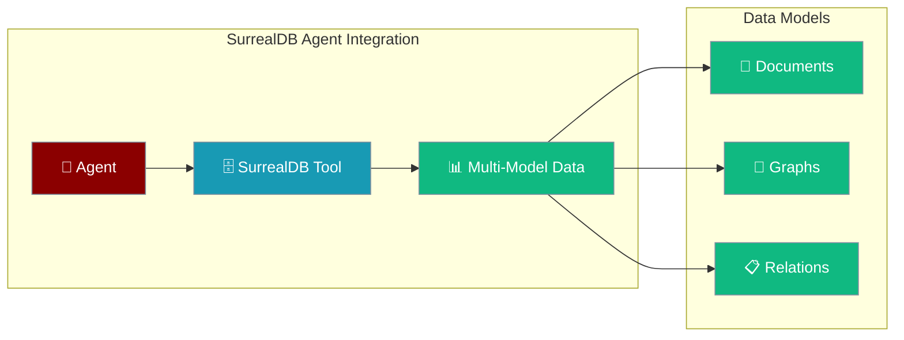

SurrealDB tool enables agents to interact with multi-model databases, supporting document, graph, and relational data through native SurrealQL queries.



## Installation

```bash
pip install "praisonai-tools[surrealdb]"
```

## Environment Variables

```bash
export SURREALDB_URL=ws://localhost:8000/rpc
export SURREALDB_USER=root
export SURREALDB_PASSWORD=root
export SURREALDB_NAMESPACE=test
export SURREALDB_DATABASE=test
```

## Quick Start

<Steps>
<Step title="Simple Agent Usage">
```python
from praisonaiagents import Agent
from praisonai_tools import SurrealDBTool

agent = Agent(
    name="DatabaseAgent",
    instructions="You analyze multi-model data using SurrealDB",
    tools=[SurrealDBTool(
        url="ws://localhost:8000/rpc",
        namespace="test",
        database="test"
    )]
)

response = agent.chat("Create a user and show all records")
```
</Step>

<Step title="Direct Tool Usage">
```python
from praisonai_tools import SurrealDBTool

db = SurrealDBTool(
    url="ws://localhost:8000/rpc",
    namespace="test",
    database="test"
)

results = db.query("SELECT * FROM users")
```
</Step>
</Steps>

## Available Methods

### query(sql)

Execute a SurrealQL query.

```python
from praisonai_tools import SurrealDBTool

db = SurrealDBTool(
    url="ws://localhost:8000/rpc",
    user="root", 
    password="root",
    namespace="test",
    database="test"
)

# SELECT query
results = db.query("SELECT * FROM users WHERE active = true")
print(results)

# Create record
db.query("CREATE users:john SET name = 'John Doe', email = 'john@example.com', active = true")

# Update record
db.query("UPDATE users:john SET last_login = time::now()")

# Delete record
db.query("DELETE users:john")
```

### create(table, data)

Create a new record in a table.

```python
user_data = {
    "name": "Alice Smith",
    "email": "alice@example.com", 
    "active": True,
    "created_at": "2024-01-01T00:00:00Z"
}

result = db.create("users", user_data)
print(f"Created user: {result}")
```

### select(table, conditions=None)

Select records from a table.

```python
# Select all users
all_users = db.select("users")

# Select with conditions
active_users = db.select("users", "active = true")
```

## Multi-Model Examples

### Document Data

```python
# Store document data
product_doc = {
    "name": "Wireless Headphones",
    "category": "Electronics",
    "specs": {
        "battery_life": "20 hours",
        "connectivity": ["Bluetooth 5.0", "USB-C"],
        "features": ["Noise Cancellation", "Quick Charge"]
    },
    "price": 199.99,
    "reviews": [
        {"rating": 5, "comment": "Excellent sound quality"},
        {"rating": 4, "comment": "Good value for money"}
    ]
}

db.create("products", product_doc)
```

### Graph Data

```python
# Create nodes and relationships
db.query("""
    CREATE person:alice SET name = 'Alice', age = 30;
    CREATE person:bob SET name = 'Bob', age = 25;
    CREATE company:acme SET name = 'Acme Corp';
    
    RELATE person:alice->works_for->company:acme SET position = 'Engineer';
    RELATE person:bob->works_for->company:acme SET position = 'Designer';
    RELATE person:alice->knows->person:bob SET since = '2020-01-01';
""")

# Query relationships
colleagues = db.query("""
    SELECT * FROM person WHERE ->works_for->company.name = 'Acme Corp'
""")
```

### Relational Data

```python
# Traditional relational operations
db.query("""
    CREATE orders SET 
        id = order:001,
        customer_id = 'user:alice',
        items = [
            { product_id: 'prod:123', quantity: 2, price: 29.99 },
            { product_id: 'prod:456', quantity: 1, price: 59.99 }
        ],
        total = 119.97,
        status = 'pending';
""")

# JOIN-like queries
order_details = db.query("""
    SELECT *, 
           customer_id.name AS customer_name,
           items.*.product_id.name AS product_names
    FROM orders WHERE id = order:001
""")
```

## Configuration Options

```python
surrealdb_tool = SurrealDBTool(
    url="ws://localhost:8000/rpc",  # WebSocket URL for RPC
    user="root",                     # Username
    password="root",                 # Password
    namespace="production",          # Namespace
    database="main",                 # Database name
    timeout=30                       # Connection timeout (seconds)
)
```

### Connection URLs

Different connection formats supported:

```python
# Local WebSocket
url = "ws://localhost:8000/rpc"

# Local HTTP
url = "http://localhost:8000/rpc"  

# Remote with SSL
url = "wss://your-surrealdb-instance.com:8000/rpc"

# SurrealDB Cloud
url = "wss://cloud.surrealdb.com/rpc"
```

## Function-Based Usage

```python
from praisonai_tools import surrealdb_query

# Quick query without persistent connection
results = surrealdb_query(
    "SELECT * FROM users",
    url="ws://localhost:8000/rpc",
    user="root",
    password="root",
    namespace="test",
    database="test"
)
print(results)
```

## Docker Setup

### Basic SurrealDB Server

<Warning>
Never use default credentials (root/root) in production. Always use strong, unique passwords and environment variables for security.
</Warning>

```bash
# Development only - use environment variables for credentials
docker run -d --name surrealdb \
    -p 8000:8000 \
    -e SURREALDB_USER="${SURREALDB_USER:-root}" \
    -e SURREALDB_PASSWORD="${SURREALDB_PASSWORD:-root}" \
    surrealdb/surrealdb:latest \
    start --log trace --user "${SURREALDB_USER:-root}" --pass "${SURREALDB_PASSWORD:-root}" memory
```

### With Persistent Storage

```bash
# With file storage
docker run -d --name surrealdb \
    -p 8000:8000 \
    -v $(pwd)/data:/data \
    -e SURREALDB_USER="${SURREALDB_USER:-root}" \
    -e SURREALDB_PASSWORD="${SURREALDB_PASSWORD:-root}" \
    surrealdb/surrealdb:latest \
    start --log trace --user "${SURREALDB_USER:-root}" --pass "${SURREALDB_PASSWORD:-root}" file:/data/database.db

# With RocksDB storage  
docker run -d --name surrealdb \
    -p 8000:8000 \
    -v $(pwd)/data:/data \
    -e SURREALDB_USER="${SURREALDB_USER:-root}" \
    -e SURREALDB_PASSWORD="${SURREALDB_PASSWORD:-root}" \
    surrealdb/surrealdb:latest \
    start --log trace --user "${SURREALDB_USER:-root}" --pass "${SURREALDB_PASSWORD:-root}" rocksdb:/data
```

## Production Setup

### Authentication

```python
# Using authentication tokens
surrealdb_tool = SurrealDBTool(
    url="wss://your-production-db.com/rpc",
    user="your-username",
    password="your-secure-password",
    namespace="production",
    database="app_data"
)
```

### Connection Pooling

```python
# For high-throughput applications
surrealdb_tool = SurrealDBTool(
    url="ws://localhost:8000/rpc",
    user="root",
    password="root", 
    namespace="production",
    database="main",
    pool_size=10,  # Connection pool size
    max_retries=3  # Retry failed connections
)
```

## Advanced Features

### Transactions

```python
# Execute multiple operations atomically
transaction = db.query("""
    BEGIN TRANSACTION;
    
    UPDATE account:alice SET balance -= 100;
    UPDATE account:bob SET balance += 100;
    CREATE transaction SET 
        from = account:alice,
        to = account:bob, 
        amount = 100,
        timestamp = time::now();
        
    COMMIT TRANSACTION;
""")
```

### Real-time Subscriptions

```python
# Live queries for real-time updates
live_query = db.query("LIVE SELECT * FROM users WHERE active = true")
print(f"Live query ID: {live_query}")

# The agent can monitor changes in real-time
```

### Geospatial Queries

```python
# Store and query geospatial data
db.query("""
    CREATE location:office SET 
        name = 'Main Office',
        coordinates = { lat: 40.7128, lng: -74.0060 };
        
    SELECT * FROM location WHERE coordinates INSIDE {
        type: 'Polygon',
        coordinates: [[
            [-74.1, 40.6], [-73.9, 40.6], 
            [-73.9, 40.8], [-74.1, 40.8], 
            [-74.1, 40.6]
        ]]
    };
""")
```

## Error Handling

```python
from praisonai_tools import SurrealDBTool

try:
    db = SurrealDBTool(
        url="ws://localhost:8000/rpc",
        user="root",
        password="root",
        namespace="test", 
        database="test"
    )
    
    result = db.query("SELECT * FROM users")
    
    if isinstance(result, dict) and "error" in result:
        print(f"Query Error: {result['error']}")
    else:
        print(f"Results: {result}")
        
except Exception as e:
    print(f"Connection Error: {e}")
```

## Common Errors

| Error | Cause | Solution |
|-------|-------|----------|
| `Connection refused` | SurrealDB not running | Start SurrealDB server |
| `Authentication failed` | Wrong credentials | Check username/password |
| `Namespace not found` | Invalid namespace | Create namespace or check name |
| `Database not found` | Invalid database | Create database or check name |
| `surrealdb not installed` | Missing dependency | `pip install surrealdb` |

## Performance Tips

1. **Use Prepared Statements**: For repeated queries, use parameterized queries
2. **Batch Operations**: Group multiple operations in transactions
3. **Index Strategy**: Create indexes on frequently queried fields
4. **Connection Reuse**: Reuse connections instead of creating new ones

```python
# Efficient batch operations
batch_operations = """
    BEGIN TRANSACTION;
    CREATE users:user1 SET name = 'User 1', email = 'user1@example.com';
    CREATE users:user2 SET name = 'User 2', email = 'user2@example.com';
    CREATE users:user3 SET name = 'User 3', email = 'user3@example.com';
    COMMIT TRANSACTION;
"""

db.query(batch_operations)
```

## SurrealQL Quick Reference

### Data Types
- **Basic**: string, number, boolean, datetime
- **Complex**: object, array, geometry, duration
- **Special**: thing (record ID), uuid, bytes

### Common Operations
```sql
-- Create
CREATE users SET name = 'John', age = 30;
CREATE users:john SET name = 'John Doe';

-- Select  
SELECT * FROM users;
SELECT name, age FROM users WHERE age > 25;

-- Update
UPDATE users SET age = 31 WHERE name = 'John';
UPDATE users:john SET age += 1;

-- Delete
DELETE users WHERE age < 18;
DELETE users:john;

-- Relate (Graph)
RELATE user:alice->likes->product:laptop;

-- Live Queries
LIVE SELECT * FROM users;
```

## Related Tools

- [PostgreSQL](/docs/tools/external/postgres) - Relational database
- [MongoDB](/docs/tools/external/mongodb) - Document database  
- [Redis](/docs/tools/external/redis) - Key-value store
- [MySQL](/docs/tools/external/mysql) - Relational database
- [SQLite](/docs/tools/external/sqlite) - Embedded database

## Best Practices

1. **Multi-Model Design**: Leverage SurrealDB's multi-model capabilities for complex data
2. **Namespace Organization**: Use namespaces to separate environments (dev/staging/prod)  
3. **Security**: Always use authentication in production environments
4. **Monitoring**: Set up monitoring for query performance and resource usage
5. **Backup Strategy**: Implement regular backups for persistent storage setups

## Community & Support

- [SurrealDB Documentation](https://surrealdb.com/docs)
- [SurrealQL Reference](https://surrealdb.com/docs/surrealql)
- [SurrealDB GitHub](https://github.com/surrealdb/surrealdb)
- [Community Discord](https://discord.gg/surrealdb)