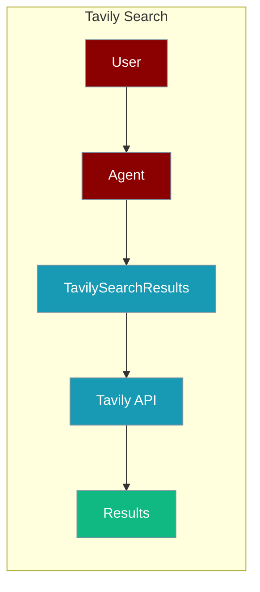
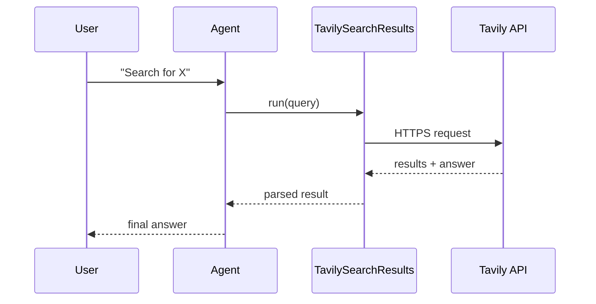

The TavilySearch tool lets an agent run AI-optimised web search through the Tavily API.



## Overview

The TavilySearch tool is a tool that allows you to search the web using the TavilySearch.

```bash
pip install "langchain-community>=0.2.11" tavily-python
export TAVILY_API_KEY="${TAVILY_API_KEY:?Set TAVILY_API_KEY in your shell}"
```

```python
from praisonaiagents import Agent, AgentTeam
from langchain_community.tools import TavilySearchResults

def search_tool(query: str):
    tool = TavilySearchResults(
        max_results=5,
        search_depth="advanced",
        include_answer=True,
        include_raw_content=True,
        include_images=True
    )
    return tool.run(query)

data_agent = Agent(instructions="I am looking for the top google searches on AI tools of 2025", tools=[search_tool])
editor_agent = Agent(instructions="Analyze the data and rank the tools based on their popularity")

agents = AgentTeam(agents=[data_agent, editor_agent])
agents.start()
```

## How It Works



## Getting Started

<Steps>
<Step title="Simple Usage">
1. Install dependencies (see **Overview** above)
2. Set required API keys in your environment
3. Run the agent example in **Overview**
</Step>
<Step title="With Configuration">
Use the same tool with an agent — see the **Overview** example, or pass env vars from the sections above.
</Step>
</Steps>

## Best Practices

<AccordionGroup>
<Accordion title="Keep TAVILY_API_KEY in the environment">
Set `TAVILY_API_KEY` in your shell or `.env`. The tool reads it automatically — never hard-code the key.
</Accordion>

<Accordion title="Cap max_results">
`TavilySearchResults(max_results=5)` controls how many hits return. Lower it so the agent processes fewer tokens.
</Accordion>

<Accordion title="Enable include_answer for direct answers">
Set `include_answer=True` when the agent needs a synthesised answer rather than raw links — it saves a follow-up LLM step.
</Accordion>
</AccordionGroup>

## Related Tools

<CardGroup cols={2}>
  <Card title="Tavily" icon="book" href="/docs/tools/external/tavily">
    Tavily tool (praisonai-tools)
  </Card>
  <Card title="Exa Search" icon="book" href="/docs/tools/external/exa-search">
    Exa LangChain integration
  </Card>
  <Card title="DuckDuckGo" icon="book" href="/docs/tools/external/duckduckgo">
    Privacy-focused search
  </Card>
</CardGroup>

