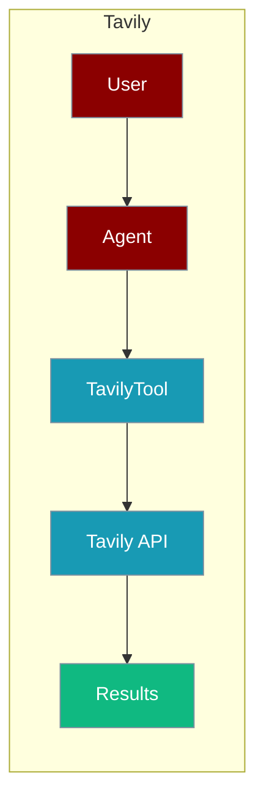
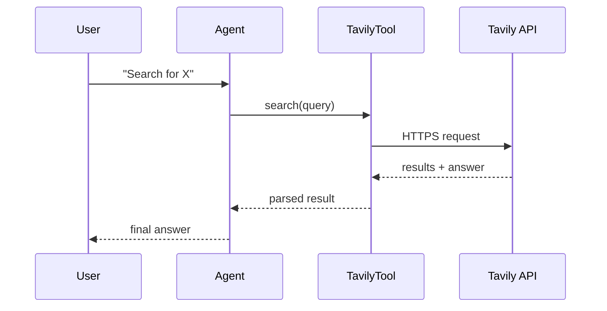

Tavily is an AI-powered search engine that gives agents high-quality results with built-in answer synthesis.



## Overview

Tavily is an AI-powered search engine optimized for LLMs and AI agents. It provides high-quality, relevant search results with built-in answer synthesis.

## Installation

```bash
pip install "praisonai[tools]"
```

## Environment Variables

```bash
export TAVILY_API_KEY="${TAVILY_API_KEY:?Set TAVILY_API_KEY in your shell}"
```

Get your API key from [Tavily](https://tavily.com/).

## How It Works



## Quick Start

<Steps>
<Step title="Simple Usage">
```python
from praisonai_tools import TavilyTool

# Initialize
tavily = TavilyTool()

# Search
results = tavily.search("What is quantum computing?")
print(results)
```
</Step>
<Step title="With Configuration">
Use the same tool with an agent — see **Usage with Agent** below, or pass env vars and options from the sections above.
</Step>
</Steps>

## Usage with Agent

```python
from praisonaiagents import Agent
from praisonai_tools import TavilyTool

agent = Agent(
    name="Researcher",
    instructions="You are a research assistant. Use Tavily to search for information.",
    tools=[TavilyTool()]
)

response = agent.chat("Search for the latest AI news")
print(response)
```

## Available Methods

### search(query, max_results=5)

Search the web with AI-powered results.

```python
from praisonai_tools import TavilyTool

tavily = TavilyTool()
results = tavily.search("Python best practices", max_results=3)

# Returns:
# {
#     "query": "Python best practices",
#     "answer": "AI-generated summary...",
#     "results": [
#         {"title": "...", "url": "...", "content": "...", "score": 0.95}
#     ]
# }
```

### search_context(query)

Get search context optimized for RAG applications.

```python
context = tavily.search_context("machine learning fundamentals")
# Returns a string with relevant context for LLM consumption
```

### extract(urls)

Extract content from specific URLs.

```python
content = tavily.extract("https://example.com,https://another.com")
# Returns list of extracted content from each URL
```

## Configuration Options

```python
tavily = TavilyTool(
    api_key="your_key",           # Optional: defaults to TAVILY_API_KEY env var
    search_depth="advanced",       # "basic" or "advanced"
    include_answer=True,           # Include AI-generated answer
    max_tokens=6000               # Max tokens for context
)
```

## Function-Based Usage

```python
from praisonai_tools import tavily_search

# Quick search without instantiating class
results = tavily_search("latest tech news", max_results=5)
```

## CLI Usage

```bash
# Set API key
export TAVILY_API_KEY=your_key

# Use with praisonai
praisonai --tools TavilyTool "Search for AI trends 2025"
```

## Error Handling

```python
from praisonai_tools import TavilyTool

tavily = TavilyTool()
results = tavily.search("my query")

if "error" in results:
    print(f"Error: {results['error']}")
else:
    print(f"Found {len(results['results'])} results")
```

## Common Errors

| Error | Cause | Solution |
|-------|-------|----------|
| `TAVILY_API_KEY not configured` | Missing API key | Set `TAVILY_API_KEY` environment variable |
| `tavily-python not installed` | Missing dependency | Run `pip install tavily-python` |
| `Invalid API key` | Wrong API key | Verify your API key at tavily.com |

## Best Practices

<AccordionGroup>
<Accordion title="Let TAVILY_API_KEY come from the environment">
`TavilyTool()` defaults to the `TAVILY_API_KEY` env var. Set it in your shell or `.env` rather than passing `api_key=` inline.
</Accordion>

<Accordion title="Use search_context for RAG">
`search_context(query)` returns text optimised for LLM consumption. Prefer it over raw `search` when feeding results straight into the agent.
</Accordion>

<Accordion title="Tune search_depth">
`search_depth="advanced"` returns richer results at higher latency. Use `"basic"` for quick lookups to keep the agent responsive.
</Accordion>
</AccordionGroup>

## Related Tools

<CardGroup cols={2}>
  <Card title="Exa Search" icon="book" href="/docs/tools/external/exa">
    Neural search engine
  </Card>
  <Card title="DuckDuckGo" icon="book" href="/docs/tools/external/duckduckgo">
    Privacy-focused search
  </Card>
  <Card title="Serper" icon="book" href="/docs/tools/external/serper">
    Google search API
  </Card>
</CardGroup>
