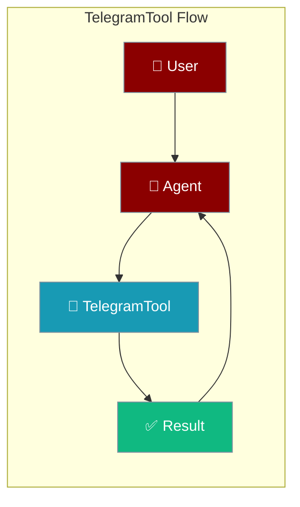
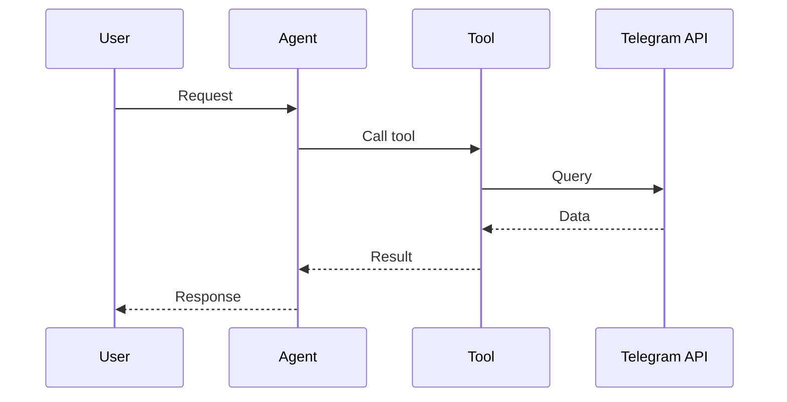

## Overview

Telegram tool allows you to send messages, photos, and documents via Telegram bots.

The user asks to send or read messages; the agent calls Telegram and returns the outcome.



## Installation

```bash
pip install "praisonai[tools]"
```

## Environment Variables

```bash
export TELEGRAM_BOT_TOKEN=your_bot_token
export TELEGRAM_CHAT_ID=your_chat_id  # Optional default chat
```

Get your bot token from [@BotFather](https://t.me/botfather).

## Quick Start

<Steps>
<Step title="Simple Usage">
```python
from praisonai_tools import TelegramTool

# Initialize
telegram = TelegramTool()

# Send message
telegram.send_message("123456789", "Hello from PraisonAI!")
```
</Step>
<Step title="With Configuration">
Use the same tool with an agent — see **Usage with Agent** below, or pass env vars and options from the sections above.
</Step>
</Steps>
 Usage with Agent

```python
from praisonaiagents import Agent
from praisonai_tools import TelegramTool

agent = Agent(
    name="TelegramBot",
    instructions="You send notifications via Telegram.",
    tools=[TelegramTool()]
)

response = agent.chat("Send a message to chat 123456789 saying hello")
print(response)
```

## Available Methods

### send_message(chat_id, text)

Send a text message.

```python
from praisonai_tools import TelegramTool

telegram = TelegramTool()
telegram.send_message("123456789", "Hello!")
```

### send_photo(chat_id, photo_url, caption=None)

Send a photo.

```python
telegram.send_photo("123456789", "https://example.com/image.jpg", "Check this out!")
```

## Common Errors

| Error | Cause | Solution |
|-------|-------|----------|
| `TELEGRAM_BOT_TOKEN not configured` | Missing token | Set environment variable |
| `chat not found` | Invalid chat ID | Check chat ID |
| `bot was blocked` | User blocked bot | User must unblock |
| `Error: API quota exceeded. Check billing.` | OpenAI 429 insufficient_quota | Add credits at platform.openai.com |
| `Error: Rate limit exceeded. Try again later.` | OpenAI / provider rate limit | Wait and retry, or upgrade plan |
| `Error: Authentication failed. Check API key.` | Invalid / missing API key | Verify `OPENAI_API_KEY` env var |
| `Error: Request timeout. Try again.` | Slow LLM / network | Retry; check connectivity |

## How It Works



---

## Best Practices

<AccordionGroup>
<Accordion title="Store the bot token securely">
Read the Telegram bot token from the environment, never hard-code it.
</Accordion>
<Accordion title="Validate chat IDs">
Confirm the target chat ID before sending so messages reach the right conversation.
</Accordion>
<Accordion title="Handle rate limits">
Telegram throttles bursts. Retry with backoff so the agent stays responsive.
</Accordion>
</AccordionGroup>

---

## Related Tools

<CardGroup cols={2}>
  <Card title="Slack" icon="book" href="/docs/tools/external/slack">
    Slack messaging
  </Card>
  <Card title="Discord" icon="book" href="/docs/tools/external/discord">
    Discord messaging
  </Card>
  <Card title="WhatsApp" icon="book" href="/docs/tools/external/whatsapp">
    WhatsApp messaging
  </Card>
</CardGroup>
