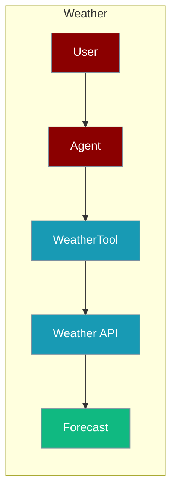
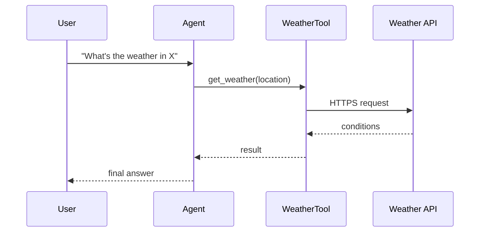

The Weather tool lets an agent fetch current conditions, forecasts, and air-quality data.



## Overview

Weather tool provides current weather, forecasts, and air quality data using various weather APIs.

## Installation

```bash
pip install "praisonai[tools]"
```

## Environment Variables

```bash
export OPENWEATHER_API_KEY="${OPENWEATHER_API_KEY:?Set OPENWEATHER_API_KEY in your shell}"
# Or
export WEATHERAPI_KEY="${WEATHERAPI_KEY:?Set WEATHERAPI_KEY in your shell}"
```

## Quick Start

<Steps>
<Step title="Simple Usage">
```python
from praisonai_tools import WeatherTool

# Initialize
weather = WeatherTool()

# Get weather
result = weather.get_weather("London")
print(result)
```
</Step>
<Step title="With Configuration">
Use the same tool with an agent — see **Usage with Agent** below, or pass env vars and options from the sections above.
</Step>
</Steps>

## How It Works



## Usage with Agent

```python
from praisonaiagents import Agent
from praisonai_tools import WeatherTool

agent = Agent(
    name="WeatherBot",
    instructions="You provide weather information.",
    tools=[WeatherTool()]
)

response = agent.chat("What's the weather in New York?")
print(response)
```

## Available Methods

### get_weather(location)

Get current weather.

```python
from praisonai_tools import WeatherTool

weather = WeatherTool()
result = weather.get_weather("San Francisco")
```

### get_forecast(location, days=3)

Get weather forecast.

```python
forecast = weather.get_forecast("Tokyo", days=5)
```

### get_air_quality(location)

Get air quality index.

```python
aqi = weather.get_air_quality("Beijing")
```

## Common Errors

| Error | Cause | Solution |
|-------|-------|----------|
| `API key not configured` | Missing key | Set environment variable |
| `City not found` | Invalid location | Check city name |

## Best Practices

<AccordionGroup>
<Accordion title="Keep the weather API key in the environment">
Set `OPENWEATHER_API_KEY` or `WEATHERAPI_KEY` in your shell or `.env`. `WeatherTool()` reads it automatically — never hard-code the key.
</Accordion>

<Accordion title="Bound forecast length">
`get_forecast(location, days=3)` defaults to 3 days. Request only the horizon the task needs to keep responses concise.
</Accordion>

<Accordion title="Handle unknown locations">
Invalid city names return a "City not found" error. Wrap the call in `try/except` so the agent can ask the user to clarify the location.
</Accordion>
</AccordionGroup>

## Related Tools

<CardGroup cols={2}>
  <Card title="Google Maps" icon="book" href="/docs/tools/external/google-maps">
    Location services
  </Card>
</CardGroup>
