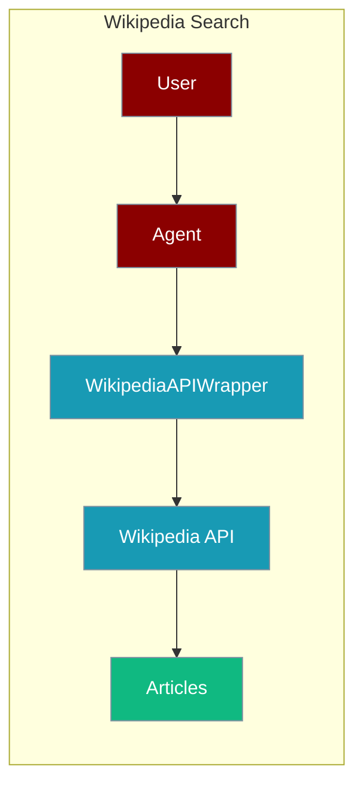
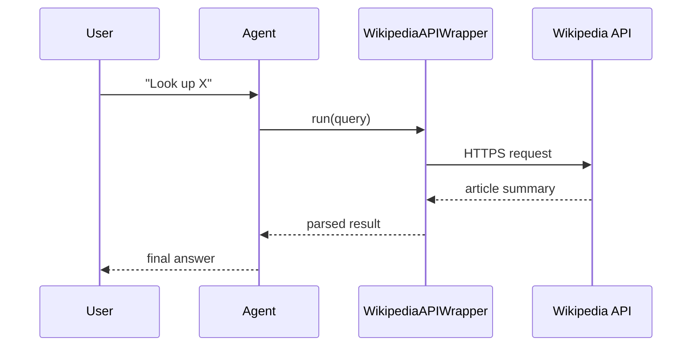

The Wikipedia Search tool lets an agent look up and retrieve encyclopedic facts from Wikipedia.



## Overview

The Wikipedia Search tool is a tool that allows you to search and retrieve information from Wikipedia.

```bash
pip install langchain-community
export OPENAI_API_KEY="${OPENAI_API_KEY:?Set OPENAI_API_KEY in your shell}"
```

```python
from praisonaiagents import Agent, AgentTeam
from langchain_community.utilities import WikipediaAPIWrapper

data_agent = Agent(instructions="Gather all of Messi's record in LaLiga", tools=[WikipediaAPIWrapper])
summarise_agent = Agent(instructions="Summarize the data into a well structured format")
agents = AgentTeam(agents=[data_agent, summarise_agent])
agents.start()
```

## How It Works



## Getting Started

<Steps>
<Step title="Simple Usage">
1. Install dependencies (see **Overview** above)
2. Set required API keys in your environment
3. Run the agent example in **Overview**
</Step>
<Step title="With Configuration">
Use the same tool with an agent — see the **Overview** example, or pass env vars from the sections above.
</Step>
</Steps>

## Best Practices

<AccordionGroup>
<Accordion title="No provider key needed">
Wikipedia search is free — only `OPENAI_API_KEY` for the agent's LLM is required. `WikipediaAPIWrapper` needs no API key.
</Accordion>

<Accordion title="Limit returned characters">
`WikipediaAPIWrapper` accepts `doc_content_chars_max`. Cap it so long articles do not overflow the agent's context window.
</Accordion>

<Accordion title="Disambiguate queries">
Ambiguous terms return the wrong page. Feed the agent specific titles (e.g. "Lionel Messi") so results match intent.
</Accordion>
</AccordionGroup>

## Related Tools

<CardGroup cols={2}>
  <Card title="Wikipedia" icon="book" href="/docs/tools/external/wikipedia">
    Wikipedia tool
  </Card>
  <Card title="Tavily" icon="book" href="/docs/tools/external/tavily">
    AI-powered search
  </Card>
  <Card title="ArXiv" icon="book" href="/docs/tools/external/arxiv">
    Academic papers
  </Card>
</CardGroup>

