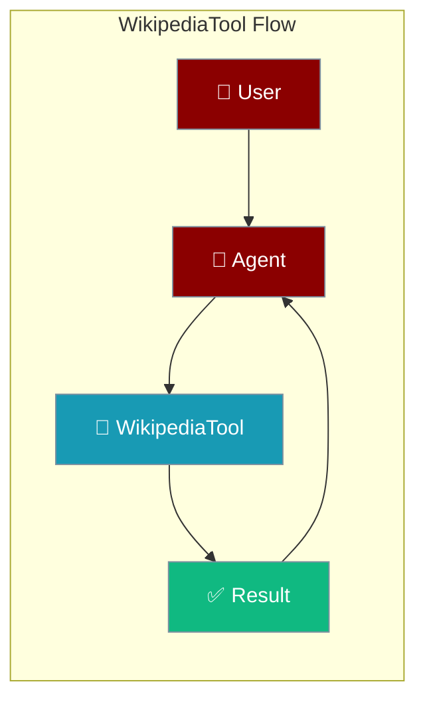
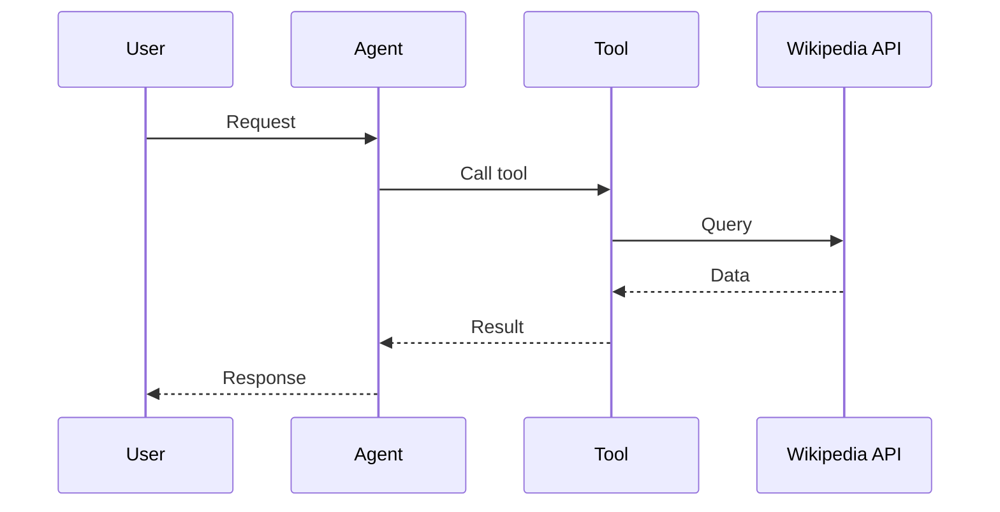

## Overview

Wikipedia tool allows you to search Wikipedia and retrieve article content. No API key required.

The user asks a factual question; the agent searches Wikipedia and returns a summary.



## Installation

```bash
pip install "praisonai[tools]"
```

No API key required!

## Quick Start

<Steps>
<Step title="Simple Usage">
```python
from praisonai_tools import WikipediaTool

# Initialize
wiki = WikipediaTool()

# Search
results = wiki.search("Python programming")
print(results)
```
</Step>
<Step title="With Configuration">
Use the same tool with an agent — see **Usage with Agent** below, or pass env vars and options from the sections above.
</Step>
</Steps>
 Usage with Agent

```python
from praisonaiagents import Agent
from praisonai_tools import WikipediaTool

agent = Agent(
    name="Researcher",
    instructions="You are a research assistant. Use Wikipedia to find information.",
    tools=[WikipediaTool()]
)

response = agent.chat("Tell me about quantum computing")
print(response)
```

## Available Methods

### search(query, max_results=5)

Search Wikipedia for articles.

```python
from praisonai_tools import WikipediaTool

wiki = WikipediaTool()
results = wiki.search("machine learning", max_results=5)

# Returns:
# [{"title": "Machine learning"}, {"title": "Deep learning"}, ...]
```

### get_page(title)

Get full Wikipedia page content.

```python
page = wiki.get_page("Python (programming language)")

# Returns:
# {
#     "title": "Python (programming language)",
#     "url": "https://en.wikipedia.org/wiki/...",
#     "summary": "...",
#     "content": "...",
#     "categories": [...]
# }
```

### summary(title, sentences=5)

Get a brief summary of an article.

```python
summary = wiki.summary("Artificial intelligence", sentences=3)

# Returns:
# {"title": "Artificial intelligence", "summary": "..."}
```

## Configuration Options

```python
wiki = WikipediaTool(
    language="en"  # Wikipedia language (en, es, fr, de, etc.)
)

# For Spanish Wikipedia
wiki_es = WikipediaTool(language="es")
```

## Function-Based Usage

```python
from praisonai_tools import wikipedia_search

# Quick search without instantiating class
results = wikipedia_search("neural networks", max_results=3)
```

## CLI Usage

```bash
# Use with praisonai (no API key needed)
praisonai --tools WikipediaTool "What is quantum computing according to Wikipedia?"
```

## Error Handling

```python
from praisonai_tools import WikipediaTool

wiki = WikipediaTool()
result = wiki.get_page("Some Ambiguous Term")

if "error" in result:
    if result["error"] == "Disambiguation":
        print(f"Multiple options: {result['options']}")
    else:
        print(f"Error: {result['error']}")
else:
    print(f"Title: {result['title']}")
```

## Common Errors

| Error | Cause | Solution |
|-------|-------|----------|
| `wikipedia not installed` | Missing dependency | Run `pip install wikipedia` |
| `Disambiguation` | Multiple pages match | Use one of the returned options |
| `Page not found` | Article doesn't exist | Check spelling or search first |

## Supported Languages

Use ISO language codes:
- `en` - English
- `es` - Spanish
- `fr` - French
- `de` - German
- `zh` - Chinese
- `ja` - Japanese
- And many more...

## How It Works



---

## Best Practices

<AccordionGroup>
<Accordion title="No API key needed">
Wikipedia works without credentials — ideal for quick factual lookups.
</Accordion>
<Accordion title="Handle disambiguation">
When a title matches multiple pages, pick from the returned options instead of guessing.
</Accordion>
<Accordion title="Summarise, don't dump">
Fetch summaries rather than full articles so the agent works with fewer tokens.
</Accordion>
</AccordionGroup>

---

## Related Tools

<CardGroup cols={2}>
  <Card title="ArXiv" icon="book" href="/docs/tools/external/arxiv">
    Academic papers
  </Card>
  <Card title="PubMed" icon="book" href="/docs/tools/external/pubmed">
    Medical research
  </Card>
  <Card title="HackerNews" icon="book" href="/docs/tools/external/hackernews">
    Tech news
  </Card>
</CardGroup>
