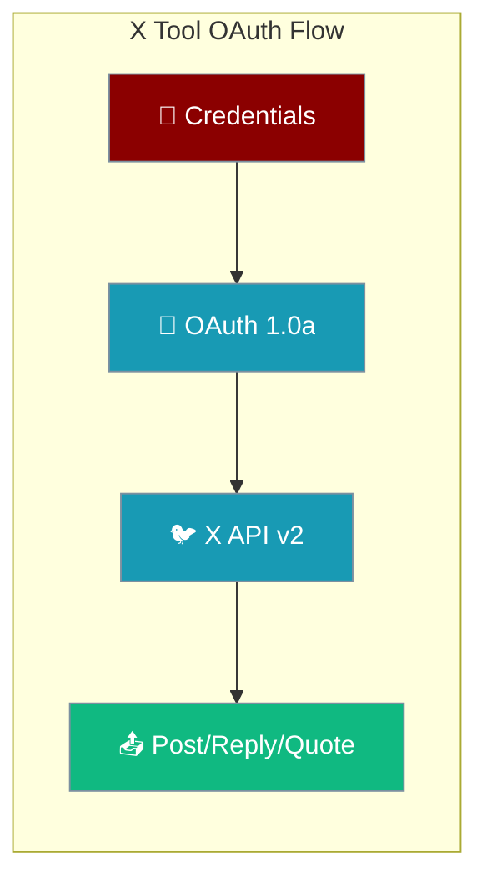
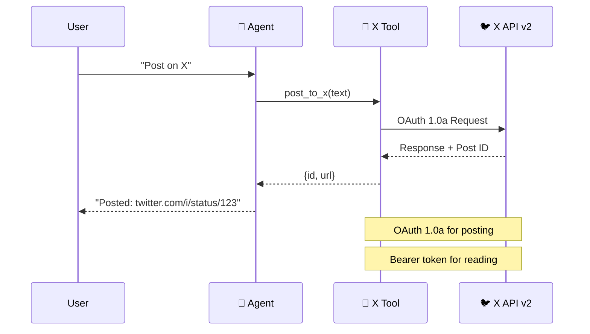

X Tool enables agents to post content, reply to posts, create quote posts, manage polls, upload media, and interact with X (formerly Twitter) using the official X API v2.

```python
from praisonaiagents import Agent
from praisonai_tools import XTool

agent = Agent(name="SocialAgent", tools=[XTool()])
agent.start('Post on X: "Just deployed our latest feature!"')
```

The user drafts a post; the agent publishes or reads timelines through the X tool.



## Quick Start

Get started with X Tool in three simple steps.

<Steps>
<Step title="Simple Post">
```python
from praisonai_tools import post_to_x

# Simple post
result = post_to_x("Shipping a new feature today! 🚀")
print(f"Posted: {result['url']}")
```
</Step>

<Step title="Function Helper">
```python
from praisonai_tools import post_to_x, reply_to_x, quote_x_post

# Post with media
post_result = post_to_x("Check out this image!", media_paths=["image.jpg"])
post_id = post_result['data']['id']

# Reply to post
reply_to_x(post_id, "Great update!")

# Quote tweet
quote_x_post(post_id, "This is exactly what we needed!")
```
</Step>

<Step title="Agent Usage">
```python
from praisonaiagents import Agent
from praisonai_tools import post_to_x

agent = Agent(
    name="social_poster",
    llm="gpt-4o-mini",
    instructions="When asked to post on X, call post_to_x and return the URL.",
    tools=[post_to_x],
)

agent.start('Post on X: "Just deployed our latest feature!"')
```
</Step>
</Steps>

---

## Installation

Install the required packages to get started with X Tool.

```bash
pip install praisonai-tools requests-oauthlib
```

---

## How It Works

X Tool supports three authentication modes for different use cases.

| Mode | Use Case | Can Post | Can Read | Setup Required |
|------|----------|----------|----------|----------------|
| **OAuth 1.0a User** | Full access (recommended) | ✅ | ✅ | X Developer Portal |
| **OAuth 2.0 User Bearer** | Read-only access | ❌ | ✅ | X Developer Portal |
| **App-only Bearer** | Public data only | ❌ | ✅ | X Developer Portal |

<Warning>
OAuth 2.0 app-only bearer tokens cannot post content. Use OAuth 1.0a for posting capabilities.
</Warning>

### OAuth 1.0a Setup (Recommended for Posting)

<Steps>
<Step title="Create X Developer Account">
Visit [developer.x.com](https://developer.x.com) and create a developer account.
</Step>

<Step title="Create App and Get Keys">
1. Create a new app in the X Developer Portal
2. Generate API Key and API Key Secret
3. Enable OAuth 1.0a with read/write permissions
4. Generate Access Token and Access Token Secret
</Step>

<Step title="Configure Environment Variables">
<CodeGroup>
```bash .env
X_API_KEY=
X_API_SECRET=
X_ACCESS_TOKEN=
X_ACCESS_SECRET=
```

```bash Export
export X_API_KEY=
export X_API_SECRET=
export X_ACCESS_TOKEN=
export X_ACCESS_SECRET=
```
</CodeGroup>
</Step>

<Step title="Test Authentication">
```python
from praisonai_tools import XTool

# Test connection
x_tool = XTool()
user_info = x_tool.get_user("your_username")
print(f"Connected as: {user_info['data']['name']}")
```
</Step>
</Steps>

---

## Configuration Options

Configure X Tool with your API credentials and preferences.

| Option | Type | Default | Description |
|--------|------|---------|-------------|
| `api_key` | `str` | `None` | X API key (from env var X_API_KEY if not provided) |
| `api_key_secret` | `str` | `None` | X API secret (from env var X_API_SECRET if not provided) |
| `access_token` | `str` | `None` | OAuth access token (from env var X_ACCESS_TOKEN if not provided) |
| `access_token_secret` | `str` | `None` | OAuth access token secret (from env var X_ACCESS_SECRET if not provided) |

### XTool Class

```python
from praisonai_tools import XTool

x_tool = XTool(
    api_key="your_api_key",               # Optional if env var set
    api_key_secret="your_api_secret",     # Optional if env var set
    access_token="your_access_token",     # Optional if env var set
    access_token_secret="your_access_secret"  # Optional if env var set
)
```

### XTool.post() Parameters

<ParamField path="text" type="str" required>
The text content of the post (up to 280 characters for basic accounts)
</ParamField>

<ParamField path="reply_to" type="str" default="None">
ID of post to reply to
</ParamField>

<ParamField path="quote_tweet_id" type="str" default="None">
ID of post to quote (Enterprise plan required)
</ParamField>

<ParamField path="media_ids" type="List[str]" default="None">
List of uploaded media IDs to attach
</ParamField>

<ParamField path="media_paths" type="List[str]" default="None">
List of local file paths to upload and attach
</ParamField>

<ParamField path="poll_options" type="List[str]" default="None">
Poll choices (2-4 options, each up to 25 chars)
</ParamField>

<ParamField path="poll_duration_minutes" type="int" default="1440">
Poll duration in minutes (5-10080, default 24 hours)
</ParamField>

### Function Helpers

| Function | Description | Returns |
|----------|-------------|---------|
| `post_to_x(text, **kwargs)` | Create a new post | Post ID and URL |
| `reply_to_x(post_id, text, **kwargs)` | Reply to a post | Reply ID and URL |
| `quote_x_post(post_id, text, **kwargs)` | Quote a post | Quote ID and URL |
| `delete_x_post(post_id)` | Delete a post | Success status |
| `search_x(query, **kwargs)` | Search posts | Search results |
| `get_x_user(username)` | Get user info | User data |

---

## Common Patterns

<Tabs>
<Tab title="Simple Post">
```python
from praisonai_tools import post_to_x

# Basic text post
result = post_to_x("Hello X! 👋")
print(f"Post URL: {result['url']}")
```
</Tab>

<Tab title="Post with Media">
```python
from praisonai_tools import post_to_x

# Post with image
result = post_to_x(
    text="Check out our new feature! 🚀",
    media_paths=["screenshot.png"]
)
print(f"Posted with media: {result['url']}")
```
</Tab>

<Tab title="Thread Creation">
```python
from praisonai_tools import post_to_x, reply_to_x

# Create thread
main_post = post_to_x("🧵 Thread about AI agents: 1/3")

reply_1 = reply_to_x(
    main_post['data']['id'], 
    "AI agents can automate social media posting... 2/3"
)

reply_2 = reply_to_x(
    reply_1['data']['id'],
    "The future is autonomous content creation! 3/3"
)
```
</Tab>

<Tab title="Poll Creation">
```python
from praisonai_tools import post_to_x

# Create poll
result = post_to_x(
    text="What's your favorite AI model? 🤖",
    poll_options=["GPT-4", "Claude", "Gemini", "Llama"],
    poll_duration_minutes=1440  # 24 hours
)
```
</Tab>
</Tabs>

---

## Agent Integration Patterns

<Tabs>
<Tab title="Social Media Manager">
```python
from praisonaiagents import Agent
from praisonai_tools import post_to_x, reply_to_x, search_x

agent = Agent(
    name="social_manager",
    llm="gpt-4o",
    instructions="""You manage social media presence on X. 
    - Post engaging content
    - Reply to mentions
    - Share updates about our products""",
    tools=[post_to_x, reply_to_x, search_x]
)

# Schedule posts
agent.start("Post about our new AI feature launch")
```
</Tab>

<Tab title="Customer Support Bot">
```python
from praisonaiagents import Agent
from praisonai_tools import search_x, reply_to_x

support_agent = Agent(
    name="support_bot",
    instructions="""Monitor mentions and provide helpful responses.
    Be professional and solution-oriented.""",
    tools=[search_x, reply_to_x]
)

# Monitor and respond
support_agent.start("Check for mentions of our brand and respond helpfully")
```
</Tab>

<Tab title="Content Curator">
```python
from praisonaiagents import Agent
from praisonai_tools import search_x, quote_x_post, post_to_x

curator = Agent(
    name="content_curator",
    instructions="""Find and share interesting tech content.
    Add thoughtful commentary when quoting posts.""",
    tools=[search_x, quote_x_post, post_to_x]
)

curator.start("Find and share interesting AI news with commentary")
```
</Tab>
</Tabs>

---

## Authentication Flow Diagram



---

## Best Practices

<AccordionGroup>
<Accordion title="Use OAuth 1.0a for Posting">
OAuth 1.0a provides full posting capabilities, while app-only bearer tokens are read-only.

```python
# ✅ Use OAuth 1.0a for posting  
x_tool = XTool(
    api_key="key",
    api_key_secret="secret", 
    access_token="token",
    access_token_secret="token_secret"
)
```
</Accordion>

<Accordion title="Handle Rate Limits Gracefully">
Implement exponential backoff to handle rate limits (300 posts per 15 minutes).

```python
import time
from praisonai_tools import post_to_x

def post_with_retry(text, max_retries=3):
    for attempt in range(max_retries):
        try:
            return post_to_x(text)
        except Exception as e:
            if attempt < max_retries - 1:
                time.sleep(2 ** attempt)  # Exponential backoff
            else:
                raise
```
</Accordion>

<Accordion title="Manage Character Limits">
Split long content into threaded posts for better readability.

```python
from praisonai_tools import post_to_x, reply_to_x

def safe_post(text, max_chunk=270):
    if len(text) <= 280:
        return post_to_x(text)
    # Split into thread; each chunk leaves room for " N/M" suffix
    chunks = [text[i:i+max_chunk] for i in range(0, len(text), max_chunk)]
    total = len(chunks)
    first = post_to_x(f"{chunks[0]} 1/{total}")
    prev_id = first['data']['id']
    for i, chunk in enumerate(chunks[1:], start=2):
        reply = reply_to_x(prev_id, f"{chunk} {i}/{total}")
        prev_id = reply['data']['id']
    return first
```
</Accordion>

<Accordion title="Secure Credential Management">
Store credentials in environment variables rather than hardcoding them.

```bash
# .env file
X_API_KEY=your_api_key
X_API_SECRET=your_api_secret
X_ACCESS_TOKEN=your_access_token
X_ACCESS_SECRET=your_access_secret
```
</Accordion>
</AccordionGroup>

---

## Premium Features

<Note>
Some features require X Premium or Enterprise plans:
- Extended character limits (Premium: up to 25,000 characters)
- Advanced search operators (Premium)
</Note>

**Quote Posts:**
```python
# Available on all plans via X API v2
quote_x_post("1234567890", "Adding my thoughts on this important topic...")
```

**Extended Posts:**
```python  
# Premium accounts can post up to 25,000 characters
long_post = "A" * 5000  # Long content
post_to_x(long_post)  # Works with Premium
```

---

## Related

<CardGroup cols={2}>
<Card title="Tools Overview" icon="wrench" href="/docs/tools/tools">
  Explore all available PraisonAI tools
</Card>
<Card title="Slack Integration" icon="slack" href="/docs/tools/external/slack">
  Send messages to Slack channels
</Card>
<Card title="Telegram Bot" icon="telegram" href="/docs/tools/external/telegram">  
  Send messages via Telegram bots
</Card>
<Card title="Custom Tools" icon="puzzle-piece" href="/docs/tools/custom">
  Create your own custom tools
</Card>
</CardGroup>