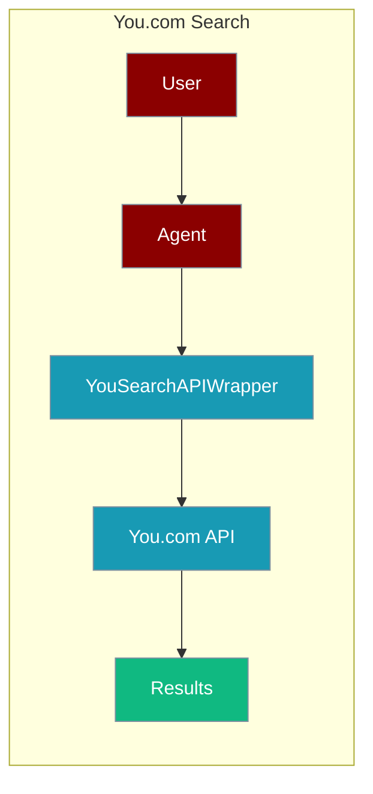
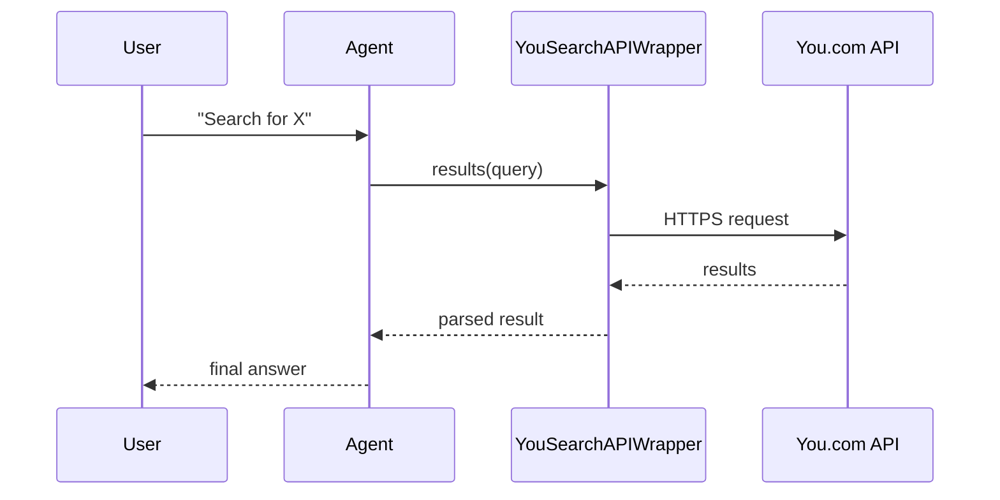

The YouSearchAPI tool lets an agent search the web through You.com's search API.



## Overview

The YouSearchAPI tool is a tool that allows you to search the web using the YouSearchAPI.

```bash
pip install langchain-community
export YDC_API_KEY="${YDC_API_KEY:?Set YDC_API_KEY in your shell}"
```

```python
from praisonaiagents import Agent, AgentTeam
from langchain_community.utilities.you import YouSearchAPIWrapper

data_agent = Agent(instructions="Gather the weather data for Barcelona", tools=[YouSearchAPIWrapper])
editor_agent = Agent(instructions="Breifly describe the weather in Barcelona")

agents = AgentTeam(agents=[data_agent, editor_agent])
agents.start()
```

## How It Works



## Getting Started

<Steps>
<Step title="Simple Usage">
1. Install dependencies (see **Overview** above)
2. Set required API keys in your environment
3. Run the agent example in **Overview**
</Step>
<Step title="With Configuration">
Use the same tool with an agent — see the **Overview** example, or pass env vars from the sections above.
</Step>
</Steps>

## Best Practices

<AccordionGroup>
<Accordion title="Keep YDC_API_KEY in the environment">
Set `YDC_API_KEY` in your shell or `.env`. `YouSearchAPIWrapper` reads it automatically — never hard-code the key.
</Accordion>

<Accordion title="Scope the query">
You.com returns web snippets. Give the agent specific queries so it processes fewer, more relevant results.
</Accordion>

<Accordion title="Handle rate limits">
The API returns HTTP 429 when the plan quota is exceeded. Wrap the call in `try/except` so the agent can fall back to another search tool.
</Accordion>
</AccordionGroup>

## Related Tools

<CardGroup cols={2}>
  <Card title="Tavily" icon="book" href="/docs/tools/external/tavily">
    AI-powered search
  </Card>
  <Card title="Exa" icon="book" href="/docs/tools/external/exa">
    Neural search
  </Card>
  <Card title="Serper" icon="book" href="/docs/tools/external/serper">
    Google search API
  </Card>
</CardGroup>

