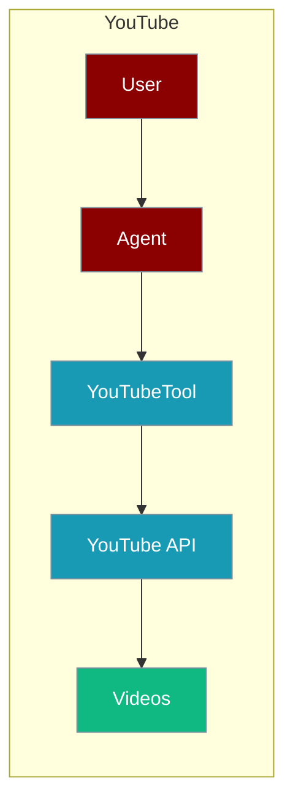
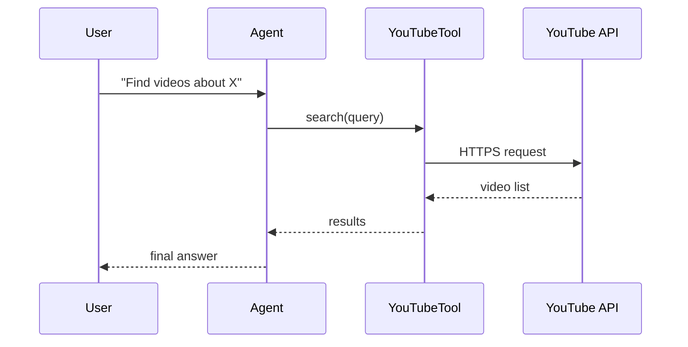

The YouTube tool lets an agent search videos, fetch details, and pull transcripts.



## Overview

YouTube tool allows you to search videos, get video details, and extract transcripts.

## Installation

```bash
pip install "praisonai[tools]"
```

## Environment Variables

```bash
export YOUTUBE_API_KEY=your_api_key  # Optional for basic features
```

## Quick Start

<Steps>
<Step title="Simple Usage">
```python
from praisonai_tools import YouTubeTool

# Initialize
youtube = YouTubeTool()

# Search
results = youtube.search("Python tutorials")
print(results)
```
</Step>
<Step title="With Configuration">
Use the same tool with an agent — see **Usage with Agent** below, or pass env vars and options from the sections above.
</Step>
</Steps>

## How It Works



## Usage with Agent

```python
from praisonaiagents import Agent
from praisonai_tools import YouTubeTool

agent = Agent(
    name="VideoResearcher",
    instructions="You help find and summarize YouTube videos.",
    tools=[YouTubeTool()]
)

response = agent.chat("Find videos about machine learning basics")
print(response)
```

## Available Methods

### search(query, max_results=5)

Search YouTube videos.

```python
from praisonai_tools import YouTubeTool

youtube = YouTubeTool()
videos = youtube.search("AI tutorials", max_results=5)
```

### get_video(video_id)

Get video details.

```python
video = youtube.get_video("dQw4w9WgXcQ")
```

### get_transcript(video_id)

Get video transcript.

```python
transcript = youtube.get_transcript("dQw4w9WgXcQ")
```

## Common Errors

| Error | Cause | Solution |
|-------|-------|----------|
| `youtube-transcript-api not installed` | Missing dependency | Run `pip install youtube-transcript-api` |
| `Transcript not available` | No captions | Try different video |
| `Rate limited` | Too many requests | Add delays |

## Best Practices

<AccordionGroup>
<Accordion title="Add YOUTUBE_API_KEY for search">
Basic transcript features work without a key, but video search needs `YOUTUBE_API_KEY`. Set it in your shell or `.env`.
</Accordion>

<Accordion title="Cap max_results">
`search(query, max_results=5)` defaults to 5. Keep it low so the agent processes fewer videos per query.
</Accordion>

<Accordion title="Handle missing transcripts">
Not every video has captions. Wrap `get_transcript(video_id)` in `try/except` so the agent can skip or report videos without transcripts.
</Accordion>
</AccordionGroup>

## Related Tools

<CardGroup cols={2}>
  <Card title="Spotify" icon="book" href="/docs/tools/external/spotify">
    Music search
  </Card>
  <Card title="Wikipedia" icon="book" href="/docs/tools/external/wikipedia">
    Knowledge base
  </Card>
</CardGroup>
